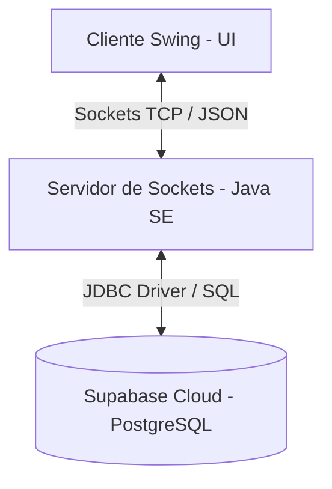
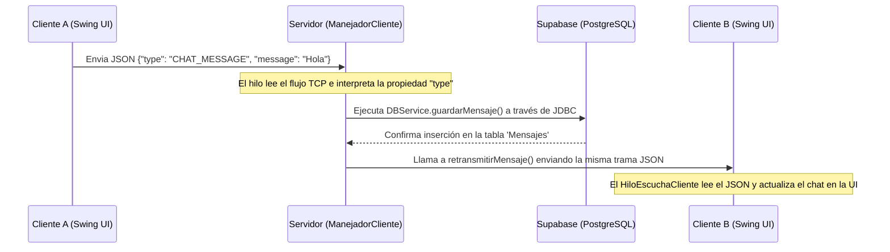
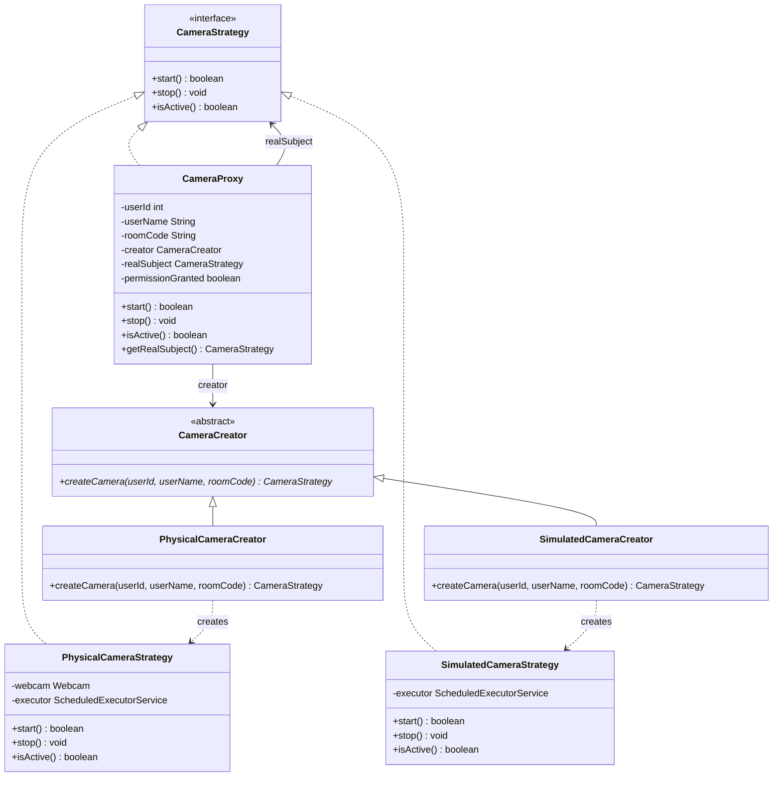

# Arquitectura del Sistema - LP2-Zoom

Este documento describe la arquitectura de software de nuestro prototipo académico de videoconferencia **LP2-Zoom**.

## 1. Propósito del Sistema

El sistema implementa un modelo de comunicación distribuido **Cliente-Servidor** para salas de videoconferencia y chat en tiempo real. 

### Regla Arquitectónica de Oro
La persistencia de datos (Supabase) es administrada de manera exclusiva por el Servidor. Los clientes nunca se conectan directamente a la base de datos de PostgreSQL en la nube, ni almacenan credenciales de base de datos. Toda la lógica de negocio, consultas de datos y tramas de transacciones se canalizan mediante conexiones TCP persistentes (sockets) y tramas en formato JSON.

---

## 2. Vista General y Componentes

La arquitectura está compuesta por tres capas lógicas e independientes:

### A. Módulo Cliente (Java Swing UI)
*   Encargado de la captura de eventos locales (login, envío de chats, subida de archivos, captura simulada/real de cámara).
*   Maneja una arquitectura reactiva basada en un hilo secundario asíncrono (`ClienteConexion`) que mantiene la escucha sobre el socket sin interrumpir el flujo del Event Dispatch Thread (EDT) de la interfaz de usuario.

### B. Módulo Servidor (Consola Java SE)
*   Orquestador central del sistema. Mantiene un hilo escuchando peticiones físicas (`ServerSocket`) en el puerto `5000`.
*   Para cada cliente conectado, el pool de hilos (`CachedThreadPool`) inicializa un hilo de ejecución dedicado (`ManejadorCliente`).
*   Procesa y valida las tramas JSON entrantes, ejecuta las consultas a la base de datos a través de JDBC y retransmite datos a otros sockets clientes.

### C. Capa de Datos (Supabase Cloud PostgreSQL)
*   Persistencia de credenciales de usuario, metadatos de salas, control de participantes de salas, cola de espera de invitados, mensajes de chat históricos y ubicaciones físicas de los archivos compartidos.

---

## 3. Flujo Principal de una Transacción (Mensajería)

A continuación se detalla cómo viaja una trama de chat desde que se redacta en el cliente hasta que se retransmite a la sala:

1.  **Emisión:** El usuario en el Cliente A escribe un mensaje y presiona el botón "Enviar". El cliente serializa un objeto del tipo `MensajeSocket` a JSON y lo envía al socket mediante `PrintWriter.println(json)`.
2.  **Recepción y Enrutamiento:** El hilo dedicado `ManejadorCliente` en el servidor lee la línea entrante. Deserializa el JSON, identifica que el `type` es `"CHAT_MESSAGE"` y lo enruta al método `ejecutarMensajeChat`.
3.  **Persistencia:** El servidor llama al método estático `DBService.guardarMensaje(...)` que ejecuta una consulta JDBC parametrizada de tipo `INSERT` sobre la base de datos de Supabase.
4.  **Difusión (Broadcast):** Una vez guardado el registro en Supabase, el servidor localiza a todos los clientes activos registrados en el mapa global `clientesActivos` que compartan la misma variable de estado `roomCode`. El servidor retransmite el objeto JSON a cada socket cliente.
5.  **Renderizado UI:** El hilo secundario del Cliente B lee la trama entrante, pasa el objeto JSON al EDT de Swing mediante `SwingUtilities.invokeLater()`, y actualiza el área de texto `txtAreaChat`.

---

## 4. Riesgos Conocidos y Estrategias de Mitigación

*   **Pérdida de Conexión y Desconexiones Abruptas:** Al operar sobre sockets TCP nativos, una desconexión abrupta (caída de internet) puede dejar hilos bloqueados en el servidor en modo de lectura. Se mitiga mediante bloques `try-catch` en el bucle continuo del método `run()` de `ManejadorCliente` que detectan fallas físicas y disparan el método de limpieza `desconectar()`.
*   **Latencia en Transmisión de Cámara (FPS Drop):** La codificación y decodificación de tramas Base64 a tasas altas de frames (FPS) saturan el procesador y aumentan la latencia de la red. Se mitiga configurando la captura de cámara a tasas reducidas (3 a 10 FPS) y comprimiendo las fotos a formato JPG de baja resolución (ej. 320x240).
*   **Saturación y Bloqueo de Hilos (Thread Exhaustion):** Si se manejara la creación manual de hilos (`new Thread`), el servidor podría colapsar ante cientos de conexiones. Se implementa un pool de hilos dinámico (`Executors.newCachedThreadPool()`) en el `MainServidor` que reutiliza hilos inactivos y limita el desbordamiento de recursos del sistema operativo.

---

## 5. Patrones de Diseño Aplicados

Para estructurar la arquitectura del sistema de manera robusta, extensible y mantenible, se han implementado los siguientes patrones de diseño de software en el módulo Cliente:

### A. Patrón Strategy (Estrategia)
Se utiliza para encapsular las diferentes formas de capturar y generar el flujo de video en la clase `RoomFrame`.
- **Estructura:**
  - [CameraStrategy](../Cliente/src/main/java/network/camera/CameraStrategy.java) (Interfaz): Define el contrato común (`start()`, `stop()`, `isActive()`).
  - [PhysicalCameraStrategy](../Cliente/src/main/java/network/camera/PhysicalCameraStrategy.java) (Estrategia Concreta): Utiliza la webcam física del computador.
  - [SimulatedCameraStrategy](../Cliente/src/main/java/network/camera/SimulatedCameraStrategy.java) (Estrategia Concreta): Dibuja formas dinámicas de prueba.
- **Beneficio:** Permite alternar entre cámara física y simulador de forma intercambiable sin acoplar la UI a la tecnología de captura de video física.

### B. Patrón Factory Method (Método de Fábrica)
Se encarga de delegar la creación física de las estrategias de cámara a creadores dedicados.
- **Estructura:**
  - [CameraCreator](../Cliente/src/main/java/network/camera/CameraCreator.java) (Creador Abstracto): Declara el método de fábrica `createCamera()`.
  - [PhysicalCameraCreator](../Cliente/src/main/java/network/camera/PhysicalCameraCreator.java) (Creador Concreto): Produce objetos del tipo `PhysicalCameraStrategy`.
  - [SimulatedCameraCreator](../Cliente/src/main/java/network/camera/SimulatedCameraCreator.java) (Creador Concreto): Produce objetos del tipo `SimulatedCameraStrategy`.
- **Beneficio:** Desacopla la lógica de instanciación de las estrategias en `RoomFrame`, promoviendo el principio de inversión de dependencia.

### C. Patrón Proxy (Intermediario)
Actúa como un representante/intermediario de la cámara, interceptando las operaciones y añadiendo comportamiento inteligente.
- **Estructura:**
  - [CameraProxy](../Cliente/src/main/java/network/camera/CameraProxy.java) (Implementa `CameraStrategy`): Envuelve al sujeto real (`PhysicalCameraStrategy` o `SimulatedCameraStrategy`).
  - **Funciones del Proxy:**
    1. **Protection Proxy (Control de Acceso):** Valida si la variable estática `permissionGranted` es verdadera antes de inicializar o encender la cámara.
    2. **Virtual Proxy (Inicialización Perezosa):** Retarda la instanciación del dispositivo de video hasta que la UI invoque explícitamente `start()`.
    3. **Logging Proxy (Logs de Red/Dispositivo):** Registra auditoría en consola cada vez que se llama a `start()` y `stop()`.
    4. **Fallback Inteligente:** Si el inicio de la cámara física falla, el proxy automáticamente e internamente conmuta al simulador de forma transparente para `RoomFrame`.

### Diagrama de Clases (Mermaid)

