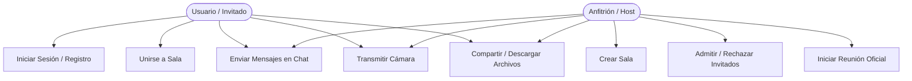
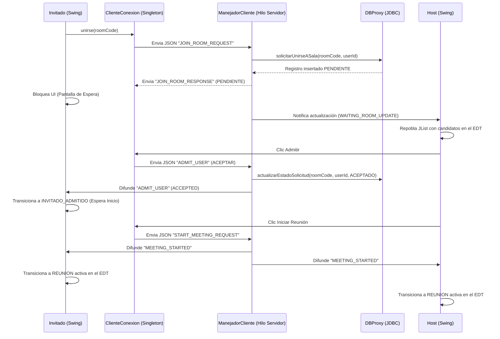
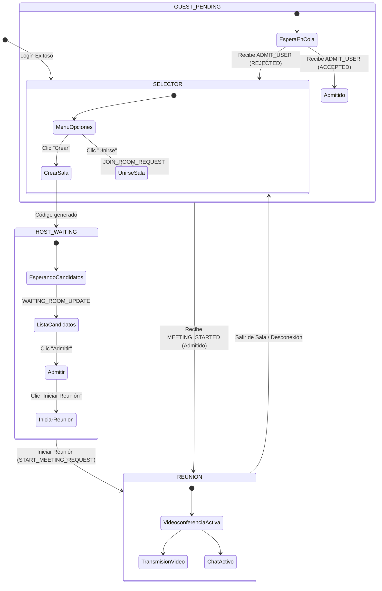

# Especificación de Caso de Uso Principal: Gestión de Admisión y Videoconferencia en Tiempo Real

Este documento detalla la especificación técnica, el flujo de datos y los diagramas generales del caso de uso principal del prototipo **LP2-Zoom**.

---

## 1. Ficha del Caso de Uso: CU-01

| Campo | Detalle |
| :--- | :--- |
| **Identificador** | **CU-01** |
| **Nombre** | Gestión de Sala de Espera, Admisión e Inicio de Videoconferencia con Transmisión en Tiempo Real |
| **Actores** | Anfitrión (Host), Invitado (Guest), Servidor de Sockets (Sistema) |
| **Descripción** | Permite a un Invitado solicitar unirse a una reunión mediante un código de 6 caracteres, ser moderado (admitido) en tiempo real por el Anfitrión, y tras el inicio de la reunión por parte de este, entablar una sesión interactiva de video y chat de forma síncrona y distribuida. |
| **Precondiciones** | 1. El Anfitrión ha iniciado sesión correctamente y ha creado una sala (obteniendo un código único de 6 caracteres persistido en Supabase).<br>2. El Invitado ha iniciado sesión y cuenta con el código de la sala proporcionado por el Anfitrión. |
| **Postcondiciones** | 1. El Invitado es admitido y la base de datos (tabla `ParticipantesSala`) se actualiza a estado activo.<br>2. Se inicia el Event Loop de transmisión de cámara y chat multicliente en la sala activa.<br>3. Los canales físicos de socket permanecen estables y auditados. |

---

## 2. Flujo de Eventos

### 2.1. Flujo Principal (Escenario de Éxito)

1. **Solicitud de Ingreso:** El Invitado escribe el código de la sala en su panel selector y presiona "Unirse".
2. **Envío de Petición:** El cliente del Invitado serializa y envía una trama JSON de tipo `JOIN_ROOM_REQUEST` conteniendo el código de sala y el ID del usuario a través de su socket TCP persistente.
3. **Registro en Base de Datos:** El `ManejadorCliente` en el servidor recibe la trama, intercepta la solicitud, e interactúa con el middleware `DBProxy` para insertar una fila en la tabla `SolicitudesSala` con el estado `PENDIENTE`.
4. **Bloqueo del Invitado:** El servidor responde con una trama `JOIN_ROOM_RESPONSE` y el cliente Invitado bloquea su interfaz, mostrando la pantalla "Sala de Espera (Invitado)" con una barra de progreso indeterminada.
5. **Notificación al Anfitrión:** El servidor identifica la conexión activa del Anfitrión de dicha sala y le envía una trama `WAITING_ROOM_UPDATE`.
6. **Actualización de la UI del Host:** El hilo de escucha del Anfitrión recibe la actualización y repuebla de forma segura el listado gráfico de solicitudes pendientes en el Event Dispatch Thread (EDT).
7. **Decisión de Admisión:** El Anfitrión selecciona al Invitado y hace clic en "Admitir".
8. **Procesamiento de Admisión:** El cliente del Anfitrión envía una trama `ADMIT_USER` con el estado `ACCEPTED`.
9. **Persistencia del Estado:** El servidor actualiza la solicitud en la tabla `SolicitudesSala` de Supabase a `ACCEPTED` e inserta al usuario en la tabla `ParticipantesSala`.
10. **Admisión del Invitado:** El servidor envía al Invitado la trama `ADMIT_USER` con el estado `ACCEPTED`. La interfaz del Invitado transiciona al estado *Invitado Admitido*, quedando a la espera de la señal de inicio oficial.
11. **Inicio de Reunión:** El Anfitrión hace clic en el botón "Iniciar reunión", lo que envía la trama `START_MEETING_REQUEST` al servidor.
12. **Difusión de Arranque:** El servidor cambia el estado de la sala en Supabase a "Activa" y difunde la trama `MEETING_STARTED` a todos los participantes conectados a esa sala (Host e Invitados).
13. **Conmutación de Pantalla:** Al recibir `MEETING_STARTED`, el `CardLayout` del frontend de ambos clientes cambia inmediatamente a la pantalla `REUNION`.
14. **Activación de Periféricos:** Ambos clientes inicializan sus hilos de transmisión de cámara (`CameraProxy`) e inician el envío asíncrono de fotogramas (`CAMERA_FRAME` codificados en Base64) y mensajes de chat (`CHAT_MESSAGE`), los cuales son distribuidos en tiempo real por el servidor.

---

### 2.2. Flujos Alternativos y de Excepción

* **A. El código de la sala es inválido o inexistente:**
  * En el paso 3, el servidor verifica la existencia del código mediante `DBProxy`. Si no existe, envía un mensaje de error. El Invitado es notificado con un diálogo modal ("La sala no existe") y la pantalla permanece en el panel de selección de rol.
* **B. El Anfitrión rechaza la solicitud de unión:**
  * En el paso 7, el Anfitrión hace clic en "Rechazar". El cliente envía `ADMIT_USER` con el estado `REJECTED`.
  * El servidor actualiza el registro en Supabase a `REJECTED`.
  * El servidor envía la trama al Invitado. La interfaz del Invitado sale de la pantalla de espera y regresa al selector inicial mostrando el mensaje "Tu solicitud de admisión fue rechazada".
* **C. El Invitado cancela la solicitud de espera antes de ser admitido:**
  * El Invitado hace clic en "Cancelar". El cliente envía `LEAVE_ROOM` al servidor.
  * El servidor elimina la solicitud pendiente de la base de datos y deja de notificar al Host.
* **D. Falla en el hardware de cámara del cliente:**
  * Al ingresar a la pantalla `REUNION`, la estrategia física de cámara (`PhysicalCameraStrategy`) falla al inicializarse.
  * El `CameraProxy` captura la excepción, registra el log de auditoría y conmuta transparentemente a `SimulatedCameraStrategy`, transmitiendo figuras y animaciones vectoriales de prueba en red sin interrumpir el hilo gráfico.

---

## 3. Diagramas UML Generales

### A. Diagrama de Casos de Uso
Describe las interacciones de los actores con las funcionalidades del sistema a nivel general.



---

### B. Diagrama de Actividades
Describe el ciclo de control y las bifurcaciones lógicas desde que el usuario arranca el cliente hasta la reunión activa.

```
   [Inicio del Cliente]
            │
    ¿Tiene cuenta? ───────── No ────────▶ [Registrarse]
            │                                    │
            Sí                             (Persistir en DB)
            │                                    │
            ▼                                    ▼
    [Ingresar Credenciales] ◄────────────────────┘
            │
     ¿Login Exitoso? ─────── No ────────▶ (Reintentar)
            │
            Sí
            │
            ▼
    [Dashboard de Selección]
            │
    ¿Qué acción desea realizar?
            ├─── [Crear Sala]
            │         │
            │   (Generar Código)
            │         │
            │   [Sala de Espera - Host] ◄───────────────┐
            │         │                                 │
            │   ¿Admitir Candidato?                     │
            │         ├─── Sí ──▶ (ACEPTADO en DB)      │
            │         └─── No ──▶ (RECHAZADO en DB)     │
            │         │                                 │
            │   ¿Iniciar Videoconferencia? ── No ───────┘
            │         │
            │        Sí (Emitir START_MEETING)
            │         │
            │         ▼
            └─── [Unirse a Sala]
                      │
                (Ingresar Código)
                      │
                (Enviar JOIN_ROOM_REQUEST)
                      │
                [Sala de Espera - Invitado]
                      │
                ¿Admitido por el Host?
                      ├─── Rechazado ──▶ [Regresar a Dashboard] ──▶ (Fin)
                      │
                      └─── Aceptado ──▶ (Estado: ADMITIDO)
                                             │
                                       (Recibe MEETING_STARTED)
                                             │
                                             ▼
                                     [Reunión Activa]
                                             │
                       ┌─────────────────────┼─────────────────────┐
                       ▼                     ▼                     ▼
                 [Módulo Chat]        [Módulo Cámara]       [Módulo Archivos]
                 (Historial/Text)    (Webcam / Fallback)   (Segmentación Base64)
                       └─────────────────────┼─────────────────────┘
                                             │
                                             ▼
                                  [Abandonar Reunión]
                                             │
                                   (Liberación de Socket)
                                             │
                                             ▼
                                           (Fin)
```

---

### C. Diagrama de Secuencia (Interacciones del Protocolo)
Describe los mensajes TCP en formato JSON y el acoplamiento asíncrono con el orquestador y la persistencia Supabase Cloud.



---

### D. Diagrama de Transición de Estados (CardLayout del Panel de Pantallas)
Muestra los estados visuales en la interfaz del cliente Swing controlados mediante el gestor de tarjetas (`CardLayout`) de la ventana principal:



---

## 4. Aspectos de Implementación y Concurrencia Clave

1. **Aislamiento JDBC en Servidor:** De acuerdo a la Regla de Oro del sistema, el cliente no conoce las credenciales ni el driver de Supabase. Todo paso por base de datos (por ejemplo, el registro de la solicitud o la asignación de participantes) es gestionado de manera segura por el servidor central de Sockets mediante el proxy transaccional `DBProxy`.
2. **EDT vs. Hilo de Escucha:** En el cliente, cuando el socket recibe `MEETING_STARTED` o `WAITING_ROOM_UPDATE` mediante el hilo secundario bloqueante de lectura, la modificación visual de Swing es encolada en el hilo gráfico principal (Event Dispatch Thread) llamando a `SwingUtilities.invokeLater()`, lo que asegura la fluidez y previene bloqueos e inconsistencias gráficas.
3. **Liberación ante Desconexión:** Si el invitado o el anfitrión pierden la conexión física en la sala de espera o durante la reunión, el socket del servidor captura la excepción física, invoca al método `desconectar()` para liberar el socket, remueve la solicitud o actualiza la sesión en Supabase a `SALIÓ`, y avisa en tiempo real a los demás miembros para actualizar los grids de video.
