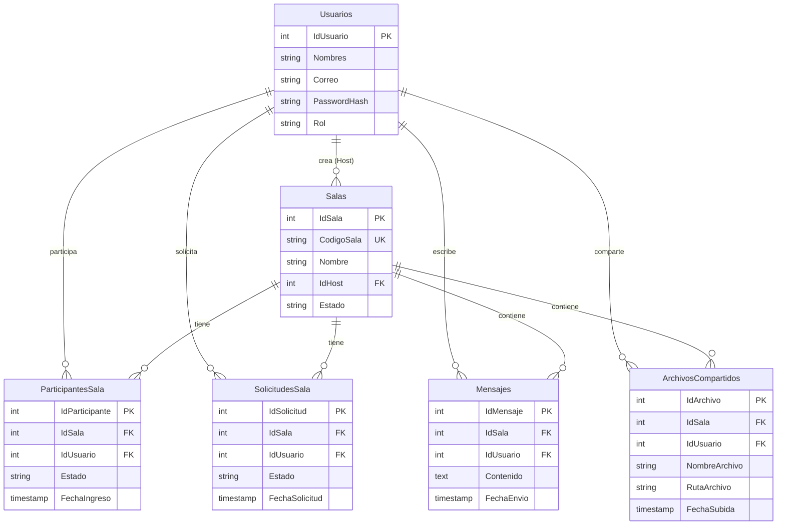

# Memoria Técnica - LP2-Zoom (Proyecto Académico)

Este documento contiene la especificación arquitectónica, el modelo de datos, el protocolo de comunicación por sockets y las directrices técnicas del proyecto **LP2-Zoom**. Su propósito es servir como la única fuente de verdad (SSOT) y memoria técnica para el desarrollo continuo del sistema.

---

## 1. Stack Tecnológico

El sistema ha sido estructurado utilizando tecnologías nativas de Java para la red y la interfaz de usuario, y bases de datos relacionales en la nube para la persistencia.

*   **Backend:** Java SE (Sockets TCP nativos `java.net.ServerSocket` y `java.net.Socket`). Control de concurrencia mediante hilos independientes asignados dinámicamente con un `ExecutorService` (Thread Pool de tipo `CachedThreadPool`).
*   **Persistencia:** Supabase (PostgreSQL alojado en la nube). Conectividad a través de JDBC nativo (utilizando pools de conexiones o conexiones directas según configuración).
*   **Gestión de Dependencias y Ciclo de Vida:** Maven. La biblioteca principal de terceros para la serialización y deserialización es **Gson** (Google) para estructurar los mensajes en formato JSON.
*   **Frontend / UI:** Java Swing (`javax.swing`), implementando layouts y estructurado mediante el patrón de diseño *CardLayout* en la ventana principal de la sala para gestionar transiciones de estado de forma reactiva.
*   **Control de Versiones:** Git y GitHub.

---

## 2. Regla Arquitectónica de Oro

> [!IMPORTANT]
> **Esquema Estricto Cliente-Servidor**
> El cliente **jamás** se conecta directamente a la base de datos de Supabase. El cliente no incluye credenciales de base de datos ni interactúa con JDBC.
>
> Todas las operaciones (autenticación, mensajería, consultas de sala, carga de metadatos de archivos, estados de admisión) se solicitan al **Servidor de Sockets** enviando tramas estructuradas en formato JSON. El servidor es el único encargado de orquestar estas peticiones, interactuar con la base de datos y retransmitir los datos/estados correspondientes a los clientes a través de las conexiones TCP activas.

---

## 3. Requerimientos Funcionales Mínimos

1.  **Autenticación (Login/Registro):** Validación segura de credenciales contra la base de datos de Supabase. Las contraseñas se almacenan de manera irreversible aplicando hashing (SHA-256 en `HashUtils`).
2.  **Gestión de Salas:** Creación dinámica de salas por parte de un anfitrión (Host). Se genera un código único de sala alfanumérico de 6 caracteres (ej. `A1B2C3`). Los invitados solicitan unirse utilizando este código único.
3.  **Sala de Espera (Admisión Diferida con Inicio Controlado):** Cuando un invitado solicita ingresar a una sala, su estado inicial queda como `PENDIENTE` en la tabla `SolicitudesSala`. El anfitrión tiene un panel visual donde recibe notificaciones en tiempo real de nuevos candidatos y puede elegir **Admitir (ACEPTAR)** o **Rechazar**. Al ser admitido, el invitado pasa a un segundo estado de espera interno (`INVITADO_ADMITIDO`) y solo entra a la reunión cuando el Host envía el comando de inicio.
4.  **Chat en Tiempo Real:** Intercambio instantáneo de mensajes de texto distribuidos exclusivamente a los miembros de la sala que han sido admitidos y que ya han ingresado a la reunión. Todos los mensajes se guardan concurrentemente en la base de datos para la persistencia histórica.
5.  **Compartición de Archivos (Chunks Binarios):** Envío de archivos pequeños segmentados. Para evitar el desbordamiento de memoria por archivos grandes en tramas JSON únicas, se define un protocolo de tres pasos (`FILE_START`, `FILE_CHUNK` serializado en Base64, y `FILE_END`). Los archivos se escriben físicamente en un directorio local del servidor (`uploads/`) y solo se guardan sus metadatos (nombre, ruta en servidor, usuario) en la base de datos a través del servicio JDBC.
6.  **Transmisión de Cámara Web (Básica):** Captura de frames de webcam local usando librerías de video o placeholders simulados, redimensionados a imágenes JPG ligeras (ej. 320x240) con compresión. Estas imágenes se convierten a texto Base64 y se envían secuencialmente de 3 a 10 cuadros por segundo (FPS) vía tramas `CAMERA_FRAME` a través del socket. El servidor retransmite el frame a los demás miembros activos en la sala para su renderizado.
7.  **Control de Concurrencia y Robustez:** El servidor mantiene un registro en memoria de todos los clientes conectados de forma activa en un mapa concurrente (`MainServidor.clientesActivos`). Si un socket se desconecta de forma abrupta o limpia (evento `windowClosing` o caída de internet), el servidor debe limpiar los recursos asociados del mapa, cerrar los canales y, opcionalmente, actualizar su estado en la base de datos para notificar a los participantes restantes de la sala.

---

## 4. Protocolo de Mensajes JSON

La comunicación bidireccional cliente-servidor se basa en objetos JSON serializados mediante la clase [MensajeSocket](file:///c:/Users/Jeanpier/OneDrive/Desktop/LP2-Zoom/Cliente/src/main/java/model/MensajeSocket.java). La clave para el enrutamiento es el campo `type`.

### Estructura base del mensaje JSON

```json
{
  "type": "TIPO_DE_MENSAJE",
  "roomCode": "CÓDIGO_DE_SALA",
  "userId": 123,
  "userName": "Nombre del Usuario",
  "message": "Contenido textual del mensaje / payload extendido",
  "sentAt": "2026-06-19T18:00:00"
}
```

### Tipos de Mensajes Obligatorios

| Tipo de Mensaje (`type`) | Flujo | Descripción | Payload / Campos clave |
| :--- | :--- | :--- | :--- |
| **`LOGIN_REQUEST`** | Cliente $\rightarrow$ Servidor | Petición para verificar credenciales de inicio de sesión. | `userName` (Correo), `message` (Contraseña texto plano) |
| **`LOGIN_RESPONSE`** | Servidor $\rightarrow$ Cliente | Respuesta al inicio de sesión. | `message` (`SUCCESS` o mensaje de error), `userId`, `userName` |
| **`CREATE_ROOM`** | Bidireccional | **Cliente:** Solicita crear sala. **Servidor:** Responde confirmando creación con el código. | `userId` (Host), `roomCode` (Generado en respuesta), `message` (Resultado) |
| **`JOIN_ROOM_REQUEST`** | Cliente $\rightarrow$ Servidor | Petición del invitado para entrar en la sala de espera. | `roomCode`, `userId`, `userName` |
| **`WAITING_ROOM_UPDATE`** | Servidor $\rightarrow$ Host | Actualiza la lista de solicitudes pendientes al anfitrión. | `roomCode`, `message` (JSON array serializado con candidatos) |
| **`ADMIT_USER`** | Bidireccional | **Host $\rightarrow$ Servidor:** Envía decisión. **Servidor $\rightarrow$ Invitado:** Notifica admisión. | `roomCode`, `userId` (Invitado), `message` (`ACEPTAR`/`RECHAZAR` o `ACCEPTED`/`REJECTED`) |
| **`CHAT_MESSAGE`** | Bidireccional | Envío y difusión de mensajes de texto en la reunión activa. | `roomCode`, `userId`, `userName`, `message` (Texto del chat) |
| **`CAMERA_FRAME`** | Bidireccional | Envío y difusión de fotogramas de la webcam codificados. | `roomCode`, `userId`, `message` (Imagen comprimida en Base64) |
| **`LEAVE_ROOM`** | Cliente $\rightarrow$ Servidor | Notifica que el usuario se sale o abandona la reunión de forma explícita. | `roomCode`, `userId` |
| **`FILE_START`** | Cliente $\rightarrow$ Servidor | Anuncia el inicio de transferencia de un archivo compartido. | `roomCode`, `message` (`fileId\|nombreArchivo`) |
| **`FILE_CHUNK`** | Cliente $\rightarrow$ Servidor | Envía un segmento binario codificado en Base64. | `roomCode`, `message` (`fileId\|chunkBase64`) |
| **`FILE_END`** | Cliente $\rightarrow$ Servidor | Finaliza la transferencia y gatilla el guardado en BD. | `roomCode`, `message` (`fileId`) |

---

## 5. Estructura de la Base de Datos

Las tablas definidas en Supabase PostgreSQL (especificadas en el archivo [schema.sql](file:///c:/Users/Jeanpier/OneDrive/Desktop/LP2-Zoom/db/schema.sql)) son las siguientes:



---

## 6. Flujo de Control y Concurrencia por Sockets

### Servidor (MainServidor)

1. Escucha en el puerto `5000` mediante un bucle infinito que bloquea en `serverSocket.accept()`.
2. Al recibir una conexión física, inicializa un `ManejadorCliente` (que implementa `Runnable`).
3. Envía el manejador al pool de hilos dinámico `CachedThreadPool`. Esto libera el hilo principal para seguir aceptando nuevas conexiones.
4. El `ManejadorCliente` lee continuamente del stream de entrada (`BufferedReader.readLine()`). Cuando recibe un JSON válido:
   * Lo deserializa a `MensajeSocket`.
   * Evalúa el tipo de mensaje y ejecuta la consulta correspondiente en la clase estática de base de datos [DBService](file:///c:/Users/Jeanpier/OneDrive/Desktop/LP2-Zoom/Servidor/src/main/java/database/DBService.java).
   * Si requiere distribución, llama al método auxiliar `retransmitirMensaje`, filtrando las conexiones registradas en el mapa concurrente `clientesActivos` por el código de sala asignado.

### Cliente (ClienteConexion)

1. Implementa el patrón **Singleton** para centralizar la conexión física TCP.
2. Posee un hilo de escucha dedicado (`escucharServidor`) que lee en segundo plano el flujo de entrada, evitando congelar la interfaz gráfica de Swing (Event Dispatch Thread).
3. Permite la suscripción de múltiples controladores u oyentes gráficos mediante la interfaz [MensajeListener](file:///c:/Users/Jeanpier/OneDrive/Desktop/LP2-Zoom/Cliente/src/main/java/network/ClienteConexion.java#L22-L25). Al recibir un mensaje del servidor, este se propaga a los observadores activos.

---

## 7. Estructura del Repositorio Actual

```text
LP2-Zoom/
├── Cliente/                      # Módulo del Cliente (UI + Conexión)
│   ├── pom.xml                   # Configuración Maven de dependencias del Cliente
│   └── src/main/java/
│       ├── model/
│       │   └── MensajeSocket.java # Modelo de datos del protocolo JSON
│       ├── network/
│       │   └── ClienteConexion.java # Gestor de sockets (Singleton + Listeners)
│       └── UI/
│           ├── LoginFrame.java   # Ventana de autenticación
│           └── RoomFrame.java    # Ventana de salas (Selector, Espera, Reunión)
├── Servidor/                     # Módulo del Servidor (Lógica de sockets + Persistencia)
│   ├── pom.xml                   # Configuración Maven del Servidor (JDBC, Gson, etc.)
│   └── src/main/
│       ├── java/
│       │   ├── database/
│       │   │   ├── ConexionBD.java # Proveedor de conexión JDBC a Supabase
│       │   │   ├── DBService.java # Transacciones y consultas JDBC
│       │   │   └── HashUtils.java # Hasheador de contraseñas (SHA-256)
│       │   ├── model/
│       │   │   ├── MensajeSocket.java
│       │   │   └── Usuario.java
│       │   └── network/
│       │       ├── MainServidor.java # Servidor principal (ServerSocket)
│       │       └── ManejadorCliente.java # Hilo dedicado a cada conexión de cliente
│       └── resources/
│           ├── config.properties # Credenciales de la BD
│           └── database/
│               └── schema.sql    # Respaldo local de esquema SQL
└── db/
    └── schema.sql                # Esquema de base de datos del proyecto
```
