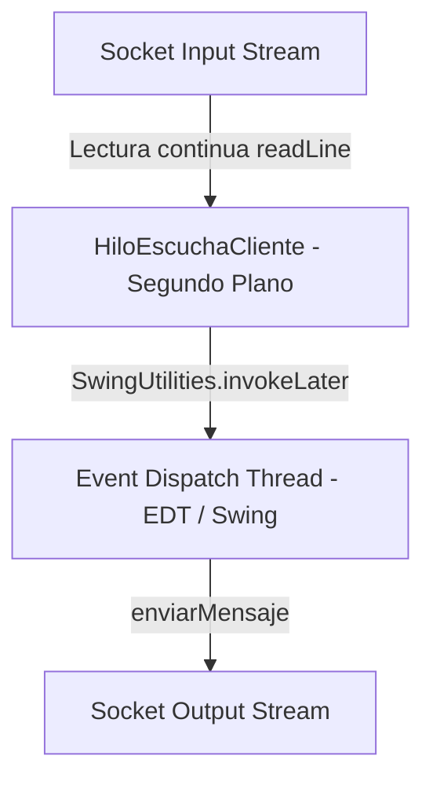
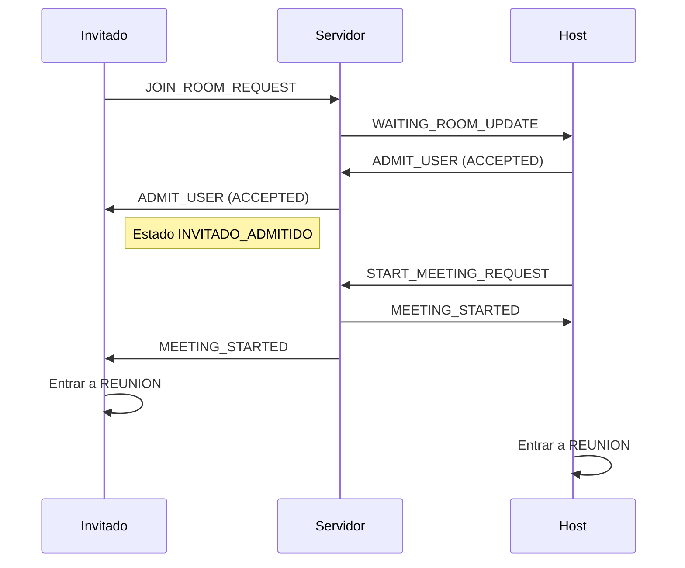

# Especificación del Frontend - LP2-Zoom

Este documento detalla el diseño técnico, la arquitectura de hilos de la UI y el control de pantallas en el módulo del Cliente de **LP2-Zoom**.

## 1. Stack Tecnológico del Frontend

La interfaz del cliente está desarrollada en Java estándar orientada a componentes gráficos nativos de escritorio:

*   **Librería Gráfica:** **Java Swing** (`javax.swing` y `java.awt`) utilizando componentes ligeros para renderizado local y contenedores administrados por layouts dinámicos (principalmente `GridBagLayout`, `BorderLayout` y `CardLayout`).
*   **Gestión de Datos:** **Gson** para serializar y deserializar los mensajes del protocolo JSON a clases planas en Java.
*   **Patrón de Diseño:** **Observer (Oyente).** Las pantallas del cliente implementan la interfaz `ClienteConexion.MensajeListener` para reaccionar asíncronamente a los paquetes de datos distribuidos por el servidor de sockets.

---

## 2. Flujo de Hilos de la Interfaz (Threading Model)

Para evitar congelamientos de la interfaz gráfica y ofrecer una experiencia de usuario fluida, el cliente utiliza un modelo de dos hilos concurrentes principales:



### A. Event Dispatch Thread (EDT)
Es el hilo principal y exclusivo de Swing encargado de pintar la pantalla, escuchar los clics de botones y capturar el teclado. **Regla de oro de Swing:** Ninguna tarea de larga duración o de red debe correr en este hilo, de lo contrario la ventana mostrará el mensaje "(No Responde)" y se congelará.

### B. Hilo de Escucha de Red (HiloEscuchaCliente)
Al iniciar la conexión física en [ClienteConexion](../Cliente/src/main/java/network/ClienteConexion.java), se instancia y arranca un hilo secundario encargado exclusivamente de bloquearse en espera de datos entrantes:

```java
// Hilo de escucha en segundo plano para evitar colgar la interfaz gráfica (EDT)
private void escucharServidor() {
    try {
        String linea;
        // Lectura de líneas de texto (JSON) en bucle infinito bloqueante
        while (conectado && (linea = entrada.readLine()) != null) {
            MensajeSocket mensaje = gson.fromJson(linea, MensajeSocket.class);
            if (mensaje != null) {
                // Se notifica de forma asíncrona a todas las ventanas registradas
                notificarListeners(mensaje);
            }
        }
    } catch (Exception e) {
        System.err.println("[-] Hilo de escucha de socket finalizado: " + e.getMessage());
    } finally {
        desconectar();
    }
}
```

### C. Retorno Seguro al EDT
Cuando el `HiloEscuchaCliente` recibe un mensaje de red e invoca a las ventanas clientes, el código que modifica las pantallas gráficas debe ser empujado de vuelta al EDT de manera segura utilizando `SwingUtilities.invokeLater(...)`:

```java
// Actualización segura de componentes visuales en Swing
@Override
public void onMensajeRecibido(MensajeSocket mensaje) {
    if ("CHAT_MESSAGE".equals(mensaje.getType())) {
        SwingUtilities.invokeLater(() -> {
            // Este bloque se ejecuta en el EDT de manera segura
            txtAreaChat.append("[" + mensaje.getUserName() + "]: " + mensaje.getMessage() + "\n");
        });
    }
}
```

---

## 3. Control de Estados Visuales de la Interfaz

La ventana principal de la reunión [RoomFrame](../Cliente/src/main/java/UI/RoomFrame.java) utiliza un contenedor principal configurado con un **CardLayout** para controlar los cuatro estados y pantallas que atraviesa el flujo del usuario:

### Máquina de Estados del CardLayout

```mermaid
stateDiagram-R
    [*] --> SELECTOR : Login exitoso
    SELECTOR --> HOST : Crear sala
    SELECTOR --> INVITADO : Unirse a sala (PENDIENTE)
    INVITADO --> SELECTOR : Cancelar solicitud / Rechazado por Host
    INVITADO --> REUNION : Admitido por Host (ACCEPTED)
    HOST --> REUNION : Iniciar videoconferencia
    REUNION --> SELECTOR : Abandonar reunión
```



1.  **SELECTOR (Selección de Rol):** Panel que ofrece crear una sala (Host) o ingresar el código de 6 caracteres para unirse (Invitado).
2.  **HOST (Sala de Espera del Anfitrión):** Panel exclusivo del Host. Muestra el código de la sala generada y despliega dinámicamente el listado de candidatos en cola recibidos vía `WAITING_ROOM_UPDATE`. Contiene controles interactivos individuales para **Admitir** o **Rechazar**. Una vez admitidos los invitados, el Host debe enviar explícitamente el mensaje `START_MEETING_REQUEST` para iniciar la reunión.
3.  **INVITADO (Pantalla de Espera):** Pantalla de bloqueo para el invitado con una barra de progreso indeterminada. Los controles están bloqueados hasta recibir la trama `ADMIT_USER` con el mensaje `ACCEPTED`, tras lo cual el invitado pasa a un estado de espera admitido (`INVITADO_ADMITIDO`). Solo después de recibir la trama `MEETING_STARTED` el invitado se redirige a la pantalla `REUNION`. Si recibe `REJECTED`, regresa a la pantalla `SELECTOR`.
4.  **REUNION (Videoconferencia Activa):** Interfaz unificada de chat de texto, visor de grid de video y gestor de carga/descarga de archivos compartidos.

## 4.1 Transmisión de cámara: Arquitectura basada en Patrones de Diseño

La captura y transmisión de frames de cámara (`CAMERA_FRAME`) y estados (`CAMERA_STATE`) en [RoomFrame](../Cliente/src/main/java/UI/RoomFrame.java) está desacoplada y estructurada mediante tres patrones de diseño fundamentales para mejorar la mantenibilidad, robustez y legibilidad:

### A. Patrón Strategy (Estrategia)
Toda fuente de video implementa la interfaz común [CameraStrategy](../Cliente/src/main/java/network/camera/CameraStrategy.java), la cual cuenta con los métodos `start()`, `stop()` y `isActive()`.
- **[PhysicalCameraStrategy](../Cliente/src/main/java/network/camera/PhysicalCameraStrategy.java):** Encapsula el acceso y captura de la webcam física usando la librería `webcam-capture`. Para evitar bloqueos, implementa un timeout síncrono controlado en `Webcam.getDefault(3000)`.
- **[SimulatedCameraStrategy](../Cliente/src/main/java/network/camera/SimulatedCameraStrategy.java):** Genera gráficos degradados interactivos con un círculo en movimiento y marcas de tiempo como fallback académico.

### B. Patrón Factory Method (Método de Fábrica)
La instanciación de las estrategias se delega a una jerarquía de creadores que heredan de [CameraCreator](../Cliente/src/main/java/network/camera/CameraCreator.java):
- **[PhysicalCameraCreator](../Cliente/src/main/java/network/camera/PhysicalCameraCreator.java):** Retorna un `PhysicalCameraStrategy`.
- **[SimulatedCameraCreator](../Cliente/src/main/java/network/camera/SimulatedCameraCreator.java):** Retorna un `SimulatedCameraStrategy`.

### C. Patrón Proxy (Intermediario)
La clase `RoomFrame` nunca interactúa directamente con los creadores o las estrategias concretas. En su lugar, utiliza el intermediario inteligente [CameraProxy](../Cliente/src/main/java/network/camera/CameraProxy.java):
- **Virtual Proxy (Carga Perezosa):** Retarda la instanciación de la cámara real hasta que se llama al método `start()`.
- **Protection Proxy (Control de Acceso):** Intercepta el inicio de la cámara y valida si el flag `permissionGranted` está habilitado. Si es falso, bloquea el inicio y retorna `false` inmediatamente.
- **Logging Proxy (Registro):** Añade trazas y logs en consola al iniciar o detener el flujo.
- **Fallback Automático Transparente:** Si la inicialización en `PhysicalCameraStrategy.start()` falla, el proxy captura el error, conmuta de creador a `SimulatedCameraCreator` e inicia la simulación de forma automática. `RoomFrame` permanece totalmente ajeno a esta conmutación interna y solo consulta a `proxy.getRealSubject()` al terminar para validar si debe mostrar un aviso visual al usuario.

### D. Mitigación de Fotogramas Congelados por Condición de Carrera
Al apagar la cámara, algunos fotogramas tardíos (`CAMERA_FRAME`) pueden llegar a los demás participantes después de la trama de estado `CAMERA_STATE = OFF`, provocando que el video de este usuario quede permanentemente congelado. Para evitar esto:
* **Registro de Estados Local:** Cada cliente mantiene un mapa concurrente `activeCameraStates` que registra el estado más reciente de la cámara de los demás integrantes de la sala.
* **Filtrado de Fotogramas:** En `updateVideoFeed()`, antes de pintar cualquier fotograma de un usuario, se verifica su estado en `activeCameraStates`. Si el estado registrado es `"OFF"`, el fotograma se descarta de forma inmediata, garantizando que el visor muestre permanentemente la leyenda "Cámara apagada" y el fondo negro.
* **Limpieza de Estados:** Al ingresar a una nueva reunión, se limpia el mapa de estados mediante `activeCameraStates.clear()`.

