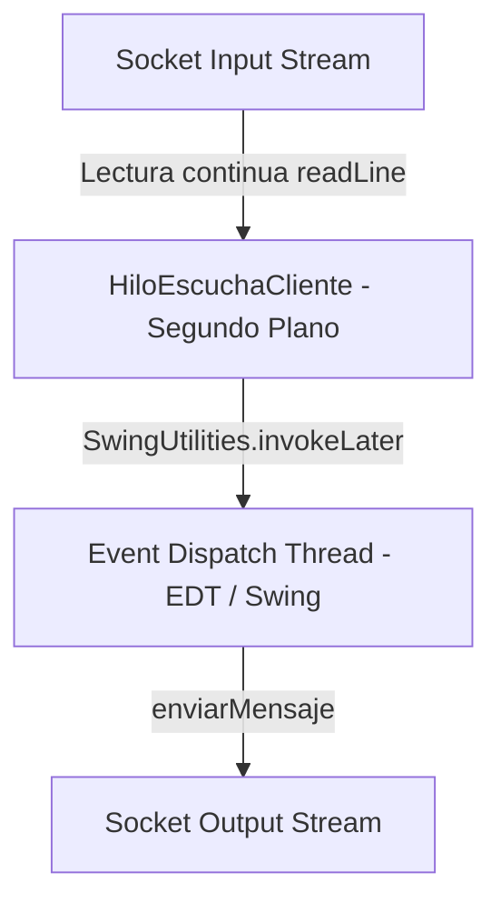

# Especificación del Frontend - LP2-Zoom

Este documento detalla el diseño técnico, la arquitectura de hilos de la UI y el control de pantallas en el módulo del Cliente de **LP2-Zoom**.

## 1. Stack Tecnológico del Frontend

La interfaz del cliente está desarrollada en Java estándar orientada a componentes gráficos nativos de escritorio:

*   **Librería Gráfica:** **Java Swing** (`javax.swing` y `java.awt`) utilizando componentes ligeros para renderizado local y contenedores administrados por layouts dinámicos (principalmente `GridBagLayout`, `BorderLayout` y `CardLayout`).
*   **Gestión de Datos:** **Gson** para serializar y deserializar los mensajes del protocolo JSON a clases planas en Java.
*   **Patrón de Diseño:** **Observer (Oyente).** Las pantallas del cliente implementan la interfaz `ClienteConexion.MensajeListener` para reaccionar asíncronamente a los paquetes de datos distribuidos por el servidor de sockets.

---

## 2. Flujo de Hilos de la Interfaz (Threading Model)

Para evitar congelamientos de la interfaz gráfica y ofrecer una experiencia de usuario fluida, el cliente utiliza un modelo de dos hilos concurrentes principales:



### A. Event Dispatch Thread (EDT)
Es el hilo principal y exclusivo de Swing encargado de pintar la pantalla, escuchar los clics de botones y capturar el teclado. **Regla de oro de Swing:** Ninguna tarea de larga duración o de red debe correr en este hilo, de lo contrario la ventana mostrará el mensaje "(No Responde)" y se congelará.

### B. Hilo de Escucha de Red (HiloEscuchaCliente)
Al iniciar la conexión física en [ClienteConexion](file:///c:/Users/Jeanpier/OneDrive/Desktop/LP2-Zoom/Cliente/src/main/java/network/ClienteConexion.java), se instancia y arranca un hilo secundario encargado exclusivamente de bloquearse en espera de datos entrantes:

```java
// Hilo de escucha en segundo plano para evitar colgar la interfaz gráfica (EDT)
private void escucharServidor() {
    try {
        String linea;
        // Lectura de líneas de texto (JSON) en bucle infinito bloqueante
        while (conectado && (linea = entrada.readLine()) != null) {
            MensajeSocket mensaje = gson.fromJson(linea, MensajeSocket.class);
            if (mensaje != null) {
                // Se notifica de forma asíncrona a todas las ventanas registradas
                notificarListeners(mensaje);
            }
        }
    } catch (Exception e) {
        System.err.println("[-] Hilo de escucha de socket finalizado: " + e.getMessage());
    } finally {
        desconectar();
    }
}
```

### C. Retorno Seguro al EDT
Cuando el `HiloEscuchaCliente` recibe un mensaje de red e invoca a las ventanas clientes, el código que modifica las pantallas gráficas debe ser empujado de vuelta al EDT de manera segura utilizando `SwingUtilities.invokeLater(...)`:

```java
// Actualización segura de componentes visuales en Swing
@Override
public void onMensajeRecibido(MensajeSocket mensaje) {
    if ("CHAT_MESSAGE".equals(mensaje.getType())) {
        SwingUtilities.invokeLater(() -> {
            // Este bloque se ejecuta en el EDT de manera segura
            txtAreaChat.append("[" + mensaje.getUserName() + "]: " + mensaje.getMessage() + "\n");
        });
    }
}
```

---

## 3. Control de Estados Visuales de la Interfaz

La ventana principal de la reunión [RoomFrame](file:///c:/Users/Jeanpier/OneDrive/Desktop/LP2-Zoom/Cliente/src/main/java/UI/RoomFrame.java) utiliza un contenedor principal configurado con un **CardLayout** para controlar los cuatro estados y pantallas que atraviesa el flujo del usuario:

### Máquina de Estados del CardLayout

```mermaid
stateDiagram-R
    [*] --> SELECTOR : Login exitoso
    SELECTOR --> HOST : Crear sala
    SELECTOR --> INVITADO : Unirse a sala (PENDIENTE)
    INVITADO --> SELECTOR : Cancelar solicitud / Rechazado por Host
    INVITADO --> REUNION : Admitido por Host (ACCEPTED)
    HOST --> REUNION : Iniciar videoconferencia
    REUNION --> SELECTOR : Abandonar reunión
```

1.  **SELECTOR (Selección de Rol):** Panel que ofrece crear una sala (Host) o ingresar el código de 6 caracteres para unirse (Invitado).
2.  **HOST (Sala de Espera del Anfitrión):** Panel exclusivo del Host. Muestra el código de la sala generada y despliega dinámicamente el listado de candidatos en cola recibidos vía `WAITING_ROOM_UPDATE`. Contiene controles interactivos individuales para **Admitir** o **Rechazar**.
3.  **INVITADO (Pantalla de Espera):** Pantalla de bloqueo para el invitado con una barra de progreso indeterminada. Los controles están bloqueados hasta recibir la trama `ADMIT_USER` con el mensaje `ACCEPTED` (que cambia la pantalla a `REUNION`) o `REJECTED` (que lo regresa a la pantalla `SELECTOR`).
4.  **REUNION (Videoconferencia Activa):** Interfaz unificada de chat de texto, visor de grid de video y gestor de carga/descarga de archivos compartidos.

## 4.1 Transmisión de cámara simulada

Se añadió soporte a nivel de cliente para enviar y recibir tramas `CAMERA_FRAME` usando un simulador local en lugar de una webcam real. El `RoomFrame` ahora contiene un `pnlVideoGrid` basado en `GridLayout` que renderiza imágenes JPEG codificadas en Base64 recibidas desde el servidor.

* El cliente crea un `CameraSimulator` al entrar a la reunión y lo detiene al abandonar la sala.
* El simulador genera imágenes de 320x240 con animación simple, las comprime a JPG y las codifica a Base64.
* Cada `CAMERA_FRAME` se transmite como mensaje JSON al servidor y se retransmite a los demás participantes de la sala.
* El frontend decodifica las tramas recibidas, crea `ImageIcon`s y actualiza dinámicamente los widgets del grid de video.
* El panel de video ya no muestra un placeholder de fase anterior; el área se centra usando un contenedor `FlowLayout` y solo muestra los feeds activos.
* Se añadió un botón `Cámara: ON/OFF` en el encabezado de `RoomFrame` para activar o desactivar la transmisión de frames del simulador.
* Se agregó la trama `CAMERA_STATE` para que el servidor notifique a los demás participantes cuando la cámara se apaga o enciende.
* Cuando un cliente recibe `CAMERA_STATE = OFF`, se muestra un panel negro centrado con el texto "Cámara apagada" y el nombre del usuario.
* Al apagar la cámara, el simulador se detiene y no se envían más `CAMERA_FRAME`. Al volver a encenderla, la simulación se reinicia automáticamente.

Esto permite probar el flujo de video y controlar la transmisión directamente desde la UI de la reunión.

