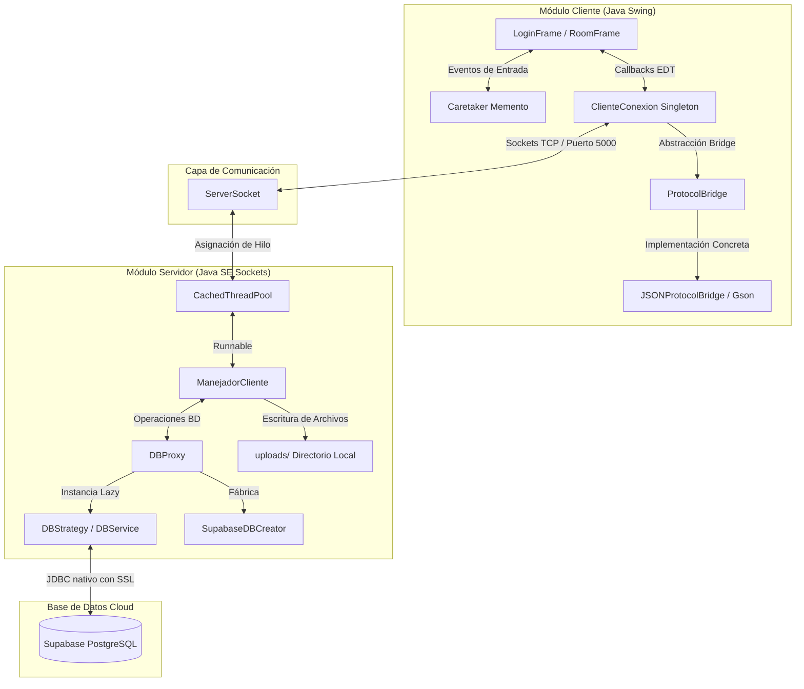

# INFORME TÉCNICO DE PROYECTO: LP2-ZOOM

> Documento académico consolidado del prototipo. Las especificaciones vivas del protocolo, despliegue y avance por fases se mantienen en la carpeta [docs/](.) (`endpoints.md`, `arquitectura.md`, `fases.md`, etc.).

---

## ÍNDICE GENERAL

*   **CAPÍTULO 1: INTRODUCCIÓN Y CONTEXTO DEL PROYECTO**
    *   **1.1.** Descripción del Problema y Necesidad Académica
    *   **1.2.** Objetivos del Prototipo Académico
    *   **1.3.** Alcance y Limitaciones del Sistema
*   **CAPÍTULO 2: REQUERIMIENTOS DEL SISTEMA**
    *   **2.1.** Requerimientos Funcionales (RF) Implementados
    *   **2.2.** Requerimientos No Funcionales (RNF) Críticos
*   **CAPÍTULO 3: DISEÑO DE LA ARQUITECTURA**
    *   **3.1.** Regla de Oro de la Arquitectura (Aislamiento de Persistencia)
    *   **3.2.** Vista General y Diagrama de Componentes (Alto Nivel)
    *   **3.3.** Arquitectura del Cliente (Threading Swing EDT vs. Hilo de Red)
    *   **3.4.** Arquitectura del Servidor (ServerSocket y CachedThreadPool)
    *   **3.5.** Sistema de Almacenamiento Local de Archivos (`uploads/`)
    *   **3.6.** Catálogo y Aplicación de los 6 Patrones de Diseño (Singleton, Strategy, Factory Method, Proxy, Memento, Bridge)
*   **CAPÍTULO 4: DISEÑO DE LA BASE DE DATOS**
    *   **4.1.** Modelo Entidad-Relación y Restricciones de Integridad
    *   **4.2.** Detalle Físico de las Tablas (Diccionario de Datos)
    *   **4.3.** Script SQL de Migración (DDL) y Semillas de Prueba (Seeds)
*   **CAPÍTULO 5: PROTOCOLO DE SOCKETS**
    *   **5.1.** Fundamentos del Protocolo TCP y Flujo de Sockets en Java SE
    *   **5.2.** Estructura de Trama JSON Estándar (`MensajeSocket`)
    *   **5.3.** Contrato de Mensajería: Catálogo y Especificación de Mensajes
    *   **5.4.** Flujo del Protocolo de Archivos Fragmentados (Chunks Base64)
    *   **5.5.** Flujo del Protocolo de Transmisión de Cámara (Frames y Estados)
*   **CAPÍTULO 6: IMPLEMENTACIÓN DE MÓDULOS CRÍTICOS**
    *   **6.1.** Módulo de Registro y Login Criptográfico (SHA-256)
    *   **6.2.** Módulo de Creación y Unión a Salas
    *   **6.3.** Módulo de Sala de Espera y Moderación
    *   **6.4.** Módulo de Chat Grupal e Historial Persistente
    *   **6.5.** Módulo de Intercambio de Archivos
    *   **6.6.** Módulo de Transmisión de Video y Cámara con Patrones de Diseño
*   **CAPÍTULO 7: PRUEBAS DEL SISTEMA Y GESTIÓN DE FALLAS**
    *   **7.1.** Escenarios de Pruebas de Integración (Casos de Éxito)
    *   **7.2.** Pruebas de Desconexión Abrupta y Recuperación de Recursos
    *   **7.3.** Evidencia y Resultados de Ejecución (Logs de Consola)
*   **CAPÍTULO 8: CONCLUSIONES Y TRABAJO FUTURO**
    *   **8.1.** Aprendizajes Técnicos y de Diseño Orientado a Objetos (POO)
    *   **8.2.** Dificultades y Retos de la Implementación
    *   **8.3.** Propuestas de Mejoras Futuras del Prototipo
*   **CAPÍTULO 9: ANEXOS Y CÓDIGO FUENTE SELECCIONADO**
    *   **9.1.** Estructura del Árbol de Directorios del Repositorio
    *   **9.2.** Código Fuente Crítico Seleccionado
    *   **9.3.** Enlace al Repositorio del Proyecto

---

# CAPÍTULO 1: INTRODUCCIÓN Y CONTEXTO DEL PROYECTO

## 1.1. Descripción del Problema y Necesidad Académica

En la actualidad, las plataformas de videoconferencia y mensajería instantánea (como Zoom, Microsoft Teams o Google Meet) representan sistemas distribuidos de altísima complejidad. Estos sistemas deben resolver desafíos críticos de concurrencia, sincronización de hilos, transmisión eficiente de datos a través de la red y persistencia consistente en tiempo real. 

Desde una perspectiva académica, el desarrollo de este tipo de aplicaciones suele abordarse utilizando frameworks modernos y bibliotecas de alto nivel (como WebSockets, servidores web empotrados, o frameworks reactivos). Si bien estas herramientas aceleran el desarrollo comercial, **ocultan e integran abstracciones** que impiden al estudiante comprender los fundamentos subyacentes de la programación de red distribuida, tales como:
1.  El manejo del flujo físico de bytes sobre canales de comunicación directa (Sockets TCP).
2.  El control manual de la concurrencia a nivel de sistema operativo y la asignación de recursos (Thread Pools).
3.  Los riesgos de congelamiento de la interfaz de usuario por el bloqueo de operaciones de red ejecutadas sobre el hilo de renderizado principal (Event Dispatch Thread).
4.  La definición y serialización de un contrato de protocolo de mensajería personalizado.

Para abordar esta brecha educativa, surge la necesidad de diseñar e implementar un prototipo académico denominado **LP2-Zoom**. Este sistema sirve como un laboratorio práctico para modelar una solución de comunicación distribuida multicliente empleando únicamente la biblioteca nativa de Java SE para la comunicación y la interfaz gráfica, conectándose a un motor de base de datos relacional en la nube de forma segura a través de un intermediario centralizado.

---

## 1.2. Objetivos del Prototipo Académico

### Objetivo General
Desarrollar un prototipo académico de videoconferencia y mensajería en tiempo real mediante el uso de Sockets TCP nativos de Java SE y persistencia en una base de datos PostgreSQL alojada en la nube (Supabase), aplicando patrones de diseño de software para lograr una arquitectura modular, desacoplada y de alto rendimiento.

### Objetivos Específicos
1.  Diseñar e implementar un protocolo de comunicación bidireccional sobre sockets TCP estructurado en tramas JSON para gestionar los flujos de autenticación, mensajería, control de salas de espera, transmisión de archivos y transmisión de video.
2.  Implementar un esquema multicliente concurrente en el servidor a través de un pool de hilos dinámico (`CachedThreadPool`) que garantice el aislamiento de recursos por cliente y prevenga condiciones de carrera.
3.  Desacoplar el renderizado gráfico en el cliente (Swing Event Dispatch Thread) de las operaciones bloqueantes de entrada/salida de red mediante un hilo de escucha en segundo plano.
4.  Aplicar de forma transversal los patrones de diseño orientados a objetos: **Singleton** (conexión de red), **Bridge** (serialización JSON), **Memento** (historial de borradores de chat), **Strategy** y **Factory Method** (persistencia y captura de video), **Proxy** (BD y cámara), y el callback **Observer** (`MensajeListener`) para desacoplar UI y red.
5.  Mantener la integridad referencial y de seguridad del sistema aislando por completo al cliente del acceso directo JDBC a la base de datos en la nube, hasheando contraseñas en el servidor.

---

## 1.3. Alcance y Limitaciones del Sistema

### Alcance Funcional e Instrumental
El sistema implementado cubre el siguiente alcance:
1.  **Módulo de Autenticación:** Registro (`RegisterFrame`) y login (`LoginFrame`) con hash SHA-256 aplicado en el servidor antes de persistir o validar credenciales.
2.  **Gestión Dinámica de Salas:** Creación de salas con identificadores de 6 caracteres únicos generados aleatoriamente.
3.  **Control de Admisión (Sala de Espera):** Cola de espera en tiempo real que permite al anfitrión (*Host*) admitir o rechazar invitados de forma interactiva antes de dar inicio a la reunión.
4.  **Chat Grupal Interactivo:** Mensajería instantánea de texto con carga de historial persistente bajo demanda (`REQUEST_HISTORY`).
5.  **Carga y Descarga de Archivos Compartidos:** Transferencia fragmentada de archivos binarios convertidos a Base64 para evitar la saturación de memoria, almacenándolos físicamente en el servidor e indexando sus metadatos en Supabase.
6.  **Transmisión de Video en Red:** Captura de la cámara web física del usuario o conmutación automática hacia un simulador de video dinámico utilizando patrones de diseño, transmitiendo fotogramas comprimidos a través del socket.

### Limitaciones (Fuera de Alcance)
*   El prototipo no incluye transmisión de audio (Voz sobre IP).
*   No está diseñado para soportar encriptación de extremo a extremo (E2EE) ni TLS en el canal cliente-servidor local; las contraseñas viajan en texto plano dentro del JSON del socket. El cifrado SSL aplica a la conexión JDBC con Supabase.
*   No cuenta con conexión directa punto a punto entre clientes (Peer-to-Peer); todo el flujo transita y se consolida a través del servidor central de sockets.

---

# CAPÍTULO 2: REQUERIMIENTOS DEL SISTEMA

Este capítulo especifica las capacidades funcionales requeridas del prototipo **LP2-Zoom**, así como las condiciones de calidad y restricciones tecnológicas bajo las cuales el sistema debe operar.

## 2.1. Requerimientos Funcionales (RF) Implementados

Los requerimientos funcionales detallan las acciones específicas que el sistema realiza en respuesta a las interacciones de los usuarios.

```
+----------------------------------------------------------------------------------+
|                              CATÁLOGO DE REQUERIMIENTOS                          |
+---------+----------------------------+-------------------------------------------+
| ID      | Requerimiento              | Descripción                               |
+---------+----------------------------+-------------------------------------------+
| RF-01   | Registro de Usuarios       | Creación de cuentas con correo y clave    |
| RF-02   | Inicio de Sesión (Login)   | Autenticación asíncrona de credenciales   |
| RF-03   | Creación de Salas (Host)   | Generación de sala y código de 6 letras   |
| RF-04   | Solicitud de Unión a Sala  | Postulación de invitados mediante código  |
| RF-05   | Cola de Espera Reactiva    | Visualización de postulantes en el Host   |
| RF-06   | Moderación de Solicitudes  | Botones para Admitir o Rechazar invitados |
| RF-07   | Inicio Controlado de Sala  | Retención de invitados hasta inicio Host  |
| RF-08   | Chat Grupal en Tiempo Real | Difusión de mensajes en la sala activa    |
| RF-09   | Historial de Chat          | Carga histórica de mensajes anteriores    |
| RF-10   | Carga de Archivos (Chunks) | Subida binaria fraccionada en Base64      |
| RF-11   | Descarga de Archivos       | Obtención y reconstrucción de archivos    |
| RF-12   | Captura de Video / Webcam  | Captura de frames o render de simulación  |
| RF-13   | Retransmisión de Stream    | Difusión de frames de video a la sala     |
+---------+----------------------------+-------------------------------------------+
```

### RF-01: Registro de Usuarios
*   **Descripción:** Permite a nuevos usuarios crear una cuenta ingresando su nombre, correo electrónico y contraseña desde `RegisterFrame`.
*   **Actores:** Usuario Invitado.
*   **Entrada:** Nombres (`fullName`), correo electrónico (único, en `userName`) y contraseña (en `message`).
*   **Proceso:** El cliente envía la trama `REGISTER_REQUEST`. El servidor verifica con `existeCorreo()` que el correo no esté registrado, aplica hash SHA-256 en `DBService.registrar()` y persiste el usuario con rol `USUARIO`.
*   **Salida:** Trama `REGISTER_RESPONSE` con `"SUCCESS"`, `"EMAIL_ALREADY_EXISTS"` o mensaje de error.

### RF-02: Inicio de Sesión (Login)
*   **Descripción:** Valida las credenciales de los usuarios registrados para permitir el acceso al panel principal.
*   **Actores:** Usuario Registrado.
*   **Entrada:** Correo electrónico (`userName`) y contraseña en texto plano (`message`).
*   **Proceso:** El cliente envía `LOGIN_REQUEST` sin hashear localmente. El servidor recibe la contraseña, calcula SHA-256 en `DBService.login()` y compara el hash con el almacenado en Supabase.
*   **Salida:** Trama `LOGIN_RESPONSE` con `"SUCCESS"` (incluye `userId` y `userName`) o mensaje de error; transición a la vista de salas.

### RF-03: Creación de Salas (Host)
*   **Descripción:** Permite a un usuario autenticado inicializar una nueva sala de videoconferencia, convirtiéndolo en el anfitrión (*Host*).
*   **Actores:** Anfitrión (*Host*).
*   **Entrada:** Petición de creación con el nombre descriptivo de la reunión.
*   **Proceso:** El servidor genera un código alfanumérico aleatorio y único de 6 caracteres (ej. `A1B2C3`), crea el registro en `Salas`, asigna al usuario como `IdHost` y lo registra de inmediato en `ParticipantesSala` con estado `ACTIVO`.
*   **Salida:** Respuesta `CREATE_ROOM` con `roomCode` y `message: "SUCCESS"`; apertura del panel de moderación del Host.

### RF-04: Solicitud de Unión a Salas (Invitado)
*   **Descripción:** Permite a un participante solicitar el ingreso a una sala activa mediante la digitación de su código único de 6 caracteres.
*   **Actores:** Invitado.
*   **Entrada:** Código de sala (6 caracteres).
*   **Proceso:** El servidor comprueba la existencia y estado de la sala. Si es válida, inserta una solicitud en estado `PENDIENTE` en `SolicitudesSala`, responde `JOIN_ROOM_RESPONSE` con `"PENDIENTE"` y notifica al Host con `WAITING_ROOM_UPDATE`.
*   **Salida:** Interfaz del invitado en pantalla de espera, o error si la sala no existe.

### RF-05: Cola de Espera Reactiva (Host)
*   **Descripción:** El panel de moderación del Host lista en tiempo real y dinámicamente a todos los participantes con solicitudes en estado `PENDIENTE`.
*   **Actores:** Anfitrión (*Host*).
*   **Entrada:** Eventos de red entrantes (`JOIN_ROOM_REQUEST`).
*   **Proceso:** El servidor intercepta cada solicitud de unión, actualiza la base de datos y envía una trama de actualización `WAITING_ROOM_UPDATE` al Host para repoblar su lista visual sin requerir recargas manuales.
*   **Salida:** Lista gráfica actualizada de aspirantes en la pantalla del Host.

### RF-06: Moderación de Solicitudes (Aceptar / Rechazar)
*   **Descripción:** El Host tiene la potestad de admitir (Aceptar) o declinar (Rechazar) a cada participante de la cola.
*   **Actores:** Anfitrión (*Host*).
*   **Entrada:** Acción de clic sobre los botones "Admitir" o "Rechazar" para un usuario específico.
*   **Proceso:** El Host envía `ADMIT_USER` con `message: "ACEPTAR"` o `"RECHAZAR"`. El servidor actualiza `SolicitudesSala` a `ACEPTADO` o `RECHAZADO` y notifica al invitado con `ADMIT_USER` y `message: "ACCEPTED"` o `"REJECTED"`.
*   **Salida:** El invitado admitido pasa a la pantalla UI `INVITADO_ADMITIDO`; el rechazado regresa al selector de salas.

### RF-07: Sincronización e Inicio Controlado de la Reunión
*   **Descripción:** Ningún invitado admitido puede visualizar el área de trabajo de la reunión (video, chat, archivos) hasta que el Host dé inicio oficial.
*   **Actores:** Anfitrión (*Host*), Invitado Admitido.
*   **Entrada:** Evento de inicio del Host ("Iniciar Reunión").
*   **Proceso:** El Host envía `START_MEETING_REQUEST`. El servidor valida que el emisor sea el Host y difunde `MEETING_STARTED` con `message: "STARTED"` al Host y a los usuarios registrados en `ParticipantesSala` con estado `ACTIVO`.
*   **Salida:** Transición mediante `CardLayout` a la pantalla `REUNION` en los clientes que reciben `MEETING_STARTED`.

### RF-08: Chat Grupal en Tiempo Real
*   **Descripción:** Habilita un chat de texto grupal para que los participantes activos se comuniquen de forma instantánea.
*   **Actores:** Todos los miembros activos de la sala.
*   **Entrada:** Mensajes de texto digitados por el usuario.
*   **Proceso:** El cliente envía la trama `CHAT_MESSAGE`. El servidor almacena el mensaje concurrentemente en la tabla `Mensajes` y lo difunde a todos los participantes conectados a esa sala específica.
*   **Salida:** Visualización inmediata del mensaje en los paneles de chat de todos los miembros.

### RF-09: Historial de Chat Persistente
*   **Descripción:** Los participantes que ingresan a una sala ven automáticamente los mensajes que se enviaron previamente en ella.
*   **Actores:** Todos los miembros al momento del ingreso.
*   **Entrada:** Transición del cliente a la pantalla de reunión activa (`entrarAReunion()`).
*   **Proceso:** El cliente envía `CHAT_MESSAGE` con `message: "REQUEST_HISTORY"`. El servidor consulta `Mensajes` filtrada por sala y reenvía cada mensaje histórico como trama `CHAT_MESSAGE` individual al solicitante, sin retransmitir ni persistir ese comando.
*   **Salida:** Área de chat precargada con el historial de la reunión.

### RF-10: Carga de Archivos Compartidos en Chunks (Base64)
*   **Descripción:** Permite compartir archivos de hasta 5 MB segmentándolos en fragmentos binarios para no saturar los sockets de red.
*   **Actores:** Miembros activos.
*   **Entrada:** Archivo seleccionado desde el disco local.
*   **Proceso:** El cliente fragmenta el archivo en bloques de 64 KB, los codifica en Base64 y los envía mediante tramas `FILE_START`, `FILE_CHUNK` y `FILE_END`. El servidor recibe los chunks, decodifica el binario, lo almacena físicamente en el directorio `uploads/` y registra sus metadatos (nombre, ruta, autor) en la base de datos.
*   **Salida:** Indicador de progreso en el cliente y listado del nuevo archivo en la sala.

### RF-11: Catálogo y Descarga de Archivos Compartidos
*   **Descripción:** Lista los archivos compartidos en la sala y permite su descarga y reconstrucción local.
*   **Actores:** Miembros activos.
*   **Entrada:** Selección de archivo y ruta de guardado en el sistema de archivos local.
*   **Proceso:** El cliente envía `GET_FILES_REQUEST` y recibe `GET_FILES_RESPONSE`. Al descargar, emite `FILE_DOWNLOAD_REQUEST`; el servidor valida la ruta dentro de `uploads/` y transmite el binario con la secuencia `FILE_START`, `FILE_CHUNK` y `FILE_END` (misma fase inversa a la subida).
*   **Salida:** Archivo reconstruido físicamente en la máquina local del cliente.

### RF-12: Captura y Envío de Video de Cámara (Webcam/Simulación)
*   **Descripción:** El cliente captura fotogramas periódicos de la cámara local o genera cuadros simulados con patrones interactivos si no se cuenta con webcam.
*   **Actores:** Miembros activos.
*   **Entrada:** Flujo de hardware de la webcam o temporizador del simulador.
*   **Proceso:** Captura imágenes individuales, las escala a 320x240 píxeles, aplica compresión JPEG de calidad controlada, las convierte a Base64 y las envía como tramas `CAMERA_FRAME` a través del socket.
*   **Salida:** Transmisión recurrente de frames (de 3 a 10 FPS).

### RF-13: Retransmisión de Stream y Renderizado Multiusuario
*   **Descripción:** Recibe los streams de video de cada participante activo y los pinta en paneles dinámicos asignados a cada usuario.
*   **Actores:** Todos los miembros activos.
*   **Entrada:** Tramas de video entrantes (`CAMERA_FRAME`) desde el servidor.
*   **Proceso:** El servidor retransmite `CAMERA_FRAME` y `CAMERA_STATE` a los demás miembros de la sala, **excluyendo al emisor**. El cliente decodifica Base64 en un pool daemon (`videoDecoderExecutor`) y pinta el frame en el EDT de Swing.
*   **Salida:** Visualización fluida del flujo de video de los participantes en la cuadrícula de Swing.

---

## 2.2. Requerimientos No Funcionales (RNF) Críticos

Los requerimientos no funcionales definen las restricciones de rendimiento, confiabilidad, modularidad, portabilidad y seguridad que rigen la operación técnica del sistema.

### RNF-01: Concurrencia y Baja Latencia (Rendimiento)
*   **Descripción:** El servidor de sockets procesa múltiples clientes en simultáneo sin causar retrasos en la entrega de tramas (latencia de chat < 100 ms).
*   **Mecanismo:** Pool de hilos dinámico `CachedThreadPool` mediante `java.util.concurrent.ExecutorService`. Cada cliente es asignado a un hilo de ejecución independiente (`ManejadorCliente`), liberando al hilo principal para seguir aceptando nuevas conexiones.

### RNF-02: Responsividad Visual y Desacoplamiento de Hilos (Usabilidad)
*   **Descripción:** La interfaz gráfica del cliente (Swing) no se bloquea ("congela") al realizar lecturas o escrituras en la red TCP.
*   **Mecanismo:** Aislamiento estricto de hilos. La lectura en el socket se ejecuta de forma asíncrona y continua en un hilo secundario (`escucharServidor` en `ClienteConexion`). Las modificaciones de la interfaz gráfica se despachan al Event Dispatch Thread (EDT) utilizando `SwingUtilities.invokeLater(...)`.

### RNF-03: Seguridad en Datos Sensibles e Interacción
*   **Descripción:** Las contraseñas no se almacenan en texto plano en la base de datos, y la conexión JDBC a Supabase es cifrada.
*   **Mecanismo:** Hasheo SHA-256 aplicado **en el servidor** al registrar (`DBService.registrar`) y al autenticar (`DBService.login`). El cliente envía la contraseña en texto plano dentro del payload JSON del socket local (sin E2EE). El cliente nunca accede a la base de datos; el servidor usa JDBC con `sslmode=require`.

### RNF-04: Confiabilidad y Gestión Limpia de Recursos
*   **Descripción:** El sistema maneja desconexiones imprevistas (caídas de internet o cierres forzados) sin dejar sockets "zombis" o hilos abiertos en el servidor.
*   **Mecanismo:** Bloques `try-catch-finally` en `ManejadorCliente`. Al detectar fin de lectura, `desconectar()` remueve al usuario de `clientesActivos`, emite `LEAVE_ROOM` y `CAMERA_STATE "OFF"`, actualiza la solicitud a `RECHAZADO` en BD y difunde un mensaje de sistema por chat antes de cerrar el socket.

### RNF-05: Alta Mantenibilidad mediante Patrones de Diseño (Modularidad)
*   **Descripción:** El código del prototipo está estructurado bajo patrones de diseño orientados a objetos que reducen el acoplamiento y facilitan la extensión.
*   **Mecanismo:**
    *   **Singleton:** Instancia única para coordinar la transmisión en `ClienteConexion`.
    *   **Bridge:** Desacopla la transmisión física (`ClienteConexion`) del formato de serialización (`ProtocolBridge` / `JSONProtocolBridge`).
    *   **Memento:** Guarda estados de edición previos del chat input (`ChatInputMemento` y `ChatHistoryCaretaker`) para navegar en el historial con flechas direccionales.
    *   **Strategy, Factory Method y Proxy:** Estructuran el motor de base de datos en el servidor y la captura de video en el cliente.
    *   **Observer (callback):** `ClienteConexion.MensajeListener` desacopla la recepción de tramas de las pantallas Swing (`LoginFrame`, `RegisterFrame`, `RoomFrame`).

### RNF-06: Portabilidad y Dependencias Controladas
*   **Descripción:** La aplicación funciona sin frameworks de servidor web ni contenedores empotrados; el backend usa Java SE nativo.
*   **Mecanismo:** Proyecto Maven con Java 17+. El servidor depende de Gson y el driver PostgreSQL. El cliente añade `webcam-capture`, JNA y SLF4J para captura de cámara física, manteniendo Swing y sockets como núcleo de la UI y la red.

---

# CAPÍTULO 3: DISEÑO DE LA ARQUITECTURA

Este capítulo describe los fundamentos arquitectónicos del sistema **LP2-Zoom**, detallando la concurrencia multihilo, el flujo de red, y la distribución e interacción de capas lógicas.

---

## 3.1. Regla de Oro de la Arquitectura (Aislamiento de Persistencia)

El diseño de **LP2-Zoom** se rige por un principio estricto de desacoplamiento de capas y seguridad de la información. El cliente **bajo ninguna circunstancia** realiza conexiones directas a la base de datos (Supabase/PostgreSQL). 

```
[Cliente Swing (Sin credenciales)]
             │
             ▼ (Trama JSON a través de Socket TCP)
[Servidor de Sockets (MainServidor)] ◄─── (Carga Credenciales y Drivers)
             │
             ▼ (JDBC seguro / SSL)
  [Supabase PostgreSQL Cloud]
```

### Justificación de la Regla de Oro
1.  **Seguridad y Ofuscación:** Si los clientes realizaran consultas directas mediante JDBC, el instalador del cliente debería incluir las credenciales de conexión (host, puerto, usuario, contraseña) expuestas a descompilación.
2.  **Modularidad:** Si el motor de base de datos migra de PostgreSQL a un motor NoSQL (como MongoDB) o un servicio externo, el cliente no requiere ninguna actualización ni modificación en su código de red; el cambio se aísla por completo en el backend.
3.  **Control de Flujos:** El servidor centraliza las reglas de negocio (por ejemplo, validar si una sala está llena o si un usuario realmente ha sido admitido antes de permitirle enviar chats o video).

---

## 3.2. Vista General y Diagrama de Componentes (Alto Nivel)

El sistema se compone de tres capas principales distribuidas: la Capa de Interfaz y Red en el Cliente, la Capa Orquestadora Concurrente en el Servidor y la Capa de Persistencia en la Nube.



---

## 3.3. Arquitectura del Cliente (Threading Swing EDT vs. Hilo de Red)

La biblioteca gráfica de Java (Swing) es monocanal (*Single-Threaded*). Toda actualización de la pantalla debe realizarse en un hilo especializado controlado por el sistema operativo, denominado **Event Dispatch Thread (EDT)**.

### El Conflicto de Bloqueo
Si un cliente realizara operaciones de lectura bloqueante (`socket.getInputStream().read()`) en el hilo de la UI (EDT), la pantalla se congelaría de inmediato (estado "No Responde") hasta recibir datos de la red.

### Solución mediante Hilos Asíncronos
Para resolver esto, la arquitectura del cliente implementa dos flujos de ejecución en paralelo:
1.  **Hilo de Escucha (Background Thread):** Al inicializarse el cliente, el Singleton `ClienteConexion` arranca el hilo `HiloEscuchaCliente` encargado exclusivamente de la lectura bloqueante del stream de red en un bucle continuo.
2.  **Hilo Gráfico (EDT):** Cuando el hilo secundario recibe y deserializa una trama, no actualiza la UI directamente. Despacha la tarea al EDT mediante `SwingUtilities.invokeLater()`.

### Patrón Observer (Callback de Red)
Las pantallas implementan `ClienteConexion.MensajeListener` (`onMensajeRecibido`, `onDesconexion`). El hilo de escucha notifica a la UI registrada sin acoplar `ClienteConexion` a Swing, permitiendo que `LoginFrame`, `RegisterFrame` y `RoomFrame` reaccionen de forma independiente.

### Pool de Decodificación de Video
Para evitar bloquear el hilo lector del socket al procesar fotogramas JPEG, `RoomFrame` delega la decodificación Base64 a un `ExecutorService` daemon (`videoDecoderExecutor`) y solo pinta la imagen resultante en el EDT.

---

## 3.4. Arquitectura del Servidor (ServerSocket y CachedThreadPool)

El servidor central de sockets de **LP2-Zoom** escucha de manera continua en el puerto `5000`. Al recibir un cliente físico, debe administrar su sesión de red sin interrumpir a los demás participantes.

### Implementación del Thread Pool
En lugar de crear un hilo físico manualmente por cada cliente, se utiliza el pool de hilos dinámico (`CachedThreadPool`) de Java:

```java
ExecutorService threadPool = Executors.newCachedThreadPool();
```

### Flujo de Concurrencia
1.  El hilo principal ejecuta `serverSocket.accept()` de forma bloqueante.
2.  Al conectarse un cliente, se instancia `ManejadorCliente(socket)` que implementa `Runnable`.
3.  El `ManejadorCliente` se envía al `CachedThreadPool`.
4.  El pool asigna un hilo libre de su caché para ejecutar el método `run()` del manejador, o crea uno nuevo si todos están ocupados. Si un hilo queda ocioso por más de 60 segundos, se destruye automáticamente para liberar recursos.
5.  El manejador mantiene un bucle que procesa las tramas JSON entrantes y consulta de forma concurrente al Proxy de Base de Datos.

---

## 3.5. Sistema de Almacenamiento Local de Archivos (`uploads/`)

La compartición de archivos entre usuarios requiere una estrategia de almacenamiento híbrido para evitar degradar el rendimiento de la base de datos relacional.

*   **Los Archivos Físicos:** Se escriben directamente en un directorio local del servidor llamado `uploads/`. La transferencia viaja segmentada en chunks codificados en Base64 para prevenir desbordamientos de la memoria de la JVM.
*   **Los Metadatos:** En Supabase solo se indexa la información de control del archivo a través de la tabla `ArchivosCompartidos` (nombre, tamaño aproximado, ruta física en el servidor, usuario que lo subió y la sala correspondiente).
*   **El Flujo de Descarga:** Cuando un usuario solicita descargar un archivo, el servidor valida la ruta canónica dentro de `uploads/`, lee el binario del disco y lo reenvía al cliente con la misma secuencia `FILE_START` → `FILE_CHUNK` → `FILE_END`.

### Conexión JDBC Persistente (`ConexionBD`)
Para reducir la latencia del handshake SSL con Supabase, `ConexionBD` mantiene una conexión física singleton y expone un **proxy dinámico** de Java que intercepta llamadas a `close()`, evitando que los bloques `try-with-resources` de JDBC cierren el socket de red en cada consulta.

---

## 3.6. Catálogo y Aplicación de los 6 Patrones de Diseño

El sistema aplica de manera estricta y transversal **6 patrones de diseño** de la ingeniería de software para estructurar la lógica de negocio, red y persistencia.

### 1. Patrón Singleton
*   **Clase Aplicada:** [ClienteConexion.java](../Cliente/src/main/java/network/ClienteConexion.java)
*   **Propósito:** Asegurar que exista una única conexión física TCP abierta entre el cliente y el servidor durante todo el ciclo de vida de la aplicación, proporcionando un punto de acceso global.
*   **Uso en Código:**
    ```java
    private static ClienteConexion instancia;
    private ClienteConexion() { ... } // Constructor privado
    public static synchronized ClienteConexion getInstancia() {
        if (instancia == null) instancia = new ClienteConexion();
        return instancia;
    }
    ```

### 2. Patrón Bridge
*   **Clases Aplicadas:** [ProtocolBridge.java](../Cliente/src/main/java/network/bridge/ProtocolBridge.java), [JSONProtocolBridge.java](../Cliente/src/main/java/network/bridge/JSONProtocolBridge.java), y la abstracción `ClienteConexion`.
*   **Propósito:** Desacoplar la abstracción de transmisión de red de la implementación concreta de serialización de mensajes (JSON utilizando la biblioteca Gson).
*   **Uso en Código:** `ClienteConexion` contiene una referencia a la interfaz `ProtocolBridge`. Toda serialización y deserialización se delega a ella, lo que permite cambiar el formato de mensajería (de JSON a XML o binario) sin alterar el socket TCP ni la interfaz Swing.

### 3. Patrón Memento
*   **Clases Aplicadas:** [ChatInputMemento.java](../Cliente/src/main/java/UI/memento/ChatInputMemento.java), [ChatHistoryCaretaker.java](../Cliente/src/main/java/UI/memento/ChatHistoryCaretaker.java), e integrador gráfico [RoomFrame.java](../Cliente/src/main/java/UI/RoomFrame.java).
*   **Propósito:** Capturar y guardar el estado interno de un cuadro de texto (el borrador escrito del chat) para permitir al usuario recuperarlo navegando hacia atrás o adelante con las flechas direccionales (Arriba/Abajo) en la UI.
*   **Uso en Código:**
    *   **Memento:** Guarda el texto escrito (`ChatInputMemento`).
    *   **Caretaker:** Mantiene la pila de mementos (`ChatHistoryCaretaker`).
    *   **Originator:** La caja de texto de `RoomFrame` guarda y restaura el estado a través del listener de teclas.

### 4. Patrón Strategy
*   **Clases Aplicadas:** [DBStrategy.java](../Servidor/src/main/java/database/DBStrategy.java), [DBService.java](../Servidor/src/main/java/database/DBService.java), [CameraStrategy.java](../Cliente/src/main/java/network/camera/CameraStrategy.java), [PhysicalCameraStrategy.java](../Cliente/src/main/java/network/camera/PhysicalCameraStrategy.java) y [SimulatedCameraStrategy.java](../Cliente/src/main/java/network/camera/SimulatedCameraStrategy.java).
*   **Propósito:** Encapsular algoritmos intercambiables tanto en persistencia (BD) como en captura de video (cámara física vs. simulador).
*   **Uso en Código:** `DBStrategy`/`DBService` en el servidor; `CameraStrategy` con implementaciones física y simulada en el cliente. `ManejadorCliente` y `RoomFrame` dependen de las abstracciones, no de implementaciones concretas.

### 5. Patrón Factory Method
*   **Clases Aplicadas:** [DBCreator.java](../Servidor/src/main/java/database/DBCreator.java), [SupabaseDBCreator.java](../Servidor/src/main/java/database/SupabaseDBCreator.java), [CameraCreator.java](../Cliente/src/main/java/network/camera/CameraCreator.java), [PhysicalCameraCreator.java](../Cliente/src/main/java/network/camera/PhysicalCameraCreator.java) y [SimulatedCameraCreator.java](../Cliente/src/main/java/network/camera/SimulatedCameraCreator.java).
*   **Propósito:** Delegar la instanciación de estrategias concretas (BD Supabase, cámara física o simulada) a creadores especializados.
*   **Uso en Código:** `SupabaseDBCreator.createDatabase()` retorna `DBService`; `PhysicalCameraCreator` y `SimulatedCameraCreator` producen sus respectivas estrategias de video.

### 6. Patrón Proxy
*   **Clases Aplicadas:** [DBProxy.java](../Servidor/src/main/java/database/DBProxy.java), [CameraProxy.java](../Cliente/src/main/java/network/camera/CameraProxy.java) y el proxy dinámico JDBC en [ConexionBD.java](../Servidor/src/main/java/database/ConexionBD.java).
*   **Propósito:** Intermediar el acceso a recursos costosos (BD, cámara, conexión JDBC) añadiendo lazy-load, auditoría y tolerancia a fallos.
*   **Uso en Código:** `DBProxy` implementa `DBStrategy` y envuelve la base de datos real.
    *   **Virtual Proxy:** Carga perezosamente la conexión JDBC real solo cuando se realiza la primera consulta del servidor, acelerando el arranque del programa.
    *   **Logging Proxy:** Intercepta cada llamada a métodos de base de datos e imprime en consola del servidor información de depuración detallando la consulta en curso.
*   **Uso en Código (Cámara):** `CameraProxy` envuelve la estrategia de captura con inicialización perezosa, control de permisos, logging y fallback automático al simulador si falla el hardware.

---

# CAPÍTULO 4: DISEÑO DE LA BASE DE DATOS

Este capítulo detalla la estructura lógica y física de la base de datos relacional PostgreSQL alojada en la nube (Supabase) para el proyecto **LP2-Zoom**.

---

## 4.1. Modelo Entidad-Relación y Restricciones de Integridad

El motor de persistencia del sistema está modelado bajo la tercera forma normal (3FN) para evitar anomalías de inserción, actualización o borrado, estructurando la comunicación a nivel relacional en torno a los usuarios, las reuniones y los recursos compartidos.

### Diagrama Entidad-Relación (ER)
El siguiente esquema muestra las dependencias y la cardinalidad entre las entidades principales:

```mermaid
erDiagram
    USUARIOS ||--o{ SALAS : "crea (Host)"
    USUARIOS ||--o{ PARTICIPANTES_SALA : "ingresa"
    USUARIOS ||--o{ SOLICITUDES_SALA : "postula"
    USUARIOS ||--o{ MENSAJES : "escribe"
    USUARIOS ||--o{ ARCHIVOS_COMPARTIDOS : "comparte"

    SALAS ||--o{ PARTICIPANTES_SALA : "contiene"
    SALAS ||--o{ SOLICITUDES_SALA : "evalua"
    SALAS ||--o{ MENSAJES : "almacena"
    SALAS ||--o{ ARCHIVOS_COMPARTIDOS : "agrupa"

    USUARIOS {
        int IdUsuario PK
        varchar Nombres
        varchar Correo UK
        varchar PasswordHash
        varchar Rol
    }
    SALAS {
        int IdSala PK
        varchar CodigoSala UK
        varchar Nombre
        int IdHost FK
        varchar Estado
    }
    PARTICIPANTES_SALA {
        int IdParticipante PK
        int IdSala FK
        int IdUsuario FK
        varchar Estado
        timestamp FechaIngreso
    }
    SOLICITUDES_SALA {
        int IdSolicitud PK
        int IdSala FK
        int IdUsuario FK
        varchar Estado
        timestamp FechaSolicitud
    }
    MENSAJES {
        int IdMensaje PK
        int IdSala FK
        int IdUsuario FK
        text Contenido
        timestamp FechaEnvio
    }
    ARCHIVOS_COMPARTIDOS {
        int IdArchivo PK
        int IdSala FK
        int IdUsuario FK
        varchar NombreArchivo
        varchar RutaArchivo
        timestamp FechaSubida
    }
```



### Restricciones de Integridad Críticas
1.  **Claves Foráneas con Borrado en Cascada (`ON DELETE CASCADE`):** Si una sala o un usuario se eliminan del sistema, todas las entidades asociadas de forma débil (mensajes de chat, registros de solicitudes de espera, participantes activos e índices de archivos compartidos) se eliminan automáticamente del motor PostgreSQL para evitar registros huérfanos.
2.  **Restricción Única de Sesión en Salas (`uq_sala_usuario`):** Impide que un mismo usuario se registre más de una vez de manera concurrente en los listados históricos o activos de una sala de reunión (`ParticipantesSala`).
3.  **Restricción Única en Cola de Espera (`uq_solicitud_sala_usuario`):** Garantiza que un invitado solo pueda poseer una postulación activa en estado pendiente en la tabla `SolicitudesSala`, evitando el desbordamiento de notificaciones al panel del Host.
4.  **Generación Automática de Tiempos (`DEFAULT CURRENT_TIMESTAMP`):** Las marcas de tiempo de ingreso de miembros, envío de mensajes y cargas de archivos son generadas por el motor PostgreSQL de Supabase en el huso UTC, previniendo alteraciones de hora local por parte del cliente.

---

## 4.2. Detalle Físico de las Tablas (Diccionario de Datos)

A continuación, se detalla la definición física de cada una de las tablas del esquema.

### 1. Tabla: `Usuarios`
Almacena la información de cuenta de los usuarios de la plataforma.

| Campo | Tipo de Dato | Nulidad | Restricciones | Descripción |
| :--- | :--- | :--- | :--- | :--- |
| **`IdUsuario`** | `SERIAL` | `NOT NULL` | `PRIMARY KEY` | Identificador autoincremental de usuario. |
| **`Nombres`** | `VARCHAR(150)` | `NOT NULL` | | Nombres y apellidos completos. |
| **`Correo`** | `VARCHAR(150)` | `NOT NULL` | `UNIQUE` | Correo electrónico institucional / personal. |
| **`PasswordHash`**| `VARCHAR(255)` | `NOT NULL` | | Hash irreversible de contraseña (SHA-256). |
| **`Rol`** | `VARCHAR(50)` | `NOT NULL` | `DEFAULT 'USUARIO'`| Rol dentro del sistema (HOST, INVITADO). |

### 2. Tabla: `Salas`
Registra las reuniones de videoconferencia creadas en la plataforma.

| Campo | Tipo de Dato | Nulidad | Restricciones | Descripción |
| :--- | :--- | :--- | :--- | :--- |
| **`IdSala`** | `SERIAL` | `NOT NULL` | `PRIMARY KEY` | Identificador autoincremental de la reunión. |
| **`CodigoSala`** | `VARCHAR(10)` | `NOT NULL` | `UNIQUE` | Código de 6 letras/números generado por el Host. |
| **`Nombre`** | `VARCHAR(150)` | `NOT NULL` | | Título o descripción temática de la sala. |
| **`IdHost`** | `INT` | `NOT NULL` | `FOREIGN KEY` (Usuarios)| Referencia al creador (Host). Borrado en cascada.|
| **`Estado`** | `VARCHAR(50)` | `NOT NULL` | `DEFAULT 'ACTIVA'` | Estado de la sala (ACTIVA, FINALIZADA). |

### 3. Tabla: `ParticipantesSala`
Registra la relación de miembros que han ingresado activamente a una reunión.

| Campo | Tipo de Dato | Nulidad | Restricciones | Descripción |
| :--- | :--- | :--- | :--- | :--- |
| **`IdParticipante`**| `SERIAL` | `NOT NULL` | `PRIMARY KEY` | Identificador único del participante en la sala. |
| **`IdSala`** | `INT` | `NOT NULL` | `FOREIGN KEY` (Salas) | Referencia a la sala asociada. Borrado en cascada. |
| **`IdUsuario`** | `INT` | `NOT NULL` | `FOREIGN KEY` (Usuarios)| Referencia al usuario ingresado. Borrado en cascada.|
| **`Estado`** | `VARCHAR(50)` | `NOT NULL` | `DEFAULT 'ACTIVO'`| Estado de presencia (ACTIVO, SALIÓ). |
| **`FechaIngreso`**| `TIMESTAMP` | `NOT NULL` | `DEFAULT NOW()` | Fecha y hora exacta de incorporación a la sala. |

### 4. Tabla: `SolicitudesSala`
Administra la lista de usuarios en cola de admisión esperando respuesta del Host.

| Campo | Tipo de Dato | Nulidad | Restricciones | Descripción |
| :--- | :--- | :--- | :--- | :--- |
| **`IdSolicitud`** | `SERIAL` | `NOT NULL` | `PRIMARY KEY` | Identificador único de postulación. |
| **`IdSala`** | `INT` | `NOT NULL` | `FOREIGN KEY` (Salas) | Referencia a la sala objetivo. Borrado en cascada. |
| **`IdUsuario`** | `INT` | `NOT NULL` | `FOREIGN KEY` (Usuarios)| Referencia al usuario en espera. Borrado en cascada.|
| **`Estado`** | `VARCHAR(50)` | `NOT NULL` | `DEFAULT 'PENDIENTE'`| Estado del flujo (PENDIENTE, ACEPTADO, RECHAZADO).|
| **`FechaSolicitud`**| `TIMESTAMP` | `NOT NULL` | `DEFAULT NOW()` | Fecha y hora de envío de la solicitud. |

### 5. Tabla: `Mensajes`
Registra el historial de mensajería instantánea grupal de las reuniones.

| Campo | Tipo de Dato | Nulidad | Restricciones | Descripción |
| :--- | :--- | :--- | :--- | :--- |
| **`IdMensaje`** | `SERIAL` | `NOT NULL` | `PRIMARY KEY` | Identificador único del mensaje escrito. |
| **`IdSala`** | `INT` | `NOT NULL` | `FOREIGN KEY` (Salas) | Referencia a la sala correspondiente. Borrado en cascada. |
| **`IdUsuario`** | `INT` | `NOT NULL` | `FOREIGN KEY` (Usuarios)| Referencia al emisor del mensaje. Borrado en cascada. |
| **`Contenido`** | `TEXT` | `NOT NULL` | | Texto plano digitado por el usuario. |
| **`FechaEnvio`** | `TIMESTAMP` | `NOT NULL` | `DEFAULT NOW()` | Fecha y hora exacta de retransmisión. |

### 6. Tabla: `ArchivosCompartidos`
Guarda el catálogo y metadatos de los documentos y archivos subidos.

| Campo | Tipo de Dato | Nulidad | Restricciones | Descripción |
| :--- | :--- | :--- | :--- | :--- |
| **`IdArchivo`** | `SERIAL` | `NOT NULL` | `PRIMARY KEY` | Identificador único del archivo. |
| **`IdSala`** | `INT` | `NOT NULL` | `FOREIGN KEY` (Salas) | Referencia a la sala contenedora. Borrado en cascada. |
| **`IdUsuario`** | `INT` | `NOT NULL` | `FOREIGN KEY` (Usuarios)| Referencia al usuario cargador. Borrado en cascada. |
| **`NombreArchivo`**| `VARCHAR(255)` | `NOT NULL` | | Nombre original del documento (ej. `tarea.pdf`). |
| **`RutaArchivo`** | `VARCHAR(500)` | `NOT NULL` | | Ruta de almacenamiento físico en el servidor. |
| **`FechaSubida`** | `TIMESTAMP` | `NOT NULL` | `DEFAULT NOW()` | Fecha y hora exacta del ensamblado final. |

---

## 4.3. Script SQL de Migración (DDL) y Semillas de Prueba (Seeds)

El siguiente script en SQL nativo limpia las preexistencias de tablas e inicializa el modelo completo de datos en Supabase, incorporando registros iniciales de prueba (con claves pre-hasheadas en SHA-256 correspondientes a la contraseña `'123456'`).

```sql
-- ========================================================
-- SCHEMA SQL PARA SUPABASE - LP2-ZOOM
-- ========================================================

-- Eliminar tablas existentes para evitar conflictos al re-ejecutar
DROP TABLE IF EXISTS ArchivosCompartidos CASCADE;
DROP TABLE IF EXISTS Mensajes CASCADE;
DROP TABLE IF EXISTS SolicitudesSala CASCADE;
DROP TABLE IF EXISTS ParticipantesSala CASCADE;
DROP TABLE IF EXISTS Salas CASCADE;
DROP TABLE IF EXISTS Usuarios CASCADE;

-- 1. Tabla: Usuarios
CREATE TABLE Usuarios (
    IdUsuario SERIAL PRIMARY KEY,
    Nombres VARCHAR(150) NOT NULL,
    Correo VARCHAR(150) UNIQUE NOT NULL,
    PasswordHash VARCHAR(255) NOT NULL,
    Rol VARCHAR(50) NOT NULL DEFAULT 'USUARIO'
);

-- 2. Tabla: Salas
CREATE TABLE Salas (
    IdSala SERIAL PRIMARY KEY,
    CodigoSala VARCHAR(10) UNIQUE NOT NULL, -- Código de 6 letras/números generado por el Host
    Nombre VARCHAR(150) NOT NULL,
    IdHost INT NOT NULL REFERENCES Usuarios(IdUsuario) ON DELETE CASCADE,
    Estado VARCHAR(50) NOT NULL DEFAULT 'ACTIVA' -- ACTIVA, FINALIZADA
);

-- 3. Tabla: ParticipantesSala (Miembros admitidos)
CREATE TABLE ParticipantesSala (
    IdParticipante SERIAL PRIMARY KEY,
    IdSala INT NOT NULL REFERENCES Salas(IdSala) ON DELETE CASCADE,
    IdUsuario INT NOT NULL REFERENCES Usuarios(IdUsuario) ON DELETE CASCADE,
    Estado VARCHAR(50) NOT NULL DEFAULT 'ACTIVO', -- ACTIVO, SALIÓ
    FechaIngreso TIMESTAMP NOT NULL DEFAULT CURRENT_TIMESTAMP,
    CONSTRAINT uq_sala_usuario UNIQUE (IdSala, IdUsuario)
);

-- 4. Tabla: SolicitudesSala (Cola de espera)
CREATE TABLE SolicitudesSala (
    IdSolicitud SERIAL PRIMARY KEY,
    IdSala INT NOT NULL REFERENCES Salas(IdSala) ON DELETE CASCADE,
    IdUsuario INT NOT NULL REFERENCES Usuarios(IdUsuario) ON DELETE CASCADE,
    Estado VARCHAR(50) NOT NULL DEFAULT 'PENDIENTE', -- PENDIENTE, ACEPTADO, RECHAZADO
    FechaSolicitud TIMESTAMP NOT NULL DEFAULT CURRENT_TIMESTAMP,
    CONSTRAINT uq_solicitud_sala_usuario UNIQUE (IdSala, IdUsuario)
);

-- 5. Tabla: Mensajes (Chat grupal)
CREATE TABLE Mensajes (
    IdMensaje SERIAL PRIMARY KEY,
    IdSala INT NOT NULL REFERENCES Salas(IdSala) ON DELETE CASCADE,
    IdUsuario INT NOT NULL REFERENCES Usuarios(IdUsuario) ON DELETE CASCADE,
    Contenido TEXT NOT NULL,
    FechaEnvio TIMESTAMP NOT NULL DEFAULT CURRENT_TIMESTAMP
);

-- 6. Tabla: ArchivosCompartidos (Metadatos)
CREATE TABLE ArchivosCompartidos (
    IdArchivo SERIAL PRIMARY KEY,
    IdSala INT NOT NULL REFERENCES Salas(IdSala) ON DELETE CASCADE,
    IdUsuario INT NOT NULL REFERENCES Usuarios(IdUsuario) ON DELETE CASCADE,
    NombreArchivo VARCHAR(255) NOT NULL,
    RutaArchivo VARCHAR(500) NOT NULL,
    FechaSubida TIMESTAMP NOT NULL DEFAULT CURRENT_TIMESTAMP
);

-- ========================================================
-- DATOS DE SEMILLAS DE PRUEBA (SEEDS)
-- La clave hasheada en SHA-256 es '123456'
-- Hash: 8d969eef6ecad3c29a3a629280e686cf0c3f5d5a86aff3ca12020c923adc6c92
-- ========================================================

INSERT INTO Usuarios (Nombres, Correo, PasswordHash, Rol) VALUES 
('Host De Prueba', 'host@zoom.com', '8d969eef6ecad3c29a3a629280e686cf0c3f5d5a86aff3ca12020c923adc6c92', 'HOST'),
('Invitado De Prueba', 'invitado@zoom.com', '8d969eef6ecad3c29a3a629280e686cf0c3f5d5a86aff3ca12020c923adc6c92', 'INVITADO');
```

---

# CAPÍTULO 5: PROTOCOLO DE SOCKETS

Este capítulo detalla las bases del protocolo de comunicación desarrollado para **LP2-Zoom**. Se describe el modelo de red TCP subyacente, la estructura del payload JSON, el catálogo de tramas obligatorias del contrato y los flujos específicos de archivos y video.

---

## 5.1. Fundamentos del Protocolo TCP y Flujo de Sockets en Java SE

Para el desarrollo del sistema se seleccionó la pila de protocolos **TCP/IP** a través de sockets de red nativos de Java SE (`java.net.Socket` y `java.net.ServerSocket`), garantizando las siguientes propiedades críticas:
*   **Orientación a Conexión:** Establece un canal bidireccional estable mediante el acuerdo de tres vías (*Three-Way Handshake*), asegurando que ambas partes estén listas para transferir bytes.
*   **Confiabilidad e Integridad:** TCP garantiza mediante sumas de verificación (*checksums*) y retransmisiones automáticas que ningún byte se pierda o se corrompa en el tránsito, lo cual es obligatorio para la serialización JSON de control y la reconstrucción exacta de archivos binarios.
*   **Entrega Ordenada:** Las tramas y bytes del chat y video se reciben exactamente en el mismo orden en que fueron emitidos, previniendo incoherencias en las conversaciones y desconfiguraciones en las imágenes.

### Flujo de Datos y Delimitador de Tramas
El flujo físico a través del socket se compone de streams de caracteres (`BufferedReader` y `PrintWriter`). Debido a que TCP es un protocolo basado en flujos continuos (*stream-oriented*), no existe una separación física natural entre un mensaje JSON y el siguiente. 

Para resolver esto, el protocolo de **LP2-Zoom** define el carácter de salto de línea (`\n`) como el **delimitador de trama**. Toda trama JSON se escribe en una sola línea física mediante `PrintWriter.println()` y el receptor la consume en una sola operación de lectura bloqueante empleando `BufferedReader.readLine()`.

---

## 5.2. Estructura de Trama JSON Estándar (`MensajeSocket`)

Todos los eventos de red del sistema se serializan bajo un único modelo de datos uniforme definido en la clase `MensajeSocket`. El mapeo a formato JSON se realiza utilizando la biblioteca Google Gson.

### Estructura del Objeto JSON (Plantilla)
```json
{
  "type": "TIPO_DE_MENSAJE",
  "roomCode": "A1B2C3",
  "userId": 123,
  "userName": "Nombre del Usuario",
  "message": "Contenido del mensaje / Cadenas codificadas en Base64 / Payload serializado",
  "sentAt": "2026-06-24T11:25:00Z",
  "fullName": "Nombre Completo (solo registro)"
}
```

### Especificación de los Campos de la Trama
*   **`type` (String):** Clave de enrutamiento principal. Indica al servidor o al cliente el propósito del mensaje para derivarlo al manejador correspondiente.
*   **`roomCode` (String):** Código alfanumérico único de la sala a la que pertenece el usuario (ej. `A1B2C3`). El servidor lo utiliza para filtrar y retransmitir los mensajes a los miembros adecuados.
*   **`userId` (Integer):** Identificador único del usuario emisor en la base de datos. Si el mensaje es emitido por el sistema, este campo toma el valor `0` o `null`.
*   **`userName` (String):** Nombre legible del usuario emisor para ser renderizado en la interfaz gráfica del chat o las leyendas de video. En login/registro transporta el correo electrónico.
*   **`message` (String):** Campo multipropósito de capacidad extendida. Contiene texto del chat, contraseña en texto plano (login/registro), arreglos JSON anidados (sala de espera), comando `"REQUEST_HISTORY"`, o bloques fragmentados codificados en Base64 (archivos o frames de video).
*   **`sentAt` (String):** Timestamp de envío en formato ISO-8601.
*   **`fullName` (String):** Nombre completo del usuario; requerido en `REGISTER_REQUEST`.

---

## 5.3. Contrato de Mensajería: Catálogo y Especificación de Mensajes

El sistema define un catálogo de mensajes específicos sobre el socket TCP para resolver los casos de uso de negocio. La especificación detallada con ejemplos JSON está en [endpoints.md](endpoints.md).

| Tipo de Mensaje (`type`) | Origen $\rightarrow$ Destino | Descripción | Payload en el campo `message` |
| :--- | :--- | :--- | :--- |
| **`REGISTER_REQUEST`** | Cliente $\rightarrow$ Servidor | Alta de nueva cuenta. | Contraseña en texto plano. `userName` = correo; `fullName` = nombres. |
| **`REGISTER_RESPONSE`** | Servidor $\rightarrow$ Cliente | Resultado del registro. | `"SUCCESS"`, `"EMAIL_ALREADY_EXISTS"` o error. |
| **`LOGIN_REQUEST`** | Cliente $\rightarrow$ Servidor | Petición para verificar credenciales. | Contraseña en texto plano. `userName` = correo. |
| **`LOGIN_RESPONSE`** | Servidor $\rightarrow$ Cliente | Resultado de autenticación. | `"SUCCESS"` (con `userId` y `userName`) o mensaje de error. |
| **`CREATE_ROOM`** | Bidireccional | Solicitud o confirmación de creación de sala. | Cliente: nombre de sala. Servidor: `"SUCCESS"` + `roomCode`. |
| **`JOIN_ROOM_REQUEST`** | Cliente $\rightarrow$ Servidor | Petición para ingresar a sala de espera. | (Vacío; código en `roomCode`.) |
| **`JOIN_ROOM_RESPONSE`** | Servidor $\rightarrow$ Cliente | Respuesta a la postulación. | `"PENDIENTE"` o mensaje de error. |
| **`WAITING_ROOM_UPDATE`** | Servidor $\rightarrow$ Host | Actualiza lista de espera al Host. | Array JSON serializado con solicitudes `PENDIENTE`. |
| **`ADMIT_USER`** | Bidireccional | Decisión de admisión. | Host→Servidor: `"ACEPTAR"` / `"RECHAZAR"`. Servidor→Invitado: `"ACCEPTED"` / `"REJECTED"`. |
| **`START_MEETING_REQUEST`**| Cliente (Host) $\rightarrow$ Servidor | Ordena iniciar la reunión activa. | Vacío. |
| **`MEETING_STARTED`** | Servidor $\rightarrow$ Clientes | Notifica inicio de reunión. | `"STARTED"`. |
| **`CHAT_MESSAGE`** | Bidireccional | Chat o solicitud de historial. | Texto libre, o `"REQUEST_HISTORY"` para cargar historial. |
| **`CAMERA_STATE`** | Bidireccional | Informa estado de cámara de un usuario. | `"ON"` o `"OFF"`. |
| **`CAMERA_FRAME`** | Bidireccional | Envío de fotograma de webcam. | Imagen JPG redimensionada codificada en Base64. |
| **`LEAVE_ROOM`** | Cliente $\rightarrow$ Servidor | Salida voluntaria o por desconexión. | Mensaje de despedida o vacío. |
| **`GET_FILES_REQUEST`** | Cliente $\rightarrow$ Servidor | Solicita lista de archivos de la sala. | Vacío. |
| **`GET_FILES_RESPONSE`** | Servidor $\rightarrow$ Cliente | Retorna la lista de archivos. | Array JSON serializado con metadatos. |
| **`FILE_START`** | Bidireccional | Inicia transferencia de archivo. | `fileId\|nombreArchivo` (subida) o metadatos (descarga). |
| **`FILE_CHUNK`** | Bidireccional | Fragmento binario en Base64. | `fileId\|chunkBase64`. |
| **`FILE_END`** | Bidireccional | Finaliza transferencia de archivo. | `fileId`. |
| **`FILE_DOWNLOAD_REQUEST`**| Cliente $\rightarrow$ Servidor | Solicita descargar un archivo físico. | Ruta relativa en `uploads/`. |

---

## 5.4. Flujo del Protocolo de Archivos Fragmentados (Chunks Base64)

Para evitar que la transferencia de archivos sature los hilos de red y la memoria del servidor, el sistema implementa un **protocolo de transferencia fragmentada en tres fases**.

```
[Cliente]                                                   [Servidor]
    │                                                           │
    ├───────── FILE_START ("fileId|archivo.pdf") ──────────────►├─ Abre FileOutputStream
    │                                                           │
    ├───────── FILE_CHUNK ("fileId|base64_chunk1") ────────────►├─ Escribe bytes decodificados
    ├───────── FILE_CHUNK ("fileId|base64_chunk2") ────────────►├─ Escribe bytes decodificados
    │                                                           │
    └───────── FILE_END ("fileId") ────────────────────────────►├─ Cierra stream, guarda en BD
                                                                └─ Difunde CHAT_MESSAGE de aviso
```

### 1. Inicialización (`FILE_START`)
*   El cliente emisor genera un identificador único aleatorio para la transferencia (`fileId`) y envía un mensaje `FILE_START`.
*   El campo `message` lleva la cadena estructurada: `fileId|nombreOriginalArchivo`.
*   Al recibirlo, el servidor valida el formato, inicializa un `FileOutputStream` asociado a un archivo temporal en la carpeta `uploads/` (`fileId_nombreOriginalArchivo`) y registra el stream abierto en un mapa concurrente (`archivosEnProgreso`).

### 2. Segmentación (`FILE_CHUNK`)
*   El cliente lee el archivo local en bloques fijos de **64 KB**. Cada bloque se codifica en formato Base64 para garantizar su representación textual segura dentro del payload JSON, y se transmite bajo el tipo `FILE_CHUNK`.
*   El campo `message` lleva: `fileId|chunkBase64`.
*   El servidor recibe la trama, extrae el `fileId`, recupera el stream abierto del mapa, decodifica el string Base64 a bytes binarios y los escribe directamente al archivo en disco.

### 3. Cierre y Consolidación (`FILE_END`)
*   Una vez leídos todos los bytes locales, el cliente envía un mensaje `FILE_END` llevando el `fileId` en el campo `message`.
*   El servidor recupera el stream del mapa, cierra la conexión al disco duro, calcula la ruta física final y registra los metadatos correspondientes en la base de datos a través del servicio JDBC (`guardarArchivo()`).
*   Finalmente, el servidor difunde un mensaje de chat automático a toda la sala informando que el archivo está disponible.

### Descarga Segura y Prevención de Directory Traversal
En el flujo de descarga (`FILE_DOWNLOAD_REQUEST`), el cliente envía la ruta física del archivo guardado en el servidor. El servidor implementa una política de seguridad estricta para evitar ataques de navegación de directorios (*Directory Traversal*):

```java
File file = new File(rutaFisica);
String pathAbsoluto = file.getCanonicalPath();
File dirUploads = new File(DIRECTORIO_UPLOADS);
String uploadsAbsoluto = dirUploads.getCanonicalPath();

if (!pathAbsoluto.startsWith(uploadsAbsoluto)) {
    // Intento de Directory Traversal interceptado y bloqueado
    return;
}
```
Si la ruta es segura y el archivo existe, el servidor arranca un hilo independiente que transmite el archivo al cliente con la secuencia **`FILE_START` → `FILE_CHUNK` → `FILE_END`** (misma fase que la subida, pero en dirección servidor→cliente), incorporando un retraso controlado de 10 ms por chunk para evitar la saturación del buffer TCP del sistema operativo.

---

## 5.5. Flujo del Protocolo de Transmisión de Cámara (Frames y Estados)

La transmisión de video se realiza a través de un canal continuo de tramas asíncronas sobre el socket principal, diseñado para equilibrar la fluidez visual con el consumo de red del backend.

```
[Cliente A]                [Servidor de Sockets]                 [Cliente B]
     │                               │                                │
     ├─ CAMERA_STATE ("ON") ────────►├─ Retransmitir a A ────────────►├─ Inicializa Panel A
     │                               │                                │
     ├─ CAMERA_FRAME (Base64 JPG) ──►├─ Retransmitir a A ────────────►├─ Dibuja Imagen A
     ├─ CAMERA_FRAME (Base64 JPG) ──►├─ Retransmitir a A ────────────►├─ Dibuja Imagen A
     │                               │                                │
     └─ CAMERA_STATE ("OFF") ───────►├─ Retransmitir a A ────────────►├─ Oculta Panel A
```

### 1. Control de Estado (`CAMERA_STATE`)
Antes de iniciar la transmisión de fotogramas, el cliente emisor envía una trama `CAMERA_STATE` con el valor `"ON"` o `"OFF"`. 
El servidor difunde este estado a los demás miembros de la sala. Al recibirlo, los clientes receptores crean dinámicamente un panel de renderizado específico para ese usuario o lo destruyen/ocultan si el estado es `"OFF"`, evitando reservar recursos gráficos de forma innecesaria.

### 2. Procesamiento de Fotogramas (`CAMERA_FRAME`)
La transmisión activa de video sigue las siguientes fases en tiempo real:
*   **Captura:** Un temporizador lee periódicamente la imagen capturada por la cámara web física o el simulador visual.
*   **Procesamiento Gráfico:** La imagen capturada es redimensionada a una resolución estándar de **320x240 píxeles** y comprimida utilizando el codificador JPEG. Esto reduce drásticamente el peso de cada fotograma (a 8 KB-15 KB).
*   **Serialización:** Los bytes resultantes del JPEG comprimido se codifican a string Base64 y se introducen en el campo `message` de la trama `CAMERA_FRAME` enviada al socket.
*   **Frecuencia:** Para no saturar la red, la tasa de captura está limitada a un rango de **3 a 10 fotogramas por segundo (FPS)**.
*   **Retransmisión y Renderizado:** El servidor recibe el frame y lo retransmite a los demás miembros activos de la sala (**excluyendo al emisor**). El hilo lector delega la decodificación Base64 al pool `videoDecoderExecutor`; el resultado se pinta en el EDT de Swing de forma segura.

---

# CAPÍTULO 6: IMPLEMENTACIÓN DE MÓDULOS CRÍTICOS

Este capítulo detalla la implementación técnica a nivel de código fuente de los componentes y flujos de negocio fundamentales de **LP2-Zoom**.

---

## 6.1. Módulo de Registro y Login Criptográfico (SHA-256)

La seguridad de las credenciales de acceso se implementa en el servidor:

1.  **En el Cliente (`LoginFrame.java` / `RegisterFrame.java`):** El usuario ingresa correo y contraseña. El cliente envía la contraseña **en texto plano** dentro de `message` mediante las tramas `LOGIN_REQUEST` o `REGISTER_REQUEST` (este último incluye `fullName`).
2.  **En el Servidor (`HashUtils.java` y `DBService.java`):** El servidor recibe la trama. En login, `DBService.login()` hashea la contraseña recibida y compara con `PasswordHash` en Supabase. En registro, `existeCorreo()` evita duplicados y `registrar()` persiste el hash SHA-256.

### Hashing SHA-256 en `HashUtils.java`:
```java
public static String hashPassword(String password) {
    try {
        MessageDigest digest = MessageDigest.getInstance("SHA-256");
        byte[] hash = digest.digest(password.getBytes());
        StringBuilder hexString = new StringBuilder();
        for (byte b : hash) {
            String hex = Integer.toHexString(0xff & b);
            if (hex.length() == 1) hexString.append('0');
            hexString.append(hex);
        }
        return hexString.toString();
    } catch (NoSuchAlgorithmException e) {
        throw new RuntimeException("[ERROR] Algoritmo no soportado", e);
    }
}
```

---

## 6.2. Módulo de Creación y Unión a Salas

Este módulo gestiona el ciclo de vida inicial de una reunión.

### Creación de la Sala
El Host ingresa el nombre de la reunión y el cliente transmite una trama `CREATE_ROOM`. El `ManejadorCliente` recibe el mensaje y ejecuta la lógica de creación:
*   Genera un código alfanumérico único de 6 caracteres en mayúsculas (ej. `ZOOM26`).
*   Inserta el registro de la sala en `Salas`, registra al Host en `ParticipantesSala` con estado `'ACTIVO'` y responde con la misma trama `CREATE_ROOM`, `message: "SUCCESS"` y el `roomCode` generado.
*   El cliente del Host transiciona al panel de sala de espera.

### Solicitud de Unión
Un participante invitado introduce el código de 6 caracteres y presiona "Unirse". El servidor recibe `JOIN_ROOM_REQUEST` y realiza las siguientes comprobaciones:
1.  Verifica que el código exista y que su estado sea `'ACTIVA'`.
2.  Inserta una solicitud con estado `'PENDIENTE'` en `SolicitudesSala`.
3.  Responde `JOIN_ROOM_RESPONSE` con `"PENDIENTE"`, notifica al Host con `WAITING_ROOM_UPDATE` y deja al invitado en pantalla de espera.

---

## 6.3. Módulo de Sala de Espera y Moderación

La admisión diferida asegura el control total del anfitrión sobre quién ingresa a la sesión.

```
[Invitado]                [Servidor]                [Host]
    │                         │                       │
    ├─ JOIN_ROOM_REQUEST ────►├─ Actualiza DB ───────►│ (Recibe WAITING_ROOM_UPDATE)
    │                         │                       ├─ Hace clic en "Admitir"
    │                         │◄─ ADMIT_USER(ACEPTAR)─┤
    │◄─ ADMIT_USER(ACCEPTED)──├─ Cambia estado DB     │
    │                         │                       │
```

### El Flujo de Actualización en Tiempo Real
*   Cada vez que un usuario postula a una sala, el servidor ejecuta el método `notificarActualizacionSalaEspera()`. Este método recupera todas las solicitudes en estado `'PENDIENTE'` para la sala en cuestión desde Supabase, las serializa a una lista JSON y las envía al Host en la trama `WAITING_ROOM_UPDATE`.
*   El panel de moderación del Host repobla dinámicamente un componente visual de Swing (`JList`) con la lista actualizada de candidatos.

### Moderación de Candidatos
*   El Host puede hacer clic en **Admitir** o **Rechazar**. El cliente emite `ADMIT_USER` con `message: "ACEPTAR"` o `"RECHAZAR"`.
*   El servidor actualiza `SolicitudesSala` a `'ACEPTADO'` o `'RECHAZADO'` y notifica al invitado con `ADMIT_USER` y `message: "ACCEPTED"` o `"REJECTED"`.
    *   Si fue **admitido**, la UI pasa al card `INVITADO_ADMITIDO` con el mensaje *"Esperando inicio del Host"* (estado visual; en BD permanece `'ACEPTADO'`).
    *   Si fue **rechazado**, el cliente regresa al panel de inicio.

### Inicio Sincronizado de la Reunión
Cuando el Host presiona **Iniciar Reunión**, se emite `START_MEETING_REQUEST`. El servidor valida que el emisor sea el Host y difunde `MEETING_STARTED` al Host y a los usuarios en `ParticipantesSala` con estado `'ACTIVO'`. Los clientes que reciben la señal ejecutan `procesarMeetingStarted()` y conmutan al card `REUNION`.

---

## 6.4. Módulo de Chat Grupal e Historial Persistente

El chat grupal combina la distribución asíncrona por red TCP con la persistencia relacional en Supabase y una experiencia de navegación interactiva basada en el patrón **Memento**.

### Transmisión y Persistencia del Chat
Cuando un participante envía un mensaje, el cliente transmite `CHAT_MESSAGE`. El servidor intercepta la trama, llama a `DBProxy.guardarMensaje(...)` para insertar el registro en `Mensajes` y retransmite el JSON a todos los participantes activos en la sala.

### Carga del Historial (`REQUEST_HISTORY`)
Al entrar a la reunión (`entrarAReunion()`), el cliente envía `CHAT_MESSAGE` con `message: "REQUEST_HISTORY"`. El servidor consulta el historial en Supabase y reenvía cada mensaje previo como trama `CHAT_MESSAGE` individual al solicitante, sin persistir ni difundir ese comando especial.

### Navegación del Historial de Entrada (Patrón Memento)
En el cliente, para facilitar la redacción y permitir al usuario navegar entre sus borradores escritos previamente, se implementa el patrón **Memento** en el listener de teclado de la caja de texto (`JTextField`):
*   **Guardado:** Al presionar la tecla Enter para enviar un mensaje, se crea una instancia inmutable de `ChatInputMemento` conteniendo el texto escrito, la cual se apila en `ChatHistoryCaretaker`.
*   **Recuperación:** Si el usuario presiona las teclas flecha **Arriba (↑)** o **Abajo (↓)**, la UI interactúa con el `Caretaker` para obtener el memento anterior o siguiente, restaurando el texto en el campo de texto.

```java
// Código simplificado del listener en RoomFrame.java
txtChatInput.addKeyListener(new KeyAdapter() {
    @Override
    public void keyPressed(KeyEvent e) {
        if (e.getKeyCode() == KeyEvent.VK_UP) {
            ChatInputMemento memento = caretaker.obtenerMementoAnterior();
            if (memento != null) {
                txtChatInput.setText(memento.getTexto());
            }
        } else if (e.getKeyCode() == KeyEvent.VK_DOWN) {
            ChatInputMemento memento = caretaker.obtenerMementoSiguiente();
            txtChatInput.setText(memento != null ? memento.getTexto() : "");
        }
    }
});
```

---

## 6.5. Módulo de Intercambio de Archivos

Este módulo implementa el guardado en disco duro del servidor y la indexación en base de datos.

### Envío Fragmentado (Upload)
El cliente inicia un hilo secundario para abrir el archivo en disco, emitiendo la trama `FILE_START` con un `fileId` único y el nombre del archivo. A continuación, lee y codifica bloques de bytes en Base64, transmitiéndolos en tramas `FILE_CHUNK`. Al finalizar, envía `FILE_END`.
El servidor recibe las tramas, decodifica los bloques y escribe directamente al disco físico en la carpeta `uploads/`. Al recibir la finalización, guarda la ruta del archivo y los metadatos en la tabla `ArchivosCompartidos` a través de JDBC.

### Listado y Descarga Segura (Download)
*   **Catálogo:** Al abrir la pestaña de archivos, el cliente envía `GET_FILES_REQUEST` y recibe la lista de archivos disponibles indexados en la base de datos para esa sala.
*   **Descarga:** Al hacer clic en descargar, el cliente emite `FILE_DOWNLOAD_REQUEST` con la ruta relativa del archivo en `uploads/`.
*   **Seguridad:** El servidor valida que el archivo resida estrictamente dentro de `uploads/` resolviendo rutas canónicas:
    ```java
    if (!file.getCanonicalPath().startsWith(new File(DIRECTORIO_UPLOADS).getCanonicalPath())) {
        throw new SecurityException("Acceso denegado: Directory Traversal detectado");
    }
    ```
*   **Transmisión:** El servidor arranca un hilo independiente que envía el archivo con `FILE_START`, `FILE_CHUNK` y `FILE_END`, con retraso de 10 ms por chunk.

---

## 6.6. Módulo de Transmisión de Video y Cámara con Patrones de Diseño

El subsistema multimedia en el cliente aplica los patrones **Strategy**, **Factory Method** y **Proxy** para orquestar la captura y simulación de video.

### 1. Encapsulamiento del Algoritmo de Captura (Strategy)
El visor de video de `RoomFrame` no depende directamente del hardware de la cámara web. En su lugar, interactúa con la interfaz `CameraStrategy` que define los métodos comunes `start()`, `stop()` y `isActive()`.
*   `PhysicalCameraStrategy`: Utiliza el framework nativo para Windows/Linux de captura de webcam y emite fotogramas reales a través del socket.
*   `SimulatedCameraStrategy`: Actúa como una estrategia de respaldo. Genera dinámicamente gráficos vectoriales interactivos con gradientes y nombres de usuario para simular una transmisión activa.

### 2. Creación Polimórfica de Estrategias (Factory Method)
La interfaz de usuario no instancia directamente las estrategias. Delega esta responsabilidad a las fábricas concretas:
*   `PhysicalCameraCreator` produce la cámara real.
*   `SimulatedCameraCreator` produce la simulación.
Ambas clases heredan de la clase base abstracta `CameraCreator`.

### 3. El Intermediario Inteligente (CameraProxy)
La clase `CameraProxy` actúa como el punto de acceso al subsistema de video, implementando `CameraStrategy` y envolviendo la estrategia real creada por la fábrica:
*   **Virtual Proxy (Carga Perezosa):** Retarda la instanciación física del objeto de la cámara web (operación pesada de hardware) hasta que se hace clic en "Encender Cámara".
*   **Protection Proxy (Control de Acceso):** Verifica que la variable de permisos locales del sistema esté en true antes de interactuar con el hardware.
*   **Logging Proxy:** Registra marcas de tiempo y auditoría en la terminal cada vez que la cámara cambia de estado.
*   **Fallback Inteligente (Tolerancia a fallos):** Si la inicialización del hardware en `PhysicalCameraStrategy` falla debido a que la cámara está en uso por otra aplicación o no está conectada, el Proxy captura la excepción e internamente cambia la fábrica a `SimulatedCameraCreator`, inicializando el simulador de forma transparente sin perturbar el funcionamiento del cliente.

---

# CAPÍTULO 7: PRUEBAS DEL SISTEMA Y GESTIÓN DE FALLAS

Este capítulo detalla la metodología de pruebas de integración aplicada al prototipo **LP2-Zoom**, analizando los casos de éxito, los mecanismos de tolerancia a fallos ante desconexiones físicas abruptas y las trazas de auditoría (logs) emitidas por el servidor.

---

## 7.1. Escenarios de Pruebas de Integración (Casos de Éxito)

Se diseñó una matriz de pruebas de caja negra y caja blanca para verificar el comportamiento conjunto de la interfaz de usuario, el canal de red TCP, los proxies intermedios y el almacenamiento relacional.

| ID Caso | Escenario de Prueba | Entrada / Precondición | Proceso / Acciones ejecutadas | Resultado Esperado (Éxito) |
| :--- | :--- | :--- | :--- | :--- |
| **TC-01** | Autenticación Exitosa | Usuario previamente registrado en la base de datos Supabase con contraseña `123456`. | Se introduce el correo `host@zoom.com` y la contraseña `123456`. Se pulsa "Ingresar". | Transición exitosa del `LoginFrame` al panel de selección de salas. |
| **TC-02** | Creación de Sala | Usuario autenticado en sesión activa. | El Host ingresa el nombre de la reunión y presiona "Crear Sala". | Se genera un código de 6 caracteres (ej. `ZOOM26`), se registra en la base de datos Supabase y se abre el panel de espera del Host. |
| **TC-03** | Admisión de Invitado | Sala activa creada por el Host. El Invitado ingresa el código `ZOOM26`. | El invitado solicita unirse. El Host recibe la notificación y pulsa "Admitir". El Host presiona "Iniciar Reunión". | El invitado es redirigido en su UI Swing a la pantalla de reunión activa de manera concurrente con el Host. |
| **TC-04** | Chat en Tiempo Real | Host e Invitado en la sala activa de la reunión. | El invitado redacta un mensaje de texto y presiona la tecla Enter. | El mensaje se almacena en la tabla `Mensajes` y se visualiza en los chats de todos los miembros en menos de 100 ms. |
| **TC-05** | Envío de Archivos | Miembros en sala activa. Se selecciona un archivo de 2 MB en el cliente. | Se hace clic en "Compartir Archivo" y se inicia la transferencia fragmentada en chunks. | El archivo físico se escribe en `uploads/` del servidor, sus metadatos se guardan en Supabase y el chat muestra la alerta de disponibilidad. |
| **TC-06** | Transmisión de Cámara | Miembro de sala activa presiona "Encender Cámara". Sin webcam física disponible. | Se llama al método `start()` del `CameraProxy`. | El proxy intercepta el fallo de hardware e inicializa la transmisión simulada, pintando gradientes e información en la cuadrícula de los demás clientes. |
| **TC-07** | Registro de Usuario | Correo no registrado previamente. | Completar formulario en `RegisterFrame` y enviar `REGISTER_REQUEST`. | Respuesta `REGISTER_RESPONSE` con `"SUCCESS"`; el usuario puede iniciar sesión. |
| **TC-08** | Integración Headless | Servidor activo en puerto 5000. | Ejecutar `IntegrationTestRunner`: login Host → crear sala → login Guest → unirse → chat. | Flujo completo sin UI; mensajes de chat recibidos por ambos sockets. |

---

## 7.2. Pruebas de Desconexión Abrupta y Recuperación de Recursos

Uno de los mayores desafíos en la programación de red distribuida con sockets TCP es la estabilidad ante fallas de conectividad. Si un cliente pierde la conexión o cierra la aplicación a la fuerza, el servidor debe liberar de inmediato los recursos asociados.

### Detección Física de Desconexión
El bucle de escucha del hilo asignado al cliente (`ManejadorCliente.run()`) lee continuamente del stream de red:
```java
while ((linea = reader.readLine()) != null) {
    MensajeSocket mensaje = gson.fromJson(linea, MensajeSocket.class);
    procesarMensaje(mensaje);
}
```
Si el canal se interrumpe físicamente (caída de internet, apagado de la máquina, finalización del proceso):
1.  `readLine()` retorna `null` o dispara una excepción `IOException`.
2.  El hilo sale del bucle principal y entra al bloque `finally`, ejecutando el método privado `desconectar()`.

### Acciones de Limpieza y Recuperación en el Servidor
Al ejecutarse `desconectar()`, el servidor orquesta las siguientes tareas de saneamiento de forma síncrona:
*   **Liberación de Memoria (Mapas Concurrentes):** Remueve la clave del usuario del mapa concurrente de conexiones activas (`MainServidor.clientesActivos.remove(userId)`), liberando el socket y evitando envíos a sockets rotos.
*   **Actualización de Estado en Persistencia:** Si el usuario estaba en una sala, actualiza su solicitud en `SolicitudesSala` a `'RECHAZADO'`.
*   **Notificación a la Reunión (Broadcast):** Difunde `LEAVE_ROOM` a los demás miembros, un mensaje de sistema por chat (*"[Nombre] se ha desconectado"*) y una trama `CAMERA_STATE` con valor `"OFF"`.
*   **Cierre de Sockets:** Cierra el canal del socket (`socketCliente.close()`), liberando el puerto del sistema operativo.

### Pruebas Automatizadas Headless
El paquete `poo.cliente` incluye utilidades de integración sin interfaz gráfica:
*   **`IntegrationTestRunner`:** Simula Host e Invitado en hilos paralelos (login, creación de sala, admisión y chat).
*   **`TestHeadlessClient`:** Cliente mínimo para validar conectividad y protocolo sin Swing.

---

## 7.3. Evidencia y Resultados de Ejecución (Logs de Consola)

El sistema emite trazas detalladas en la terminal de comandos que demuestran la inicialización perezosa de la base de datos, el enrutamiento de red y la auditoría de consultas.

### Consola del Servidor de Sockets:
```text
=========================================
   INICIANDO SERVIDOR ZOOM SOCKETS
=========================================
[OK] Servidor escuchando en el puerto 5000...

[*] Cliente conectado físicamente desde: /127.0.0.1:58432
[CachedThreadPool] Hilo asignado para administrar la sesión del cliente.

[*] Intento de login para: host@zoom.com
[DB Proxy Logging] Intento de login para correo: host@zoom.com
[DB Proxy] Inicialización perezosa de la base de datos (Virtual Proxy)...
[DB] Nueva conexión física establecida con Supabase.
[OK] Login exitoso. Usuario ID: 1

[*] Creando sala ZOOM26 solicitada por Host ID: 1
[OK] Sala creada con éxito: ZOOM26

[*] Cliente conectado físicamente desde: /127.0.0.1:58450
[*] Usuario Invitado De Prueba (ID: 2) solicita unirse a sala: ZOOM26
[OK] Solicitud registrada como PENDIENTE para Invitado De Prueba
[->] Enviada actualización de sala de espera al Host (ID: 1)

[*] Host (ID: 1) actualizó solicitud de Invitado ID: 2 a: ACEPTADO

[OK] Reunión iniciada en sala ZOOM26 por host ID 1. Participantes notificados: 1

[*] Iniciando recepción de archivo: manual.pdf (FileId: 8ef621)
[OK] Archivo recibido por completo. Guardando metadatos.

[CHAT] Mensaje recibido de Invitado De Prueba en sala ZOOM26: Hola a todos

[-] Usuario Invitado De Prueba (ID: 2) desconectado del registro.
[->] Difundiendo LEAVE_ROOM y CAMERA_STATE OFF para Invitado De Prueba en sala ZOOM26.
```

---

# CAPÍTULO 8: CONCLUSIONES Y TRABAJO FUTURO

Este capítulo consolida los aprendizajes técnicos y de diseño obtenidos durante el desarrollo de **LP2-Zoom**, analiza las dificultades operativas afrontadas en la integración de redes multihilo y plantea las propuestas de mejora futuras.

---

## 8.1. Aprendizajes Técnicos y de Diseño Orientado a Objetos (POO)

El desarrollo del sistema desde cero empleando la biblioteca estándar de Java SE ha consolidado conocimientos profundos de la arquitectura de software:

*   **Los Patrones de Diseño como Solución a Problemas Reales:** La implementación de los seis patrones GOF más el callback Observer demostró que los patrones resuelven problemas concretos de red y responsabilidad de clases:
    *   **Singleton y Bridge:** Resolvieron la reutilización del socket físico y desacoplaron el contrato de transporte (TCP Sockets) del formato de datos (JSON).
    *   **Observer:** Permitió que las pantallas Swing reaccionen a tramas entrantes sin acoplar `ClienteConexion` a componentes visuales concretos.
    *   **Strategy y Factory Method:** Habilitaron la sustitución polimórfica de persistencia (BD) y captura de video (cámara física vs. simulador).
    *   **Proxy:** Abstrajo lazy-load en base de datos, auditoría de consultas, fallback de cámara y conexión JDBC persistente en `ConexionBD`.
    *   **Memento:** Capturó el historial de borradores del chat sin violar la encapsulación del campo de texto.
*   **Comprensión de la Red TCP Subyacente:** Escribir y leer bytes sobre un canal socket obligó a entender flujos continuos, delimitadores `\n` y la necesidad de fragmentar binarios en JSON.
*   **Gestión Segura del Desacoplamiento de Hilos:** Se coordinó el EDT de Swing con el hilo lector de socket y pools auxiliares (`videoDecoderExecutor`) para mantener la UI fluida.

El proyecto alcanza el **100% de avance** en las seis fases funcionales documentadas en [fases.md](fases.md).

---

## 8.2. Dificultades y Retos de la Implementación

Durante el ciclo de vida del proyecto se superaron desafíos técnicos de alta complejidad:

1.  **Exclusión Mutua y Sincronización en Concurrencia:** Coordinar el envío simultáneo de tramas de video, chat y estado de cámara requirió colecciones concurrentes (`ConcurrentHashMap`) en el servidor para evitar condiciones de carrera.
2.  **Manejo de Librerías Nativas y Dependencias de Hardware:** La captura de video real mediante `webcam-capture` y su runtime nativo (`bridj`/JNA) exigió fallback automático al simulador. En Windows, se mitigó el bloqueo DirectShow con timeout de captura, filtro de dispositivos virtuales y escalado en memoria con `Graphics2D` (sin `setViewSize` nativo).
3.  **Transferencia de Binarios sobre Protocolos Textuales (JSON):** Fragmentar en bloques de 64 KB, codificar a Base64, aplicar delay de 10 ms entre chunks y validar rutas canónicas en descarga representó el reto de integración más arduo.
4.  **Latencia JDBC con Supabase Cloud:** El handshake SSL repetido ralentizaba cada consulta; se resolvió con conexión singleton en `ConexionBD` y proxy que ignora `close()`.
5.  **Bloqueo del Hilo Lector por Video:** Decodificar JPEG en el hilo de red degradaba el chat; se mitigó con `videoDecoderExecutor` en `RoomFrame`.
6.  **Paneles de Video Huérfanos y Desconexiones:** Se implementó `LEAVE_ROOM`, limpieza de paneles al salir y emisión de `CAMERA_STATE "OFF"` en desconexiones abruptas.

---

## 8.3. Propuestas de Mejoras Futuras del Prototipo

Para evolucionar el prototipo académico hacia una solución de nivel comercial, se proponen las siguientes mejoras:

*   **Soporte de VoIP (Audio en Tiempo Real):** Incorporar captura y transmisión fragmentada de flujos de audio (ej. Opus) empleando sockets UDP (`DatagramSocket`) en lugar de TCP, priorizando la baja latencia necesaria para la conversación sobre la confiabilidad de entrega de paquetes individuales.
*   **Transmisión P2P para Flujos de Video (WebRTC):** Implementar conexiones directas punto a punto entre los clientes para la transmisión de las cámaras web, de modo que el servidor central solo actúe como un canalizador de señalización inicial, disminuyendo en un 90% el consumo de ancho de banda en el backend.
*   **Cifrado de Extremo a Extremo (E2EE):** Introducir un protocolo de cifrado simétrico (como AES-256) en el cliente emisor antes del empaquetado Base64, asegurando que ni el servidor de sockets ni atacantes intermediarios en Supabase puedan visualizar el contenido de los mensajes de chat o fotogramas de video.
*   **Integración de Base de Datos Documental para Historiales:** Mudar la persistencia de mensajes e historiales a una base de datos NoSQL de alto rendimiento (como MongoDB o Redis) que ofrezca mayor velocidad de consulta concurrente en comparación con la base de datos relacional PostgreSQL.

---

# CAPÍTULO 9: ANEXOS Y CÓDIGO FUENTE SELECCIONADO

Este capítulo presenta el mapa físico del repositorio del proyecto **LP2-Zoom**, recopila las referencias del código fuente que implementan los patrones de diseño acordados y detalla el enlace de acceso al repositorio.

---

## 9.1. Estructura del Árbol de Directorios del Repositorio

La distribución modular del proyecto divide de manera física la interfaz y red del cliente, la persistencia y control del servidor y los scripts SQL de la base de datos:

```text
LP2-Zoom/
├── docs/                         # Documentación técnica (informe, arquitectura, endpoints, fases, etc.)
├── uploads/                      # Archivos compartidos en runtime (generado por el servidor)
├── bin_servidor/                 # Clases compiladas del servidor (ejecución rápida)
├── db/
│   └── schema.sql                # Esquema SQL maestro del proyecto
├── Cliente/                      # Módulo del Cliente (UI + Conexión)
│   ├── pom.xml                   # Dependencias: Gson, webcam-capture, JNA, SLF4J
│   └── src/main/java/
│       ├── model/
│       │   └── MensajeSocket.java
│       ├── network/
│       │   ├── ClienteConexion.java   # Singleton + Bridge + MensajeListener
│       │   ├── bridge/
│       │   │   ├── ProtocolBridge.java
│       │   │   └── JSONProtocolBridge.java
│       │   └── camera/                # Strategy + Factory Method + Proxy (video)
│       │       ├── CameraStrategy.java
│       │       ├── PhysicalCameraStrategy.java
│       │       ├── SimulatedCameraStrategy.java
│       │       ├── CameraCreator.java
│       │       ├── PhysicalCameraCreator.java
│       │       ├── SimulatedCameraCreator.java
│       │       └── CameraProxy.java
│       ├── poo/cliente/
│       │   ├── IntegrationTestRunner.java  # Pruebas headless de integración
│       │   └── TestHeadlessClient.java
│       └── UI/
│           ├── LoginFrame.java
│           ├── RegisterFrame.java
│           ├── RoomFrame.java
│           └── memento/
│               ├── ChatInputMemento.java
│               └── ChatHistoryCaretaker.java
├── Servidor/                     # Módulo Servidor (Sockets + Persistencia)
│   ├── pom.xml
│   └── src/main/
│       ├── java/
│       │   ├── database/
│       │   │   ├── ConexionBD.java    # Singleton JDBC + proxy dinámico close()
│       │   │   ├── DBStrategy.java
│       │   │   ├── DBService.java
│       │   │   ├── DBCreator.java
│       │   │   ├── SupabaseDBCreator.java
│       │   │   ├── DBProxy.java
│       │   │   └── HashUtils.java
│       │   ├── model/
│       │   │   ├── MensajeSocket.java
│       │   │   └── Usuario.java
│       │   └── network/
│       │       ├── MainServidor.java
│       │       └── ManejadorCliente.java
│       └── resources/
│           ├── config.properties
│           └── database/
│               └── schema.sql
└── README.md
```

---

## 9.2. Código Fuente Crítico Seleccionado

Se adjuntan las firmas y definiciones esenciales que materializan los patrones de diseño del proyecto, utilizando los nombres de métodos correctos sincronizados con la base de código (`serialize` / `deserialize`):

### 1. Interfaz del Strategy de Base de Datos y su Fábrica
*   **Archivos:** [DBStrategy.java](../Servidor/src/main/java/database/DBStrategy.java) y [DBCreator.java](../Servidor/src/main/java/database/DBCreator.java)
```java
// Interfaz de Estrategia para persistencia
public interface DBStrategy {
    Usuario login(String correo, String password);
    boolean registrar(String nombres, String correo, String password, String rol);
    boolean existeCorreo(String correo);
    boolean crearSala(String codigoSala, String nombre, int idHost);
    int obtenerIdSalaPorCodigo(String codigoSala);
    int obtenerHostIdPorCodigo(String codigoSala);
    boolean solicitarUnirseASala(String codigoSala, int idUsuario);
    boolean actualizarEstadoSolicitud(String codigoSala, int idUsuario, String nuevoEstado);
    boolean agregarParticipante(String codigoSala, int idUsuario);
    List<Map<String, Object>> obtenerSolicitudesPendientes(String codigoSala);
    List<Integer> obtenerParticipantesActivos(String codigoSala);
    boolean guardarMensaje(String codigoSala, int idUsuario, String contenido);
    boolean guardarArchivo(String codigoSala, int idUsuario, String nombreArchivo, String rutaArchivo);
    List<MensajeSocket> obtenerHistorialMensajes(String codigoSala);
    List<Map<String, Object>> obtenerArchivosCompartidos(String codigoSala);
}

// Creador Abstracto (Factory Method)
public abstract class DBCreator {
    public abstract DBStrategy createDatabase();
}
```

### 2. Implementación del Proxy de Base de Datos (Lazy-load & Logging)
*   **Archivo:** [DBProxy.java](../Servidor/src/main/java/database/DBProxy.java)
```java
public class DBProxy implements DBStrategy {
    private final DBCreator creator;
    private DBStrategy realSubject;

    public DBProxy(DBCreator creator) {
        this.creator = creator;
    }

    private synchronized DBStrategy getRealSubject() {
        if (realSubject == null) {
            System.out.println("[DB Proxy] Inicialización perezosa de la base de datos (Virtual Proxy)...");
            realSubject = creator.createDatabase();
        }
        return realSubject;
    }

    @Override
    public Usuario login(String correo, String password) {
        System.out.println("[DB Proxy Logging] Intento de login para correo: " + correo);
        return getRealSubject().login(correo, password);
    }
    // ... Delegación auditada de los demás métodos del contrato
}
```

### 3. Patrón Bridge en el Canal de Comunicación del Cliente
*   **Archivos:** [ProtocolBridge.java](../Cliente/src/main/java/network/bridge/ProtocolBridge.java) y [JSONProtocolBridge.java](../Cliente/src/main/java/network/bridge/JSONProtocolBridge.java)
```java
// Interfaz Implementadora del Bridge
public interface ProtocolBridge {
    String serialize(MensajeSocket message);
    MensajeSocket deserialize(String data);
}

// Implementación Concreta JSON del Bridge
public class JSONProtocolBridge implements ProtocolBridge {
    private final Gson gson = new Gson();

    @Override
    public String serialize(MensajeSocket message) {
        return gson.toJson(message);
    }

    @Override
    public MensajeSocket deserialize(String data) {
        return gson.fromJson(data, MensajeSocket.class);
    }
}
```

### 4. Patrón Memento para Historial de Escritura de Chat
*   **Archivos:** [ChatInputMemento.java](../Cliente/src/main/java/UI/memento/ChatInputMemento.java) y [ChatHistoryCaretaker.java](../Cliente/src/main/java/UI/memento/ChatHistoryCaretaker.java)
```java
// Memento Inmutable
public class ChatInputMemento {
    private final String texto;

    public ChatInputMemento(String texto) {
        this.texto = texto;
    }

    public String getTexto() {
        return texto;
    }
}

// Caretaker
public class ChatHistoryCaretaker {
    private final List<ChatInputMemento> historial = new ArrayList<>();
    private int indiceActual = -1;

    public void agregarMemento(ChatInputMemento memento) {
        historial.add(memento);
        indiceActual = historial.size(); // Reinicia el cursor al final
    }

    public ChatInputMemento obtenerMementoAnterior() {
        if (historial.isEmpty()) return null;
        if (indiceActual > 0) {
            indiceActual--;
        }
        return historial.get(indiceActual);
    }

    public ChatInputMemento obtenerMementoSiguiente() {
        if (historial.isEmpty() || indiceActual >= historial.size() - 1) {
            indiceActual = historial.size();
            return null;
        }
        indiceActual++;
        return historial.get(indiceActual);
    }
}
```

---

## 9.3. Enlace al Repositorio del Proyecto

El código fuente completo, junto con el historial de commits, las fases de desarrollo y los archivos compilados listos para ejecución local, están disponibles en:

*   **Repositorio GitHub:** [https://github.com/W4t4r1/LP2-Zoom](https://github.com/W4t4r1/LP2-Zoom)
