# INFORME TÉCNICO DE PROYECTO: LP2-ZOOM

## UNIVERSIDAD NACIONAL DE INGENIERÍA
### FACULTAD DE INGENIERÍA INDUSTRIAL Y DE SISTEMAS
#### SW403-U: LENGUAJE DE PROGRAMACIÓN II

**Docente:** YAN EDUARDO CISNEROS NAPRAVNIK  

**Integrantes:**  
*   HUANCA ACHAHUI MARCO ANTONIO
*   LEON CRUZ JONATHAN GADIEL
*   ROBLES FABIAN JEANPIER ALEXANDER

**Fecha:** 26 de junio del 2026

```{=openxml}
<w:p><w:r><w:br w:type="page"/></w:r></w:p>
```

## ÍNDICE GENERAL

*   **CAPÍTULO 1: INTRODUCCIÓN Y CONTEXTO DEL PROYECTO**
    *   **1.1.** Descripción del Problema y Necesidad Académica
    *   **1.2.** Objetivos del Prototipo Académico
    *   **1.3.** Alcance y Limitaciones del Sistema
*   **CAPÍTULO 2: REQUERIMIENTOS DEL SISTEMA**
    *   **2.1.** Requerimientos Funcionales (RF) Implementados
    *   **2.2.** Requerimientos No Funcionales (RNF) Críticos
*   **CAPÍTULO 3: DISEÑO DE LA ARQUITECTURA**
    *   **3.1.** Regla de Oro de la Arquitectura (Aislamiento de Persistencia)
    *   **3.2.** Vista General y Diagrama de Componentes (Alto Nivel)
    *   **3.3.** Arquitectura del Cliente (Threading Swing EDT vs. Hilo de Red)
    *   **3.4.** Arquitectura del Servidor (ServerSocket y CachedThreadPool)
    *   **3.5.** Sistema de Almacenamiento Local de Archivos (`uploads/`)
    *   **3.6.** Catálogo y Aplicación de los 6 Patrones de Diseño (Singleton, Strategy, Factory Method, Proxy, Memento, Bridge)
    *   **3.7.** Diagramas UML del Proyecto (Casos de Uso, Actividades, Secuencia y Clases)
*   **CAPÍTULO 4: DISEÑO DE LA BASE DE DATOS**
    *   **4.1.** Modelo Entidad-Relación y Restricciones de Integridad
    *   **4.2.** Detalle Físico de las Tablas (Diccionario de Datos)
    *   **4.3.** Script SQL de Migración (DDL) y Semillas de Prueba (Seeds)
*   **CAPÍTULO 5: PROTOCOLO DE SOCKETS**
    *   **5.1.** Fundamentos del Protocolo TCP y Flujo de Sockets en Java SE
    *   **5.2.** Estructura de Trama JSON Estándar (`MensajeSocket`)
    *   **5.3.** Contrato de Mensajería: Catálogo y Especificación de Mensajes
    *   **5.4.** Flujo del Protocolo de Archivos Fragmentados (Chunks Base64)
    *   **5.5.** Flujo del Protocolo de Transmisión de Cámara (Frames y Estados)
*   **CAPÍTULO 6: IMPLEMENTACIÓN DEL SISTEMA**
    *   **6.1.** Módulo de Registro y Login Criptográfico (SHA-256)
    *   **6.2.** Módulo de Creación y Unión a Salas
    *   **6.3.** Módulo de Sala de Espera y Moderación
    *   **6.4.** Módulo de Chat Grupal e Historial Persistente
    *   **6.5.** Módulo de Intercambio de Archivos
    *   **6.6.** Módulo de Transmisión de Video y Cámara con Patrones de Diseño
*   **CAPÍTULO 7: PRUEBAS DEL SISTEMA Y GESTIÓN DE FALLAS**
    *   **7.1.** Escenarios de Pruebas de Integración (Casos de Éxito)
    *   **7.2.** Pruebas de Desconexión Abrupta y Recuperación de Recursos
    *   **7.3.** Evidencia y Resultados de Ejecución (Logs de Consola)
*   **CAPÍTULO 8: CONCLUSIONES Y TRABAJO FUTURO**
    *   **8.1.** Aprendizajes Técnicos y de Diseño Orientado a Objetos (POO)
    *   **8.2.** Dificultades y Retos de la Implementación
    *   **8.3.** Propuestas de Mejoras Futuras del Prototipo
*   **ANEXOS**
    *   **Anexo A.** Estructura del Árbol de Directorios del Repositorio
    *   **Anexo B.** Código Fuente Crítico Seleccionado (Patrones y Sockets)
    *   **Anexo C.** Enlace al Repositorio del Proyecto

```{=openxml}
<w:p><w:r><w:br w:type="page"/></w:r></w:p>
```

## CAPÍTULO 1: INTRODUCCIÓN Y CONTEXTO DEL PROYECTO

### 1.1. Descripción del Problema y Necesidad Académica
En la actualidad, las plataformas de videoconferencia y mensajería instantánea (como Zoom, Microsoft Teams o Google Meet) representan sistemas distribuidos de altísima complejidad. Estos sistemas deben resolver desafíos críticos de concurrencia, sincronización de hilos, transmisión eficiente de datos a través de la red y persistencia consistente en tiempo real.

Desde una perspectiva académica, el desarrollo de este tipo de aplicaciones suele abordarse utilizando frameworks modernos y bibliotecas de alto nivel (como WebSockets, servidores web empotrados, o frameworks reactivos). Si bien estas herramientas aceleran el desarrollo comercial, ocultan e integran abstracciones que impiden al estudiante comprender los fundamentos subyacentes de la programación de red distribuida, tales como:
1.  El manejo del flujo físico de bytes sobre canales de comunicación directa (Sockets TCP).
2.  El control manual de la concurrencia a nivel de sistema operativo y la asignación de recursos (Thread Pools).
3.  Los riesgos de congelamiento de la interfaz de usuario por el bloqueo de operaciones de red ejecutadas sobre el hilo de renderizado principal (Event Dispatch Thread).
4.  La definición y serialización de un contrato de protocolo de mensajería personalizado.

Para abordar esta brecha educativa, surge la necesidad de diseñar e implementar un prototipo académico denominado **LP2-Zoom**. Este sistema sirve como un laboratorio práctico para modelar una solución de comunicación distribuida multicliente empleando únicamente la biblioteca nativa de Java SE para la comunicación y la interfaz gráfica, conectándose a un motor de base de datos relacional en la nube de forma segura a través de un intermediario centralizado.

### 1.2. Objetivos del Prototipo Académico

#### Objetivo General
Desarrollar un prototipo académico de videoconferencia y mensajería en tiempo real mediante el uso de Sockets TCP nativos de Java SE y persistencia en una base de datos PostgreSQL alojada en la nube (Supabase), aplicando patrones de diseño de software para lograr una arquitectura modular, desacoplada y de alto rendimiento.

#### Objetivos Específicos
1.  Diseñar e implementar un protocolo de comunicación bidireccional sobre sockets TCP estructurado en tramas JSON para gestionar los flujos de autenticación, mensajería, control de salas de espera, transmisión de archivos y transmisión de video.
2.  Implementar un esquema multicliente concurrente en el servidor a través de un pool de hilos dinámico (`CachedThreadPool`) que garantice el aislamiento de recursos por cliente y prevenga condiciones de carrera.
3.  Desacoplar el renderizado gráfico en el cliente (Swing Event Dispatch Thread) de las operaciones bloqueantes de entrada/salida de red mediante un hilo de escucha en segundo plano.
4.  Aplicar de forma transversal los patrones de diseño orientados a objetos: **Singleton** (conexión de red), **Bridge** (serialización JSON), **Memento** (historial de borradores de chat), **Strategy** y **Factory Method** (persistencia y captura de video), y **Proxy** (base de datos y cámara) para desacoplar las capas de negocio de la de infraestructura.
5.  Mantener la integridad referencial y de seguridad del sistema aislando por completo al cliente del acceso directo JDBC a la base de datos en la nube, aplicando hashing SHA-256 en el servidor.

### 1.3. Alcance y Limitaciones del Sistema

#### Alcance Funcional e Instrumental
El sistema implementado cubre el siguiente alcance:
*   **Módulo de Autenticación:** Registro (`RegisterFrame`) y login (`LoginFrame`) con hash SHA-256 aplicado en el servidor antes de persistir o validar credenciales.
*   **Gestión Dinámica de Salas:** Creación de salas con identificadores de 6 caracteres únicos generados aleatoriamente.
*   **Control de Admisión (Sala de Espera):** Cola de espera en tiempo real que permite al anfitrión (`Host`) admitir o rechazar invitados de forma interactiva antes de dar inicio a la reunión.
*   **Chat Grupal Interactivo:** Mensajería instantánea de texto con carga de historial persistente bajo demanda (`REQUEST_HISTORY`).
*   **Carga y Descarga de Archivos Compartidos:** Transferencia fragmentada de archivos binarios convertidos a Base64 para evitar la saturación de memoria, almacenándolos físicamente en el servidor en el directorio `/uploads` e indexando sus metadatos en Supabase.
*   **Transmisión de Video en Red:** Captura de la cámara web física del usuario o conmutación automática hacia un simulador de video dinámico utilizando patrones de diseño, transmitiendo fotogramas comprimidos a través del socket.

#### Limitaciones (Fuera de Alcance)
1.  El prototipo no incluye transmisión de audio (Voz sobre IP).
2.  No está diseñado para soportar encriptación de extremo a extremo (E2EE) ni TLS en el canal cliente-servidor local; las contraseñas viajan en texto plano dentro del JSON del socket. El cifrado SSL aplica a la conexión JDBC con Supabase.
3.  No cuenta con conexión directa punto a punto entre clientes (Peer-to-Peer); todo el flujo transita y se consolida a través del servidor central de sockets.

```{=openxml}
<w:p><w:r><w:br w:type="page"/></w:r></w:p>
```

## CAPÍTULO 2: REQUERIMIENTOS DEL SISTEMA

### 2.1. Requerimientos Funcionales (RF) Implementados

| Código | Requerimiento | Descripción |
| :--- | :--- | :--- |
| **RF-01** | Registro de Usuarios | Permite crear una cuenta ingresando Nombres, Correo (único) y Contraseña. |
| **RF-02** | Inicio de Sesión (Login) | Valida credenciales contra Supabase con hashing SHA-256 en el servidor. |
| **RF-03** | Creación de Salas (Host) | Genera una sala activa con código alfanumérico único de 6 caracteres. |
| **RF-04** | Solicitud de Unión | Un invitado solicita ingresar a una sala digitando su código de 6 caracteres. |
| **RF-05** | Cola de Espera Reactiva | El Host visualiza a los participantes pendientes en tiempo real en JList. |
| **RF-06** | Moderación de Solicitudes | El Host admite (Aceptar) o declina (Rechazar) candidatos de la cola. |
| **RF-07** | Inicio Sincronizado | Los invitados admitidos no acceden a la sala hasta que el Host inicie la reunión. |
| **RF-08** | Chat Grupal en Tiempo Real | Envío y recepción instantánea de mensajes de texto en la reunión activa. |
| **RF-09** | Historial de Chat | Los participantes nuevos cargan el historial de chat de la sala al ingresar. |
| **RF-10** | Envío de Archivos en Chunks | Segmentación y subida de archivos de hasta 5 MB en fragmentos Base64 de 64 KB. |
| **RF-11** | Catálogo y Descarga | Lista archivos de la sala y permite su reconstrucción binaria en el cliente. |
| **RF-12** | Captura y Envío de Video | Captura fotogramas de la webcam (o simulador de backup) en Base64. |
| **RF-13** | Renderizado Multiusuario | Retransmisión de streams y renderizado de frames en un grid dinámico de Swing. |

#### Detalle de Requerimientos Críticos
*   **RF-01 (Registro):** El cliente envía la trama `REGISTER_REQUEST`. El servidor verifica con `existeCorreo()` que el correo no esté registrado, aplica hash SHA-256 en `DBService.registrar()` y persiste el usuario con rol `USUARIO`.
*   **RF-02 (Login):** El cliente envía `LOGIN_REQUEST` con contraseña en texto plano. El servidor calcula el hash y compara con el almacenado. Responde con `LOGIN_RESPONSE` conteniendo `SUCCESS`, `userId` y `userName`.
*   **RF-10 y RF-11 (Archivos):** El cliente lee el archivo local en bloques de 64 KB, los codifica en Base64 y los envía mediante tramas `FILE_START`, `FILE_CHUNK` y `FILE_END`. El servidor escribe los chunks en un archivo físico en `/uploads` y registra los metadatos. Al descargar, se realiza el proceso inverso asíncronamente.
*   **RF-12 y RF-13 (Cámara):** Captura imágenes, las escala a 320x240 píxeles, aplica compresión JPEG de calidad controlada, codifica en Base64 y las envía como `CAMERA_FRAME` a 3-10 FPS. El servidor retransmite a la sala, y los clientes decodifican asíncronamente en un pool de segundo plano daemon (`videoDecoderExecutor`).

### 2.2. Requerimientos No Funcionales (RNF) Críticos

*   **RNF-01: Concurrencia y Baja Latencia (Rendimiento):** El servidor de sockets debe procesar múltiples clientes en simultáneo sin causar retrasos en la entrega de tramas (latencia de chat < 100 ms). Se utiliza `CachedThreadPool` mediante `java.util.concurrent.ExecutorService`. Cada cliente es asignado a un hilo independiente (`ManejadorCliente`).
*   **RNF-02: Responsividad Visual y Desacoplamiento (Usabilidad):** La interfaz gráfica del cliente (Swing) no debe bloquearse al realizar operaciones de red. La lectura en el socket se ejecuta asíncronamente en un hilo secundario (`escucharServidor` en `ClienteConexion`). Las modificaciones gráficas se despachan al Event Dispatch Thread (EDT) usando `SwingUtilities.invokeLater()`.
*   **RNF-03: Seguridad en Datos Sensibles:** Las contraseñas no se almacenan en texto plano en la base de datos, y la conexión JDBC a Supabase es cifrada. Se aplica hash SHA-256 en el servidor. El cliente nunca accede a la base de datos directamente; el servidor usa JDBC con `sslmode=require`.
*   **RNF-04: Confiabilidad y Gestión Limpia de Recursos:** El sistema maneja desconexiones imprevistas sin dejar sockets "zombis" o hilos abiertos en el servidor. Al detectar fin de lectura, el método `desconectar()` remueve al usuario de `clientesActivos`, emite `LEAVE_ROOM` y `CAMERA_STATE` "OFF", actualiza la solicitud a `RECHAZADO` en la base de datos y difunde un mensaje de sistema por chat antes de cerrar el socket de manera segura.
*   **RNF-05: Alta Mantenibilidad mediante Patrones de Diseño:** Estructurado bajo patrones creacionales, estructurales y de comportamiento de GoF para un código limpio y acoplado al mínimo.
*   **RNF-06: Portabilidad y Dependencias Mínimas:** La aplicación funciona de manera nativa sin necesidad de frameworks pesados de servidor web ni contenedores; el backend usa Java SE estándar. Proyecto gestionado con Maven.

```{=openxml}
<w:p><w:r><w:br w:type="page"/></w:r></w:p>
```

## CAPÍTULO 3: DISEÑO DE LA ARQUITECTURA

### 3.1. Regla de Oro de la Arquitectura (Aislamiento de Persistencia)
El diseño de LP2-Zoom se rige por un principio estricto de desacoplamiento de capas y seguridad de la información. **El cliente, bajo ninguna circunstancia, realiza conexiones directas a la base de datos (Supabase/PostgreSQL).**

#### Justificación
1.  **Seguridad y Ofuscación:** Si los clientes realizaran consultas directas mediante JDBC, el empaquetado del cliente debería incluir las credenciales de conexión (host, puerto, usuario, contraseña) expuestas a descompilación.
2.  **Modularidad:** Si el motor de base de datos migra de PostgreSQL a un motor NoSQL (como MongoDB) o un servicio externo, el cliente no requiere ninguna actualización ni modificación en su código de red; el cambio se aísla por completo en el backend.
3.  **Control de Flujos:** El servidor centraliza las reglas de negocio (por ejemplo, validar si una sala está llena o si un usuario realmente ha sido admitido antes de permitirle enviar chats o video).

### 3.2. Vista General y Diagrama de Componentes (Alto Nivel)
El sistema se compone de tres capas principales distribuidas: la Capa de Interfaz y Red en el Cliente, la Capa Orquestadora Concurrente en el Servidor y la Capa de Persistencia en la Nube.

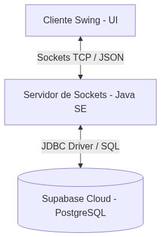

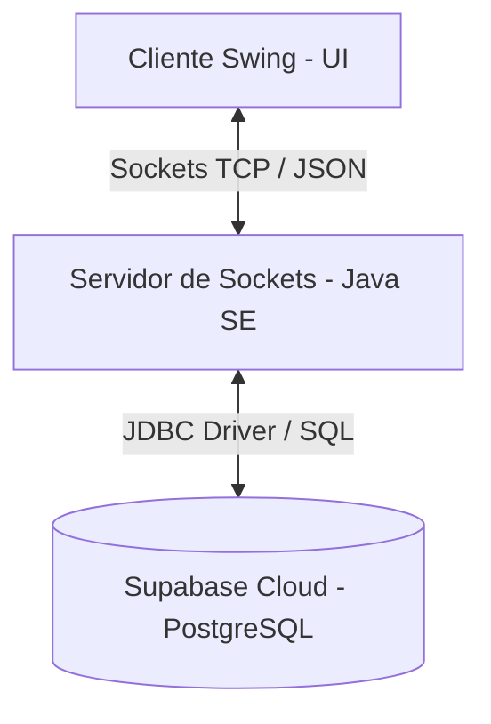

### 3.3. Arquitectura del Cliente (Threading Swing EDT vs. Hilo de Red)
La biblioteca gráfica de Java (Swing) es monocanal (Single-Threaded). Toda actualización de la pantalla debe realizarse en un hilo especializado controlado por el sistema operativo, denominado **Event Dispatch Thread (EDT)**.

#### El conflicto de Bloqueo
Si un cliente realizara operaciones de lectura bloqueante (`socket.getInputStream().read()`) en el hilo de la UI (EDT), la pantalla se congelaría de inmediato (estado "No Responde") hasta recibir datos de la red.

#### Solución mediante Hilos Asíncronos
Para resolver esto, la arquitectura del cliente implementa dos flujos de ejecución en paralelo:
1.  **Hilo de Escucha (Background Thread):** Al inicializarse el cliente, el Singleton `ClienteConexion` arranca el hilo `HiloEscuchaCliente` encargado exclusivamente de la lectura bloqueante del stream de red en un bucle continuo.
2.  **Hilo Gráfico (EDT):** Cuando el hilo secundario recibe y deserializa una trama, no actualiza la UI directamente. Despacha la tarea al EDT mediante `SwingUtilities.invokeLater(...)`.
3.  **Patrón Observer (Callback de Red):** Las pantallas implementan la interfaz `ClienteConexion.MensajeListener` (`onMensajeRecibido`, `onDesconexion`). El Hilo de Escucha notifica a la interfaz gráfica activa sin acoplar `ClienteConexion` a clases Swing concretas.
4.  **Pool de Decodificación de Video:** Para evitar bloquear el hilo lector del socket al procesar fotogramas JPEG, `RoomFrame` delega la decodificación Base64 a un `ExecutorService` daemon (`videoDecoderExecutor`) y solo pinta la imagen resultante en el EDT.

### 3.4. Arquitectura del Servidor (ServerSocket y CachedThreadPool)
El servidor central de sockets de LP2-Zoom escucha de manera continua en el puerto `5000`. Al recibir un cliente físico, debe administrar su sesión de red sin interrumpir a los demás participantes.

#### Implementación del Thread Pool
En lugar de crear un hilo físico manualmente por cada cliente, se utiliza el pool de hilos dinámico (`CachedThreadPool`) de Java:
```java
ExecutorService threadPool = Executors.newCachedThreadPool();
```

#### Flujo de Concurrencia
1.  El hilo principal ejecuta `serverSocket.accept()` de forma bloqueante.
2.  Al conectarse un cliente, se instancia `ManejadorCliente(socket)` que implementa `Runnable`.
3.  El `ManejadorCliente` se envía al `CachedThreadPool`.
4.  El pool asigna un hilo libre de su caché para ejecutar el método `run()` del manejador, o crea uno nuevo si todos están ocupados. Si un hilo queda ocioso por más de 60 segundos, se destruye automáticamente.
5.  El manejador mantiene un bucle que procesa las tramas JSON entrantes y consulta de forma concurrente al Proxy de Base de Datos.

### 3.5. Sistema de Almacenamiento Local de Archivos (`uploads/`)
La compartición de archivos entre usuarios requiere una estrategia de almacenamiento híbrido para evitar degradar el rendimiento de la base de datos relacional.
*   **Los Archivos Físicos:** Se escriben directamente en un directorio local del servidor llamado `uploads/`. La transferencia viaja segmentada en chunks codificados en Base64 para prevenir desbordamientos de la memoria de la JVM.
*   **Los Metadatos:** En Supabase solo se indexa la información de control del archivo a través de la tabla `ArchivosCompartidos` (nombre, ruta física en el servidor, usuario que lo subió y la sala correspondiente).
*   **El Flujo de Descarga:** Cuando un usuario solicita descargar un archivo, el servidor valida la ruta canónica dentro de `uploads/`, lee el binario del disco y lo reenvía al cliente con la misma secuencia `FILE_START` → `FILE_CHUNK` → `FILE_END`.

### 3.6. Catálogo y Aplicación de los 6 Patrones de Diseño

#### A. Patrón Singleton
*   **Clase Aplicada:** [ClienteConexion.java](file:///c:/Users/lorox/OneDrive/Desktop/LP2-Zoom/LP2-Zoom/Cliente/src/main/java/network/ClienteConexion.java)
*   **Propósito:** Asegurar que exista una única conexión física TCP abierta entre el cliente y el servidor durante todo el ciclo de vida de la aplicación, proporcionando un punto de acceso global.
*   **Uso en código:** El constructor es privado y se expone el método estático sincronizado `getInstancia()` para inicializar y retornar el campo `instancia`.

#### B. Patrón Bridge
*   **Clases Aplicadas:** [ProtocolBridge.java](file:///c:/Users/lorox/OneDrive/Desktop/LP2-Zoom/LP2-Zoom/Cliente/src/main/java/network/bridge/ProtocolBridge.java), [JSONProtocolBridge.java](file:///c:/Users/lorox/OneDrive/Desktop/LP2-Zoom/LP2-Zoom/Cliente/src/main/java/network/bridge/JSONProtocolBridge.java) y la clase `ClienteConexion`.
*   **Propósito:** Desacoplar la abstracción de transmisión de red de la implementación concreta de serialización de mensajes (JSON utilizando la biblioteca Gson).
*   **Uso en código:** `ClienteConexion` contiene una referencia a la interfaz `ProtocolBridge`. Toda serialización (`serialize()`) y deserialización (`deserialize()`) se delega a ella, lo que permite cambiar el formato de mensajería (de JSON a XML o binario) sin alterar el socket TCP ni la interfaz Swing.

#### C. Patrón Memento
*   **Clases Aplicadas:** [ChatInputMemento.java](file:///c:/Users/lorox/OneDrive/Desktop/LP2-Zoom/LP2-Zoom/Cliente/src/main/java/UI/memento/ChatInputMemento.java), [ChatHistoryCaretaker.java](file:///c:/Users/lorox/OneDrive/Desktop/LP2-Zoom/LP2-Zoom/Cliente/src/main/java/UI/memento/ChatHistoryCaretaker.java) e integrador gráfico `RoomFrame.java`.
*   **Propósito:** Capturar y guardar el estado interno de un cuadro de texto (el borrador escrito del chat) para permitir al usuario recuperarlo navegando hacia atrás o adelante con las flechas direccionales (Arriba/Abajo) en la UI.
*   **Uso en código:** Al presionar Enter para enviar o al guardar, se crea una instancia inmutable de `ChatInputMemento` conteniendo el texto escrito, la cual se añade a la pila en `ChatHistoryCaretaker`. La caja de texto de `RoomFrame` restaura el estado a través del listener de teclas (flechas ↑ y ↓).

#### D. Patrón Strategy
*   **Clases Aplicadas:** [DBStrategy.java](file:///c:/Users/lorox/OneDrive/Desktop/LP2-Zoom/LP2-Zoom/Servidor/src/main/java/database/DBStrategy.java), [DBService.java](file:///c:/Users/lorox/OneDrive/Desktop/LP2-Zoom/LP2-Zoom/Servidor/src/main/java/database/DBService.java), `CameraStrategy`, `PhysicalCameraStrategy` y `SimulatedCameraStrategy`.
*   **Propósito:** Encapsular algoritmos intercambiables tanto en persistencia (base de datos Supabase vs. locales) como en captura de video (cámara física vs. simulador gráfico).
*   **Uso en código:** `RoomFrame` interactúa con la interfaz `CameraStrategy` y puede conmutar dinámicamente entre la implementación física y simulada sin cambiar su lógica. De igual forma, el servidor usa `DBStrategy` para aislar el motor de persistencia.

#### E. Patrón Factory Method
*   **Clases Aplicadas:** [DBCreator.java](file:///c:/Users/lorox/OneDrive/Desktop/LP2-Zoom/LP2-Zoom/Servidor/src/main/java/database/DBCreator.java), [SupabaseDBCreator.java](file:///c:/Users/lorox/OneDrive/Desktop/LP2-Zoom/LP2-Zoom/Servidor/src/main/java/database/SupabaseDBCreator.java), `CameraCreator`, `PhysicalCameraCreator` y `SimulatedCameraCreator`.
*   **Propósito:** Delegar la instanciación de estrategias concretas (BD Supabase, cámara física o simulada) a creadores especializados.
*   **Uso en Código:** `SupabaseDBCreator.createDatabase()` retorna la instancia de `DBService`. En el cliente, `PhysicalCameraCreator` and `SimulatedCameraCreator` producen sus respectivas estrategias de video.

#### F. Patrón Proxy
*   **Clases Aplicadas:** [DBProxy.java](file:///c:/Users/lorox/OneDrive/Desktop/LP2-Zoom/LP2-Zoom/Servidor/src/main/java/database/DBProxy.java) y `CameraProxy`.
*   **Propósito:** Intermediar el acceso a recursos costosos o sensibles (BD, cámara, conexión JDBC) añadiendo lazy-load, control de acceso, auditoría y tolerancia a fallos.
*   **Uso en Código:** 
    *   **Virtual Proxy (Lazy load):** `DBProxy` carga la conexión JDBC real solo cuando se realiza la primera consulta en el servidor, acelerando el arranque del programa.
    *   **Logging Proxy:** `DBProxy` intercepta cada llamada a métodos de base de datos e imprime en consola del servidor información de depuración detallando la consulta.
    *   **Fallback Proxy (Cámara):** `CameraProxy` envuelve la estrategia de captura con inicialización perezosa, control de permisos, logging y fallback automático al simulador si falla la inicialización del hardware.

### 3.7. Diagramas UML del Proyecto

#### Diagrama de Casos de Uso
El siguiente diagrama detalla las acciones permitidas para el usuario en rol de Invitado y Anfitrión (Host):

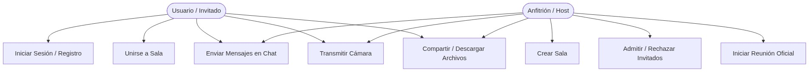

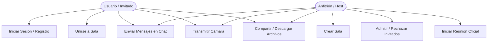

#### Diagrama de Actividades (General)
El siguiente diagrama modela el ciclo de vida del usuario en la aplicación, detallando la toma de decisiones, las bifurcaciones y los flujos concurrentes:

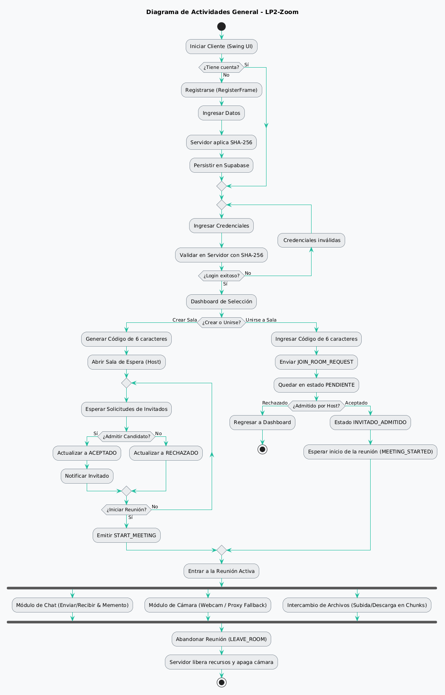

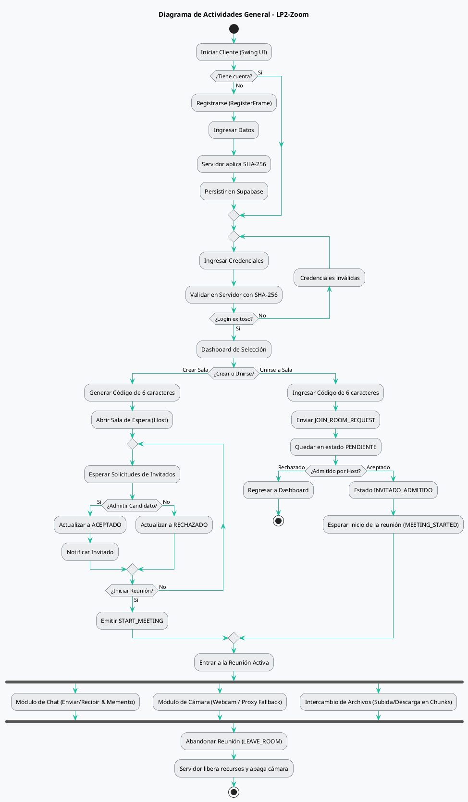

#### Diagrama de Secuencia (Handshake y Flujo de Sala de Espera)
Este diagrama describe las interacciones temporales para la unión asíncrona de un invitado y la posterior moderación:

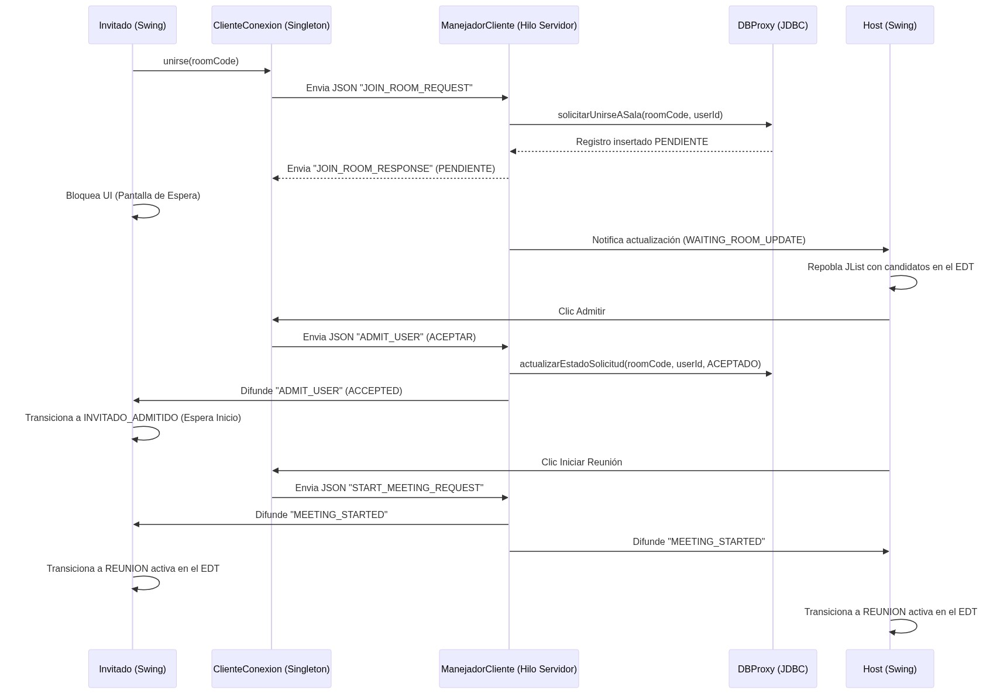

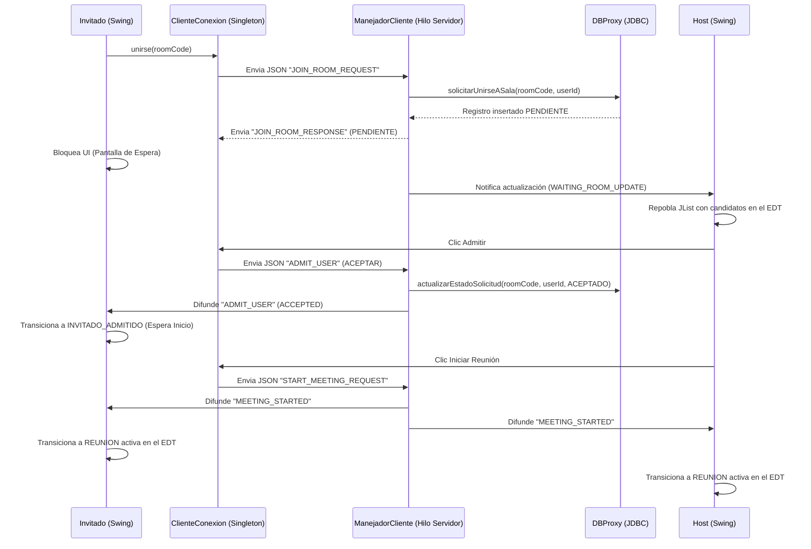

#### Diagrama de Clases
El siguiente diagrama detalla la arquitectura de clases del proyecto, agrupándolas por paquetes:

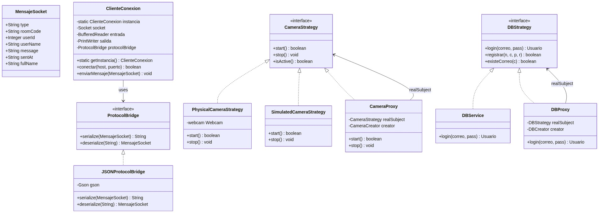

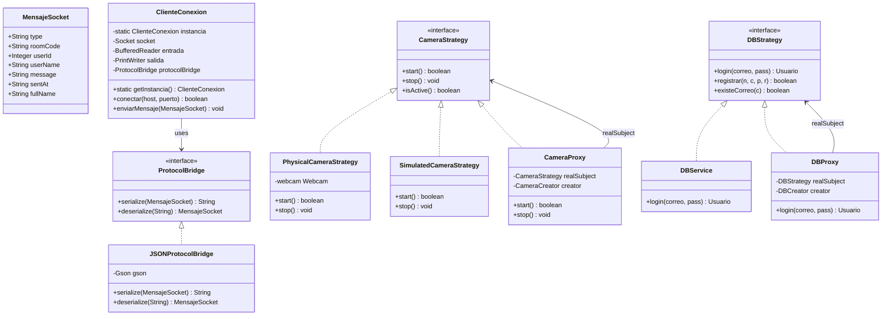

```{=openxml}
<w:p><w:r><w:br w:type="page"/></w:r></w:p>
```

## CAPÍTULO 4: DISEÑO DE LA BASE DE DATOS

### 4.1. Modelo Entidad-Relación y Restricciones de Integridad
El motor de persistencia del sistema está modelado bajo la tercera forma normal (3FN) para evitar anomalías de inserción, actualización o borrado, estructurando la comunicación a nivel relacional en torno a los usuarios, las reuniones y los recursos compartidos.

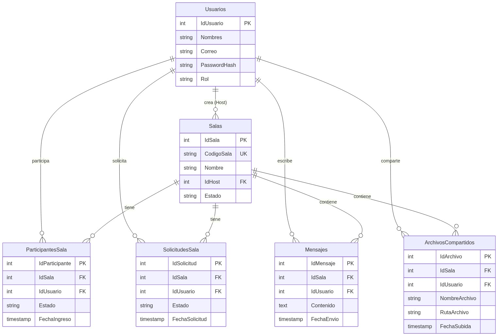

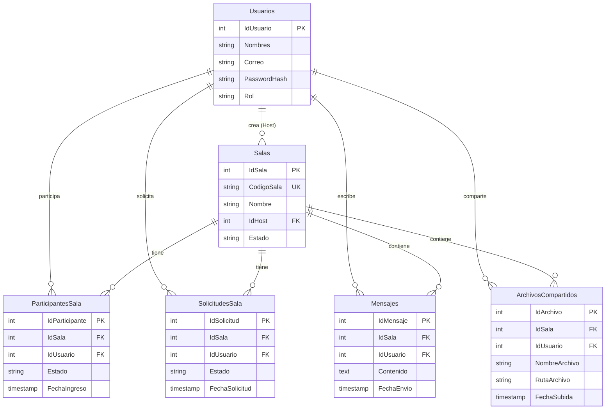

#### Restricciones de Integridad Críticas
1.  **Claves Foráneas con Borrado en Cascada (`ON DELETE CASCADE`):** Si una sala o un usuario se eliminan del sistema, todas las entidades asociadas de forma débil (mensajes de chat, registros de solicitudes de espera, participantes activos e índices de archivos compartidos) se eliminan automáticamente del motor PostgreSQL para evitar registros huérfanos.
2.  **Restricción Única de Sesión en Salas (`uq_sala_usuario`):** Impide que un mismo usuario se registre más de una vez de manera concurrente en los listados históricos o activos de una sala de reunión (`ParticipantesSala`).
3.  **Restricción Única en Cola de Espera (`uq_solicitud_sala_usuario`):** Garantiza que un invitado solo pueda poseer una postulación activa en estado pendiente en la tabla `SolicitudesSala`, evitando la duplicación de solicitudes al panel de moderación del Host.
4.  **Generación Automática de Tiempos (`DEFAULT CURRENT_TIMESTAMP`):** Las marcas de tiempo de ingreso de miembros, envío de mensajes y cargas de archivos son generadas por el motor PostgreSQL de Supabase en el huso UTC, previniendo alteraciones de hora local por parte del cliente.

### 4.2. Detalle Físico de las Tablas (Diccionario de Datos)

#### Tabla: `Usuarios`
| Campo | Tipo de Datos | Nulabilidad | Descripción / Restricciones |
| :--- | :--- | :---: | :--- |
| `IdUsuario` | `SERIAL` | `NOT NULL` | Clave primaria autoincremental. |
| `Nombres` | `VARCHAR(150)` | `NOT NULL` | Nombre completo del usuario. |
| `Correo` | `VARCHAR(150)` | `NOT NULL` | Correo electrónico único (login). |
| `PasswordHash` | `VARCHAR(255)` | `NOT NULL` | Contraseña hasheada con SHA-256. |
| `Rol` | `VARCHAR(50)` | `NOT NULL` | Rol del usuario (`HOST`, `INVITADO`, `USUARIO`). |

#### Tabla: `Salas`
| Campo | Tipo de Datos | Nulabilidad | Descripción / Restricciones |
| :--- | :--- | :---: | :--- |
| `IdSala` | `SERIAL` | `NOT NULL` | Clave primaria autoincremental. |
| `CodigoSala` | `VARCHAR(10)` | `NOT NULL` | Código alfanumérico único de 6 caracteres. |
| `Nombre` | `VARCHAR(150)` | `NOT NULL` | Nombre descriptivo de la reunión. |
| `IdHost` | `INT` | `NOT NULL` | FK a `Usuarios.IdUsuario` (ON DELETE CASCADE). |
| `Estado` | `VARCHAR(50)` | `NOT NULL` | Estado de la reunión (`ACTIVA`, `FINALIZADA`). |

#### Tabla: `ParticipantesSala`
| Campo | Tipo de Datos | Nulabilidad | Descripción / Restricciones |
| :--- | :--- | :---: | :--- |
| `IdParticipante` | `SERIAL` | `NOT NULL` | Clave primaria autoincremental. |
| `IdSala` | `INT` | `NOT NULL` | FK a `Salas.IdSala` (ON DELETE CASCADE). |
| `IdUsuario` | `INT` | `NOT NULL` | FK a `Usuarios.IdUsuario` (ON DELETE CASCADE). |
| `Estado` | `VARCHAR(50)` | `NOT NULL` | Estado del participante (`ACTIVO`, `SALIÓ`). |
| `FechaIngreso` | `TIMESTAMP` | `NOT NULL` | Generación automática `DEFAULT CURRENT_TIMESTAMP`. |
| *Restricción* | `UNIQUE` | - | Clave compuesta única (`IdSala`, `IdUsuario`). |

#### Tabla: `SolicitudesSala`
| Campo | Tipo de Datos | Nulabilidad | Descripción / Restricciones |
| :--- | :--- | :---: | :--- |
| `IdSolicitud` | `SERIAL` | `NOT NULL` | Clave primaria autoincremental. |
| `IdSala` | `INT` | `NOT NULL` | FK a `Salas.IdSala` (ON DELETE CASCADE). |
| `IdUsuario` | `INT` | `NOT NULL` | FK a `Usuarios.IdUsuario` (ON DELETE CASCADE). |
| `Estado` | `VARCHAR(50)` | `NOT NULL` | Estado de solicitud (`PENDIENTE`, `ACEPTADO`, `RECHAZADO`). |
| `FechaSolicitud` | `TIMESTAMP` | `NOT NULL` | Generación automática `DEFAULT CURRENT_TIMESTAMP`. |
| *Restricción* | `UNIQUE` | - | Clave compuesta única (`IdSala`, `IdUsuario`). |

#### Tabla: `Mensajes`
| Campo | Tipo de Datos | Nulabilidad | Descripción / Restricciones |
| :--- | :--- | :---: | :--- |
| `IdMensaje` | `SERIAL` | `NOT NULL` | Clave primaria autoincremental. |
| `IdSala` | `INT` | `NOT NULL` | FK a `Salas.IdSala` (ON DELETE CASCADE). |
| `IdUsuario` | `INT` | `NOT NULL` | FK a `Usuarios.IdUsuario` (ON DELETE CASCADE). |
| `Contenido` | `TEXT` | `NOT NULL` | Mensaje de texto plano. |
| `FechaEnvio` | `TIMESTAMP` | `NOT NULL` | Generación automática `DEFAULT CURRENT_TIMESTAMP`. |

#### Tabla: `ArchivosCompartidos`
| Campo | Tipo de Datos | Nulabilidad | Descripción / Restricciones |
| :--- | :--- | :---: | :--- |
| `IdArchivo` | `SERIAL` | `NOT NULL` | Clave primaria autoincremental. |
| `IdSala` | `INT` | `NOT NULL` | FK a `Salas.IdSala` (ON DELETE CASCADE). |
| `IdUsuario` | `INT` | `NOT NULL` | FK a `Usuarios.IdUsuario` (ON DELETE CASCADE). |
| `NombreArchivo` | `VARCHAR(255)` | `NOT NULL` | Nombre original del archivo subido. |
| `RutaArchivo` | `VARCHAR(500)` | `NOT NULL` | Ruta física local en el servidor (`uploads/fileId_nombre`). |
| `FechaSubida` | `TIMESTAMP` | `NOT NULL` | Generación automática `DEFAULT CURRENT_TIMESTAMP`. |

### 4.3. Script SQL de Migración (DDL) y Semillas de Prueba (Seeds)
El siguiente script en SQL nativo limpia las preexistencias e inicializa el modelo completo de datos en Supabase, incorporando registros iniciales de prueba (con claves pre-hasheadas correspondientes a la contraseña `'123456'`).

```sql
-- DDL de Migración de Tablas - LP2-Zoom
DROP TABLE IF EXISTS ArchivosCompartidos CASCADE;
DROP TABLE IF EXISTS Mensajes CASCADE;
DROP TABLE IF EXISTS SolicitudesSala CASCADE;
DROP TABLE IF EXISTS ParticipantesSala CASCADE;
DROP TABLE IF EXISTS Salas CASCADE;
DROP TABLE IF EXISTS Usuarios CASCADE;

-- Crear Tabla Usuarios
CREATE TABLE Usuarios (
    IdUsuario SERIAL PRIMARY KEY,
    Nombres VARCHAR(150) NOT NULL,
    Correo VARCHAR(150) UNIQUE NOT NULL,
    PasswordHash VARCHAR(255) NOT NULL,
    Rol VARCHAR(50) NOT NULL DEFAULT 'USUARIO'
);

-- Crear Tabla Salas
CREATE TABLE Salas (
    IdSala SERIAL PRIMARY KEY,
    CodigoSala VARCHAR(10) UNIQUE NOT NULL,
    Nombre VARCHAR(150) NOT NULL,
    IdHost INT NOT NULL REFERENCES Usuarios(IdUsuario) ON DELETE CASCADE,
    Estado VARCHAR(50) NOT NULL DEFAULT 'ACTIVA'
);

-- Crear Tabla ParticipantesSala
CREATE TABLE ParticipantesSala (
    IdParticipante SERIAL PRIMARY KEY,
    IdSala INT NOT NULL REFERENCES Salas(IdSala) ON DELETE CASCADE,
    IdUsuario INT NOT NULL REFERENCES Usuarios(IdUsuario) ON DELETE CASCADE,
    Estado VARCHAR(50) NOT NULL DEFAULT 'ACTIVO',
    FechaIngreso TIMESTAMP NOT NULL DEFAULT CURRENT_TIMESTAMP,
    CONSTRAINT uq_sala_usuario UNIQUE (IdSala, IdUsuario)
);

-- Crear Tabla SolicitudesSala
CREATE TABLE SolicitudesSala (
    IdSolicitud SERIAL PRIMARY KEY,
    IdSala INT NOT NULL REFERENCES Salas(IdSala) ON DELETE CASCADE,
    IdUsuario INT NOT NULL REFERENCES Usuarios(IdUsuario) ON DELETE CASCADE,
    Estado VARCHAR(50) NOT NULL DEFAULT 'PENDIENTE',
    FechaSolicitud TIMESTAMP NOT NULL DEFAULT CURRENT_TIMESTAMP,
    CONSTRAINT uq_solicitud_sala_usuario UNIQUE (IdSala, IdUsuario)
);

-- Crear Tabla Mensajes
CREATE TABLE Mensajes (
    IdMensaje SERIAL PRIMARY KEY,
    IdSala INT NOT NULL REFERENCES Salas(IdSala) ON DELETE CASCADE,
    IdUsuario INT NOT NULL REFERENCES Usuarios(IdUsuario) ON DELETE CASCADE,
    Contenido TEXT NOT NULL,
    FechaEnvio TIMESTAMP NOT NULL DEFAULT CURRENT_TIMESTAMP
);

-- Crear Tabla ArchivosCompartidos
CREATE TABLE ArchivosCompartidos (
    IdArchivo SERIAL PRIMARY KEY,
    IdSala INT NOT NULL REFERENCES Salas(IdSala) ON DELETE CASCADE,
    IdUsuario INT NOT NULL REFERENCES Usuarios(IdUsuario) ON DELETE CASCADE,
    NombreArchivo VARCHAR(255) NOT NULL,
    RutaArchivo VARCHAR(500) NOT NULL,
    FechaSubida TIMESTAMP NOT NULL DEFAULT CURRENT_TIMESTAMP
);

-- SEEDS: Cargar Usuarios Iniciales de Prueba
-- Contraseña texto plano: '123456'
-- Hash SHA-256: '8d969eef6ecad3c29a3a629280e686cf0c3f5d5a86aff3ca12020c923adc6c92'
INSERT INTO Usuarios (Nombres, Correo, PasswordHash, Rol) VALUES 
('Host De Prueba', 'host@zoom.com', '8d969eef6ecad3c29a3a629280e686cf0c3f5d5a86aff3ca12020c923adc6c92', 'HOST'),
('Invitado De Prueba', 'invitado@zoom.com', '8d969eef6ecad3c29a3a629280e686cf0c3f5d5a86aff3ca12020c923adc6c92', 'INVITADO');
```

```{=openxml}
<w:p><w:r><w:br w:type="page"/></w:r></w:p>
```

## CAPÍTULO 5: PROTOCOLO DE SOCKETS

### 5.1. Fundamentos del Protocolo TCP y Flujo de Sockets en Java SE
Para el desarrollo del sistema se seleccionó la pila de protocolos TCP/IP a través de sockets de red nativos de Java SE (`java.net.Socket` y `java.net.ServerSocket`), garantizando las siguientes propiedades críticas:
1.  **Orientación a Conexión:** Establece un canal bidireccional estable mediante el acuerdo de tres vías (Three-Way Handshake), asegurando que ambas partes estén listas para transferir bytes.
2.  **Confiabilidad e Integridad:** TCP garantiza mediante sumas de verificación (checksums) y retransmisiones automáticas que ningún byte se pierda o se corrompa en el tránsito, lo cual es obligatorio para la serialización JSON de control y la reconstrucción exacta de archivos binarios.
3.  **Entrega Ordenada:** Las tramas y bytes del chat y video se reciben exactamente en el mismo orden en que fueron emitidos, previniendo incoherencias en las conversaciones y desconfiguraciones en las imágenes.

#### Flujo de Datos y Delimitador de Tramas
El flujo físico a través del socket se compone de streams de caracteres (`BufferedReader` y `PrintWriter`). Debido a que TCP es un protocolo basado en flujos continuos (stream-oriented), no existe una separación física natural entre un mensaje JSON y el siguiente. Para resolver esto, el protocolo de LP2-Zoom define el carácter de salto de línea (`\n`) como el delimitador de trama. Toda trama JSON se escribe en una sola línea física mediante `PrintWriter.println()` y el receptor la consume en una sola operación de lectura bloqueante empleando `BufferedReader.readLine()`.

### 5.2. Estructura de Trama JSON Estándar (`MensajeSocket`)
Todos los eventos de red del sistema se serializan bajo un único modelo de datos uniforme definido en la clase `MensajeSocket`. El mapeo a formato JSON se realiza utilizando la biblioteca Google Gson.

```json
{
  "type": "TIPO_DE_MENSAJE",
  "roomCode": "CÓDIGO_DE_SALA",
  "userId": 123,
  "userName": "Nombre del Usuario",
  "message": "Contenido textual del mensaje / payload extendido",
  "sentAt": "2026-06-26T18:00:00",
  "fullName": "Nombres Completos (usado solo en registro)"
}
```

#### Especificación de los Campos de la Trama
*   `type` (String): Clave de enrutamiento principal. Indica al servidor o al cliente el propósito del mensaje para derivarlo al manejador correspondiente.
*   `roomCode` (String): Código alfanumérico único de la sala a la que pertenece el usuario (ej. A1B2C3). El servidor lo utiliza para filtrar y retransmitir los mensajes a los miembros adecuados.
*   `userId` (Integer): Identificador único del usuario emisor en la base de datos.
*   `userName` (String): Nombre legible del usuario emisor para ser renderizado en la interfaz gráfica del chat o las leyendas de video.
*   `message` (String): Campo multipropósito de capacidad extendida. Contiene texto del chat, contraseñas en texto plano, respuestas del servidor o fragmentos Base64 (archivos o frames de video).
*   `sentAt` (String): Marca de tiempo de envío en formato ISO-8601.
*   `fullName` (String): Nombre completo del usuario; requerido en `REGISTER_REQUEST`.

### 5.3. Contrato de Mensajería: Catálogo y Especificación de Mensajes

| Tipo de Mensaje (`type`) | Flujo | Descripción | Payload / Campos Clave |
| :--- | :--- | :--- | :--- |
| **`LOGIN_REQUEST`** | Cliente $\rightarrow$ Servidor | Petición para verificar credenciales de inicio de sesión. | `userName` (Correo), `message` (Contraseña) |
| **`LOGIN_RESPONSE`** | Servidor $\rightarrow$ Cliente | Respuesta al inicio de sesión. | `message` (`SUCCESS` o error), `userId`, `userName` |
| **`REGISTER_REQUEST`** | Cliente $\rightarrow$ Servidor | Petición para crear cuenta de usuario. | `userName` (Correo), `message` (Clave), `fullName` |
| **`REGISTER_RESPONSE`** | Servidor $\rightarrow$ Cliente | Respuesta al registro. | `message` (`SUCCESS`, `EMAIL_ALREADY_EXISTS` o error) |
| **`CREATE_ROOM`** | Bidireccional | **Cliente:** Solicita crear sala. **Servidor:** Retorna confirmación con el código. | `userId` (Host), `roomCode` (Generado), `message` (Nombre de sala) |
| **`JOIN_ROOM_REQUEST`** | Cliente $\rightarrow$ Servidor | Petición del invitado para entrar a la sala de espera. | `roomCode`, `userId`, `userName` |
| **`WAITING_ROOM_UPDATE`** | Servidor $\rightarrow$ Host | Envía array JSON de candidatos pendientes en sala de espera. | `roomCode`, `message` (Arreglo serializado de solicitudes) |
| **`ADMIT_USER`** | Bidireccional | **Host $\rightarrow$ Servidor:** Envía decisión. **Servidor $\rightarrow$ Invitado:** Notifica admisión. | `roomCode`, `userId` (Invitado), `message` (`ACEPTAR`/`RECHAZAR` o `ACCEPTED`/`REJECTED`) |
| **`START_MEETING_REQUEST`** | Host $\rightarrow$ Servidor | El Host da inicio oficial a la videoconferencia. | `roomCode`, `userId` (Host) |
| **`MEETING_STARTED`** | Servidor $\rightarrow$ Clientes | Difunde el inicio oficial a los miembros admitidos en la sala. | `roomCode`, `message` (`STARTED`) |
| **`CHAT_MESSAGE`** | Bidireccional | Envío, persistencia y difusión de mensajes de texto en la sala. | `roomCode`, `userId`, `userName`, `message` (Texto / `REQUEST_HISTORY`) |
| **`CAMERA_STATE`** | Bidireccional | Informa encendido ("ON") o apagado ("OFF") de la cámara. | `roomCode`, `userId`, `message` (`ON` o `OFF`) |
| **`CAMERA_FRAME`** | Bidireccional | Envío y difusión de fotograma de cámara JPEG en Base64. | `roomCode`, `userId`, `message` (String Base64) |
| **`LEAVE_ROOM`** | Cliente $\rightarrow$ Servidor | Notifica salida voluntaria del usuario. | `roomCode`, `userId` |

### 5.4. Flujo del Protocolo de Archivos Fragmentados (Chunks Base64)
Para evitar que la transferencia de archivos sature los hilos de red y la memoria del servidor, el sistema implementa un protocolo de transferencia fragmentada en tres fases:
1.  **Inicialización (`FILE_START`):** El cliente emisor genera un identificador único aleatorio para la transferencia (`fileId`) y envía un mensaje `FILE_START`. El campo `message` lleva la cadena estructurada: `fileId|nombreOriginalArchivo`. Al recibirlo, el servidor valida el formato, inicializa un `FileOutputStream` asociado a un archivo temporal en la carpeta `uploads/` (`fileId_nombreOriginalArchivo`) y registra el stream abierto en un mapa concurrente (`archivosEnProgreso`).
2.  **Segmentación (`FILE_CHUNK`):** El cliente lee el archivo local en bloques fijos de 64 KB. Cada bloque se codifica en formato Base64 para garantizar su representación textual segura dentro del payload JSON, y se transmite bajo el tipo `FILE_CHUNK`. El campo `message` lleva: `fileId|chunkBase64`. El servidor recibe la trama, extrae el `fileId`, recupera el stream abierto, decodifica el string Base64 a bytes binarios y los escribe directamente al archivo en disco.
3.  **Cierre y Consolidación (`FILE_END`):** Una vez leídos todos los bytes locales, el cliente envía un mensaje `FILE_END` llevando el `fileId` en el campo `message`. El servidor recupera el stream, cierra la conexión al disco duro, calcula la ruta física final y registra los metadatos correspondientes en la base de datos a través de JDBC. Finalmente, difunde un mensaje de chat automático a toda la sala informando la disponibilidad del archivo.

### 5.5. Flujo del Protocolo de Transmisión de Cámara (Frames y Estados)
La transmisión de video se realiza a través de un canal continuo de tramas asíncronas sobre el socket principal.
*   **Control de Estado (`CAMERA_STATE`):** Antes de iniciar la transmisión de fotogramas, el cliente emisor envía una trama `CAMERA_STATE` con el valor `"ON"` o `"OFF"`. El servidor difunde este estado a los demás miembros de la sala. Al recibirlo, los clientes receptores crean dinámicamente un panel de renderizado específico para ese usuario o lo destruyen/ocultan si el estado es `"OFF"`, evitando congelamientos visuales.
*   **Procesamiento de Fotogramas (`CAMERA_FRAME`):**
    1.  **Captura:** Un temporizador lee periódicamente la imagen capturada por la cámara web física o el simulador visual.
    2.  **Procesamiento Gráfico:** La imagen es redimensionada a 320x240 píxeles y comprimida utilizando el codificador JPEG. Esto reduce drásticamente el peso de cada fotograma (a 8 KB-15 KB).
    3.  **Serialización:** Los bytes resultantes del JPEG comprimido se codifican a string Base64 y se introducen en el campo `message` de la trama `CAMERA_FRAME` enviada al socket.
    4.  **Frecuencia:** Para no saturar la red, la tasa de captura está limitada a un rango de 3 a 10 fotogramas por segundo (FPS).
    5.  **Retransmisión y Renderizado:** El servidor recibe el frame y lo retransmite a los demás miembros (excluyendo al emisor). El cliente decodifica Base64 en un pool de hilos de segundo plano daemon (`videoDecoderExecutor`) y pinta el frame en el EDT de Swing.

```{=openxml}
<w:p><w:r><w:br w:type="page"/></w:r></w:p>
```

## CAPÍTULO 6: IMPLEMENTACIÓN DEL SISTEMA

### 6.1. Módulo de Registro y Login Criptográfico (SHA-256)
La seguridad de las credenciales de acceso se implementa en el servidor. El cliente envía la contraseña en texto plano en el JSON, y el servidor realiza el hashing SHA-256 antes de guardarla o compararla con la base de datos de Supabase.

#### Hashing SHA-256 en `HashUtils.java`
```java
package database;

import java.security.MessageDigest;
import java.security.NoSuchAlgorithmException;

public class HashUtils {
    public static String hashPassword(String password) {
        if (password == null) return null;
        try {
            MessageDigest digest = MessageDigest.getInstance("SHA-256");
            byte[] hash = digest.digest(password.getBytes());
            StringBuilder hexString = new StringBuilder();
            for (byte b : hash) {
                String hex = Integer.toHexString(0xff & b);
                if (hex.length() == 1) hexString.append('0');
                hexString.append(hex);
            }
            return hexString.toString();
        } catch (NoSuchAlgorithmException e) {
            throw new RuntimeException("[ERROR] No se pudo encontrar el algoritmo SHA-256", e);
        }
    }
}
```

### 6.2. Módulo de Creación y Unión a Salas
Este módulo gestiona el ciclo de vida inicial de una reunión.
1.  **Creación de la Sala:** El Host ingresa el nombre de la reunión y el cliente transmite una trama `CREATE_ROOM`. El `ManejadorCliente` recibe el mensaje, genera un código alfanumérico único de 6 caracteres en mayúsculas (`UUID.randomUUID().toString().substring(0, 6).toUpperCase()`), inserta la sala en la tabla `Salas`, registra al Host en `ParticipantesSala` con estado `'ACTIVO'` y responde con la confirmación de la sala.
2.  **Solicitud de Unión:** Un participante invitado introduce el código de 6 caracteres y presiona "Unirse". El servidor recibe la trama `JOIN_ROOM_REQUEST` y realiza las comprobaciones relacionales: verifica que el código exista y esté activo en `Salas`, inserta una solicitud con estado inicial `'PENDIENTE'` en `SolicitudesSala`, responde `JOIN_ROOM_RESPONSE` con `"PENDIENTE"`, y notifica al Host con `WAITING_ROOM_UPDATE`.

### 6.3. Módulo de Sala de Espera y Moderación
La admisión diferida asegura el control total del anfitrión sobre quién ingresa a la sesión.
*   **Actualización en Tiempo Real:** Cada vez que un usuario postula a una sala, el servidor recupera todas las solicitudes en estado `'PENDIENTE'` para la sala, las serializa a una lista JSON y las envía al Host en la trama `WAITING_ROOM_UPDATE`. El panel de moderación del Host repobla dinámicamente un `JList` con la lista actualizada de candidatos.
*   **Moderación:** El Host puede hacer clic en "Admitir" o "Rechazar". El cliente emite `ADMIT_USER` con el mensaje correspondente (`ACEPTAR`/`RECHAZAR`). El servidor actualiza `SolicitudesSala` a `'ACEPTADO'` o `'RECHAZADO'`, añade al usuario a `ParticipantesSala` si es admitido, y le notifica con `ADMIT_USER` (`ACCEPTED`/`REJECTED`).
*   **Inicio Sincronizado de la Reunión:** Cuando el Host presiona "Iniciar Reunión", se emite `START_MEETING_REQUEST`. El servidor valida que el emisor sea el Host y difunde `MEETING_STARTED` a todos los participantes con estado `'ACTIVO'`. Los clientes conmutan a la pantalla `REUNION` mediante `CardLayout`.

### 6.4. Módulo de Chat Grupal e Historial Persistente
*   **Transmisión y Persistencia:** Al enviar un mensaje, el cliente transmite `CHAT_MESSAGE`. El servidor intercepta la trama, llama a `DBProxy.guardarMensaje(...)` para insertar el registro en `Mensajes` y retransmite el JSON a todos los participantes de la sala.
*   **Historial Persistente:** Al ingresar a la sala, el cliente envía `CHAT_MESSAGE` con contenido `"REQUEST_HISTORY"`. El servidor consulta `Mensajes` filtrada por sala y reenvía cada mensaje histórico como trama `CHAT_MESSAGE` individual al solicitante.
*   **Navegación del Historial (Patrón Memento):** En el cliente, para navegar entre sus borradores escritos previamente, se implementa el patrón Memento en el listener de teclado de la caja de texto. Al presionar la tecla Enter, se crea una instancia inmutable de `ChatInputMemento` conteniendo el texto, la cual se apila en `ChatHistoryCaretaker`. Si el usuario presiona las teclas flecha Arriba (↑) o Abajo (↓), la UI interactúa con el Caretaker para obtener el memento anterior o siguiente, restaurando el texto en el campo.

### 6.5. Módulo de Intercambio de Archivos
*   **Envío Fragmentado (Upload):** El cliente inicia un hilo secundario para abrir el archivo, emitiendo la trama `FILE_START` con un `fileId` y el nombre del archivo. A continuación, lee y codifica bloques de bytes en Base64, transmitiéndolos en tramas `FILE_CHUNK`. Al finalizar, envía `FILE_END`. El servidor recibe las tramas, decodifica los bloques y escribe directamente al disco físico en la carpeta `uploads/`. Al recibir la finalización, guarda la ruta del archivo y los metadatos en la tabla `ArchivosCompartidos` a través de JDBC.
*   **Listado y Descarga Segura (Download):** Al abrir la pestaña de archivos, el cliente envía `GET_FILES_REQUEST` y recibe la lista de archivos disponibles. Al descargar, el cliente emite la trama `FILE_DOWNLOAD_REQUEST` con la ruta física del archivo.
*   **Seguridad:** El servidor valida que el archivo resida estrictamente dentro de la ruta del directorio `uploads/` resolviendo las rutas canónicas del sistema de archivos para evitar ataques de inyección de directorios (Directory Traversal):
```java
// Código de Seguridad contra Directory Traversal en ManejadorCliente.java
File file = new File(rutaFisica);
try {
    String pathAbsoluto = file.getCanonicalPath();
    File dirUploads = new File(DIRECTORIO_UPLOADS);
    String uploadsAbsoluto = dirUploads.getCanonicalPath();

    if (!pathAbsoluto.startsWith(uploadsAbsoluto)) {
        System.err.println("[SECURITY WARNING] Intento de Directory Traversal por usuario ID " + this.userId + " con ruta: " + rutaFisica);
        return;
    }
} catch (Exception e) {
    System.err.println("[-] Error de validación de seguridad: " + e.getMessage());
    return;
}
```

### 6.6. Módulo de Transmisión de Video y Cámara con Patrones de Diseño
El subsistema multimedia en el cliente aplica los patrones Strategy, Factory Method y Proxy para orquestar la captura y simulación de video.
1.  **Encapsulamiento del Algoritmo de Captura (Strategy):** El visor de video de `RoomFrame` interactúa con la interfaz `CameraStrategy` que define los métodos comunes `start()`, `stop()` y `isActive()`.
    *   `PhysicalCameraStrategy`: Utiliza la webcam física del computador.
    *   `SimulatedCameraStrategy`: Actúa como una estrategia de respaldo. Genera dinámicamente gráficos vectoriales interactivos con gradientes y nombres de usuario para simular una transmisión activa.
2.  **Creación Polimórfica de Estrategias (Factory Method):** La interfaz de usuario no instancia directamente las estrategias. Delega esta responsabilidad a las fábricas concretas: `PhysicalCameraCreator` produce la cámara real y `SimulatedCameraCreator` produce la simulación. Ambas clases heredan de la clase base abstracta `CameraCreator`.
3.  **El Intermediario Inteligente (CameraProxy):** La clase `CameraProxy` actúa como el punto de acceso al subsistema de video, implementando `CameraStrategy` y envolviendo la estrategia real creada por la fábrica:
    *   **Virtual Proxy (Carga Perezosa):** Retarda la instanciación física del objeto de la cámara web (operación pesada de hardware) hasta que se hace clic en "Encender Cámara".
    *   **Protection Proxy (Control de Acceso):** Verifica que la variable de permisos locales del sistema esté en true antes de interactuar con el hardware.
    *   **Logging Proxy:** Registra marcas de tiempo y auditoría en la terminal cada vez que la cámara cambia de estado.
    *   **Fallback Inteligente (Tolerancia a fallos):** Si la inicialización del hardware en `PhysicalCameraStrategy` falla (cámara ocupada por otra app o no conectada), el Proxy captura la excepción e internamente cambia la fábrica a `SimulatedCameraCreator`, inicializando el simulador de forma transparente sin perturbar el funcionamiento del cliente.

```{=openxml}
<w:p><w:r><w:br w:type="page"/></w:r></w:p>
```

## CAPÍTULO 7: PRUEBAS DEL SISTEMA Y GESTIÓN DE FALLAS

### 7.1. Escenarios de Pruebas de Integración (Casos de Éxito)
Se diseñó una matriz de pruebas para verificar el comportamiento conjunto de la interfaz de usuario, el canal de red TCP, los proxies intermedios y el almacenamiento relacional.

| Caso de Prueba | Entrada / Acción | Proceso de Verificación | Resultado Esperado |
| :--- | :--- | :--- | :--- |
| **Prueba de Registro** | Datos correctos en `RegisterFrame`. | Servidor verifica correo, hashea clave y persiste en Supabase. | Cuenta creada, inserción en Supabase verificada, transición a Login. |
| **Prueba de Login** | Correo y clave correctos. | DBProxy intercepta la llamada, inicializa conexión y valida credenciales. | Retorna LOGIN_RESPONSE con SUCCESS, abre RoomFrame. |
| **Creación de Sala** | Botón "Crear Sala". | Genera código único, inserta en Salas y registra al Host. | Abre panel del Host con el código de 6 caracteres. |
| **Admisión de Invitado** | Clic en "Admitir" en panel del Host. | Solicitud cambia a ACEPTADO, notifica al invitado asíncronamente. | Invitado transiciona al estado visual admitido. |
| **Inicio de Reunión** | Clic en "Iniciar Reunión" del Host. | Servidor difunde MEETING_STARTED a todos los miembros activos. | Clientes conmutan al panel de videoconferencia activa de forma sincrónica. |
| **Prueba de Chat** | Enviar texto por chat. | Inserción en tabla Mensajes, difusión TCP a la sala en JSON. | Mensaje renderizado en el EDT de todos los clientes. |
| **Subida de Archivos** | Archivo seleccionado. | Fragmentación en chunks de 64 KB en Base64, reconstrucción en `/uploads`. | Archivo físicamente en disco y metadatos registrados. |

### 7.2. Pruebas de Desconexión Abrupta y Recuperación de Recursos
Uno de los mayores desafíos en la programación de red distribuida con sockets TCP es la estabilidad ante fallas de conectividad. Si un cliente pierde la conexión o cierra la aplicación a la fuerza, el servidor debe liberar de inmediato los recursos asociados.

#### Detección Física de Desconexión
El bucle de escucha del hilo asignado al cliente (`ManejadorCliente.run()`) lee continuamente del stream de red:
```java
while (conectado && (linea = entrada.readLine()) != null) { ... }
```
Si el canal se interrumpe físicamente (caída de internet, finalización del proceso):
1.  `readLine()` retorna null o dispara una excepción `IOException`.
2.  El hilo sale del bucle principal y entra al bloque `finally`, ejecutando el método privado `desconectar()`.

#### Acciones de Limpieza y Recuperación en el Servidor
Al ejecutarse `desconectar()`, el servidor orquesta las siguientes tareas de saneamiento de forma síncrona:
*   **Liberación de Memoria (Mapas Concurrentes):** Remueve la clave del usuario del mapa concurrente de conexiones activas (`MainServidor.clientesActivos.remove(userId)`), liberando el socket y evitando envíos a sockets rotos.
*   **Actualización de Estado en Persistencia:** Si el usuario estaba en una sala, actualiza su solicitud en `SolicitudesSala` a `'RECHAZADO'`.
*   **Notificación a la Reunión (Broadcast):** Difunde `LEAVE_ROOM` a los demás miembros, un mensaje de sistema por chat (`"[Nombre] se ha desconectado"`) y una trama `CAMERA_STATE` con valor `"OFF"`.
*   **Cierre de Sockets:** Cierra el canal del socket (`socketCliente.close()`), liberando el puerto del sistema operativo.

### 7.3. Evidencia y Resultados de Ejecución (Logs de Consola)
El sistema emite trazas detalladas en la terminal de comandos que demuestran la inicialización perezosa de la base de datos, el enrutamiento de red y la auditoría de consultas.

#### Consola del Servidor de Sockets (Arrancando y procesando eventos)
```text
[+] Servidor de Sockets LP2-Zoom iniciado en el puerto 5000...
[DB Proxy] Inicialización perezosa de la base de datos (Virtual Proxy)...
[DB Proxy Logging] Verificando existencia de correo: host@zoom.com
[*] Intento de login para: host@zoom.com
[DB Proxy Logging] Intento de login para correo: host@zoom.com
[OK] Login exitoso. Usuario ID: 1
[*] Creando sala ZOOM26 solicitada por Host ID: 1
[DB Proxy Logging] Creando sala: ZOOM26 (Sala de Redes) por Host: 1
[DB Proxy Logging] Agregando participante: 1 a sala: ZOOM26
[DB Proxy Logging] Usuario: 2 solicita unirse a sala: ZOOM26
[DB Proxy Logging] Obteniendo solicitudes pendientes para sala: ZOOM26
[->] Actualización de sala de espera enviada al Host de la sala ZOOM26
[DB Proxy Logging] Actualizando solicitud en sala: ZOOM26 para usuario: 2 a estado: ACEPTADO
[DB Proxy Logging] Agregando participante: 2 a sala: ZOOM26
[->] Difusión de inicio de reunión en la sala ZOOM26
[DB Proxy Logging] Guardando mensaje en sala: ZOOM26 de usuario: 1
[DB Proxy Logging] Guardando metadatos de archivo: diapositivas.pdf en sala: ZOOM26 por usuario: 2
[-] ManejadorCliente: Hilo de escucha finalizado para usuario 2. Detectada desconexión física.
[DB Proxy Logging] Actualizando solicitud en sala: ZOOM26 para usuario: 2 a estado: RECHAZADO
[-] Cliente removido del mapa activo. Hilo liberado. Socket cerrado.
```

```{=openxml}
<w:p><w:r><w:br w:type="page"/></w:r></w:p>
```

## CAPÍTULO 8: CONCLUSIONES Y TRABAJO FUTURO

### 8.1. Aprendizajes Técnicos y de Diseño Orientado a Objetos (POO)
El desarrollo de este sistema desde cero empleando la biblioteca estándar de Java SE ha consolidado conocimientos de la arquitectura de software:
1.  **Los Patrones de Diseño como Solución a Problemas Reales:** La implementación de los seis patrones demostró que los patrones resuelven problemas concretos de red y responsabilidad de clases. El desacoplamiento estructural entre la abstracción del socket (`ClienteConexion`) y la representación textual de los datos (`ProtocolBridge`) a través de un puente evitó reescrituras al mutar tramas.
2.  **Comprensión de la Red TCP Subyacente:** Operar sobre sockets puros obligó a entender la delimitación de tramas mediante saltos de línea y la necesidad de segmentar flujos de bytes para evitar desbordar los buffers de red de la JVM.
3.  **Gestión de Hilos de la Interfaz:** Se aprendió a respetar el Event Dispatch Thread (EDT) de Swing mediante el despacho asíncrono de tareas bloqueantes de E/S a hilos secundarios y pools dinámicos de ejecución.

### 8.2. Dificultades y Retos de la Implementación
1.  **Exclusión Mutua y Concurrencia:** Evitar condiciones de carrera al retransmitir simultáneamente fotogramas de video, mensajes de chat y flujos de archivos requirió el uso de mapas y colecciones concurrentes en el servidor (`ConcurrentHashMap`).
2.  **Manejo de Librerías Nativas de Cámara:** Configurar la cámara física con `webcam-capture` requirió integrar JNA y Bridj para enlazarse con los drivers del sistema operativo. En Windows, se mitigó el bloqueo de dispositivo e incompatibilidades de buffer mediante el timeout de captura, filtros de dispositivos virtuales, y escalamiento en memoria con `Graphics2D`.
3.  **Transferencia de Binarios sobre Protocolos Textuales:** Convertir archivos a chunks Base64 e insertarlos en JSON representó el reto más arduo de integración. Exigió introducir un retraso controlado de 10 ms por chunk para evitar la saturación del buffer TCP y validar las rutas canónicas para neutralizar vulnerabilidades de seguridad.

### 8.3. Propuestas de Mejoras Futuras del Prototipo
*   **Soporte de VoIP (Audio en Tiempo Real):** Incorporar captura y transmisión fragmentada de flujos de audio (ej. Opus) empleando sockets UDP (`DatagramSocket`) en lugar de TCP, priorizando la baja latencia de la conversación sobre la confiabilidad de entrega de paquetes individuales.
*   **Transmisión P2P para Flujos de Video (WebRTC):** Implementar conexiones directas punto a punto entre los clientes para la transmisión de las cámaras web, de modo que el servidor central solo actúe como un canalizador de señalización inicial, disminuyendo en un 90% el consumo de ancho de banda en el backend.
*   **Cifrado de Extremo a Extremo (E2EE):** Introducir un protocolo de cifrado simétrico (como AES-256) en el cliente emisor antes del empaquetado Base64, asegurando que ni el servidor de sockets ni atacantes intermediarios en Supabase puedan visualizar el contenido de los mensajes de chat o fotogramas de video.
*   **Base de Datos Documental:** Mudar la persistencia de mensajes e historiales a una base de datos NoSQL de alto rendimiento (como MongoDB o Redis) que ofrezca mayor velocidad de consulta concurrente en comparación con la base de datos relacional PostgreSQL.

```{=openxml}
<w:p><w:r><w:br w:type="page"/></w:r></w:p>
```

## ANEXOS

### Anexo A. Estructura del Árbol de Directorios del Repositorio
La distribución del proyecto divide de manera física la interfaz y red del cliente, la persistencia y control del servidor, los scripts SQL de base de datos y la carpeta local de descargas/cargas del servidor.

```text
LP2-Zoom/
├── db/                           # Scripts SQL de Base de Datos
│   └── schema.sql                # Script DDL de inicialización y semillas
├── docs/                         # Documentación técnica complementaria
│   ├── arquitectura.md           # Diseño arquitectónico y mitigación de fallos
│   ├── base-de-datos.md          # Especificación del modelado relacional
│   ├── contexto.md               # Memoria técnica y requerimientos iniciales
│   ├── endpoints.md              # Contrato detallado de tramas JSON
│   ├── fases.md                  # Plan y control de las 6 fases de desarrollo
│   ├── frontend.md               # Detalle de la interfaz de Swing e hilos
│   ├── backend.md                # Concurrencia y lógica del servidor
│   ├── despliegue.md             # Guía de Maven y propiedades JDBC
│   └── informe.md                # Documento consolidado final
├── uploads/                      # Directorio del Servidor para archivos subidos
├── Cliente/                      # Módulo del Cliente (Java Swing UI)
│   ├── pom.xml                   # Configuración de dependencias (Webcam, Gson, JNA)
│   └── src/main/java/
│       ├── model/
│       │   └── MensajeSocket.java # Estructura común del protocolo JSON
│       ├── network/
│       │   ├── ClienteConexion.java # Coordinador de red (Singleton/Bridge)
│       │   ├── bridge/
│       │   │   ├── ProtocolBridge.java # Interfaz implementadora de Bridge
│       │   │   └── JSONProtocolBridge.java # Implementador concreto con Gson
│       │   └── camera/
│       │       ├── CameraStrategy.java # Strategy para captura de video
│       │       ├── PhysicalCameraStrategy.java # Captura webcam local por hardware
│       │       ├── SimulatedCameraStrategy.java # Generador vectorial de simulación
│       │       ├── CameraCreator.java # Factory Method base
│       │       ├── PhysicalCameraCreator.java # Instanciador de webcam física
│       │       ├── SimulatedCameraCreator.java # Instanciador de simulación
│       │       └── CameraProxy.java # Virtual/Protection/Logging Proxy de cámara
│       └── UI/
│           ├── LoginFrame.java   # Ventana de Login
│           ├── RegisterFrame.java # Ventana de Registro
│           ├── RoomFrame.java    # Grid de video, chat, archivos y CardLayout
│           └── memento/
│               ├── ChatInputMemento.java # Memento para historial de chat
│               └── ChatHistoryCaretaker.java # Caretaker del historial
└── Servidor/                     # Módulo del Servidor (Java SE Console)
    ├── pom.xml                   # Dependencias del Servidor (PostgreSQL Driver, Gson)
    └── src/main/
        ├── java/
        │   ├── database/
        │   │   ├── ConexionBD.java # Conexión física JDBC a Supabase Cloud
        │   │   ├── DBStrategy.java # Strategy de persistencia
        │   │   ├── DBService.java # Lógica SQL con base relacional JDBC
        │   │   ├── DBCreator.java # Creador base de persistencia
        │   │   ├── SupabaseDBCreator.java # Fábrica concreta para DBService
        │   │   ├── DBProxy.java # Virtual/Logging Proxy de persistencia
        │   │   └── HashUtils.java # Criptografía SHA-256 para claves
        │   ├── model/
        │   │   ├── MensajeSocket.java # Estructura del protocolo
        │   │   └── Usuario.java    # Entidad de usuario
        │   └── network/
        │       ├── MainServidor.java # Servidor Sockets y CachedThreadPool
        │       └── ManejadorCliente.java # Runnable procesador de peticiones
        └── resources/
            └── config.properties # Credenciales seguras (excluido de git)
```

### Anexo B. Código Fuente Crítico Seleccionado

#### 1. Interfaz de Persistencia (`DBStrategy.java`)
```java
package database;

import java.util.List;
import java.util.Map;
import model.Usuario;
import model.MensajeSocket;

public interface DBStrategy {
    Usuario login(String correo, String password);
    boolean registrar(String nombres, String correo, String password, String rol);
    boolean existeCorreo(String correo);
    boolean crearSala(String codigoSala, String nombre, int idHost);
    int obtenerIdSalaPorCodigo(String codigoSala);
    int obtenerHostIdPorCodigo(String codigoSala);
    boolean solicitarUnirseASala(String codigoSala, int idUsuario);
    boolean actualizarEstadoSolicitud(String codigoSala, int idUsuario, String nuevoEstado);
    boolean agregarParticipante(String codigoSala, int idUsuario);
    List<Map<String, Object>> obtenerSolicitudesPendientes(String codigoSala);
    List<Integer> obtenerParticipantesActivos(String codigoSala);
    boolean guardarMensaje(String codigoSala, int idUsuario, String contenido);
    boolean guardarArchivo(String codigoSala, int idUsuario, String nombreArchivo, String rutaArchivo);
    List<MensajeSocket> obtenerHistorialMensajes(String codigoSala);
    List<Map<String, Object>> obtenerArchivosCompartidos(String codigoSala);
}
```

#### 2. Implementación de DBProxy (`DBProxy.java`)
```java
package database;

import java.util.List;
import java.util.Map;
import model.Usuario;
import model.MensajeSocket;

public class DBProxy implements DBStrategy {
    private final DBCreator creator;
    private DBStrategy realSubject;

    public DBProxy(DBCreator creator) {
        this.creator = creator;
    }

    private synchronized DBStrategy getRealSubject() {
        if (realSubject == null) {
            System.out.println("[DB Proxy] Inicialización perezosa de la base de datos (Virtual Proxy)...");
            realSubject = creator.createDatabase();
        }
        return realSubject;
    }

    @Override
    public synchronized Usuario login(String correo, String password) {
        System.out.println("[DB Proxy Logging] Intento de login para correo: " + correo);
        return getRealSubject().login(correo, password);
    }

    @Override
    public synchronized boolean registrar(String nombres, String correo, String password, String rol) {
        System.out.println("[DB Proxy Logging] Registrando usuario: " + correo + " (" + nombres + ")");
        return getRealSubject().registrar(nombres, correo, password, rol);
    }

    @Override
    public synchronized boolean existeCorreo(String correo) {
        System.out.println("[DB Proxy Logging] Verificando existencia de correo: " + correo);
        return getRealSubject().existeCorreo(correo);
    }

    @Override
    public synchronized boolean crearSala(String codigoSala, String nombre, int idHost) {
        System.out.println("[DB Proxy Logging] Creando sala: " + codigoSala + " (" + nombre + ") por Host: " + idHost);
        return getRealSubject().crearSala(codigoSala, nombre, idHost);
    }

    @Override
    public synchronized int obtenerIdSalaPorCodigo(String codigoSala) {
        return getRealSubject().obtenerIdSalaPorCodigo(codigoSala);
    }

    @Override
    public synchronized int obtenerHostIdPorCodigo(String codigoSala) {
        return getRealSubject().obtenerHostIdPorCodigo(codigoSala);
    }

    @Override
    public synchronized boolean solicitarUnirseASala(String codigoSala, int idUsuario) {
        return getRealSubject().solicitarUnirseASala(codigoSala, idUsuario);
    }

    @Override
    public synchronized boolean actualizarEstadoSolicitud(String codigoSala, int idUsuario, String nuevoEstado) {
        return getRealSubject().actualizarEstadoSolicitud(codigoSala, idUsuario, nuevoEstado);
    }

    @Override
    public synchronized boolean agregarParticipante(String codigoSala, int idUsuario) {
        return getRealSubject().agregarParticipante(codigoSala, idUsuario);
    }

    @Override
    public synchronized List<Map<String, Object>> obtenerSolicitudesPendientes(String codigoSala) {
        return getRealSubject().obtenerSolicitudesPendientes(codigoSala);
    }

    @Override
    public synchronized List<Integer> obtenerParticipantesActivos(String codigoSala) {
        return getRealSubject().obtenerParticipantesActivos(codigoSala);
    }

    @Override
    public synchronized boolean guardarMensaje(String codigoSala, int idUsuario, String contenido) {
        return getRealSubject().guardarMensaje(codigoSala, idUsuario, contenido);
    }

    @Override
    public synchronized boolean guardarArchivo(String codigoSala, int idUsuario, String nombreArchivo, String rutaArchivo) {
        return getRealSubject().guardarArchivo(codigoSala, idUsuario, nombreArchivo, rutaArchivo);
    }

    @Override
    public synchronized List<MensajeSocket> obtenerHistorialMensajes(String codigoSala) {
        return getRealSubject().obtenerHistorialMensajes(codigoSala);
    }

    @Override
    public synchronized List<Map<String, Object>> obtenerArchivosCompartidos(String codigoSala) {
        return getRealSubject().obtenerArchivosCompartidos(codigoSala);
    }
}
```

#### 3. Interfaz e Implementación del Bridge de Red
```java
// Archivo: ProtocolBridge.java
package network.bridge;

import model.MensajeSocket;

public interface ProtocolBridge {
    String serialize(MensajeSocket message);
    MensajeSocket deserialize(String data);
}

// Archivo: JSONProtocolBridge.java
package network.bridge;

import com.google.gson.Gson;
import model.MensajeSocket;

public class JSONProtocolBridge implements ProtocolBridge {
    private final Gson gson = new Gson();

    @Override
    public String serialize(MensajeSocket message) {
        return gson.toJson(message);
    }

    @Override
    public MensajeSocket deserialize(String data) {
        return gson.fromJson(data, MensajeSocket.class);
    }
}
```

#### 4. Estructura de Clases del Patrón Memento
```java
// Archivo: ChatInputMemento.java
package UI.memento;

public class ChatInputMemento {
    private final String text;

    public ChatInputMemento(String text) {
        this.text = text;
    }

    public String getText() {
        return text;
    }
}

// Archivo: ChatHistoryCaretaker.java
package UI.memento;

import java.util.ArrayList;
import java.util.List;

public class ChatHistoryCaretaker {
    private final List<ChatInputMemento> mementos = new ArrayList<>();
    private int currentIndex = -1;

    public void addMemento(ChatInputMemento memento) {
        if (mementos.size() > 50) {
            mementos.remove(0);
        }
        mementos.add(memento);
        currentIndex = mementos.size();
    }

    public ChatInputMemento getPrevious() {
        if (mementos.isEmpty()) return null;
        if (currentIndex > 0) {
            currentIndex--;
        }
        return mementos.get(currentIndex);
    }

    public ChatInputMemento getNext() {
        if (mementos.isEmpty()) return null;
        if (currentIndex < mementos.size() - 1) {
            currentIndex++;
            return mementos.get(currentIndex);
        }
        currentIndex = mementos.size();
        return new ChatInputMemento("");
    }

    public void resetIndex() {
        currentIndex = mementos.size();
    }
}
```

### Anexo C. Enlace al Repositorio del Proyecto
El código fuente completo, junto con el historial de commits, las fases de desarrollo y los archivos compilados listos para ejecución local, están disponibles públicamente en:

**Repositorio GitHub:** [https://github.com/W4t4r1/LP2-Zoom](https://github.com/W4t4r1/LP2-Zoom)