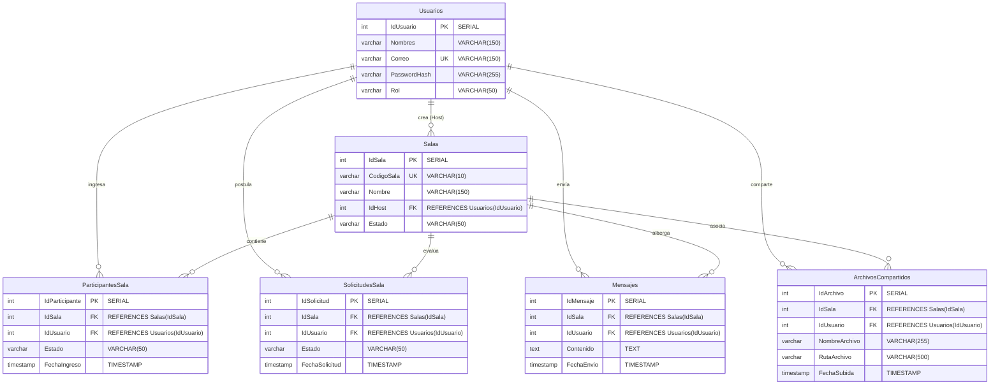
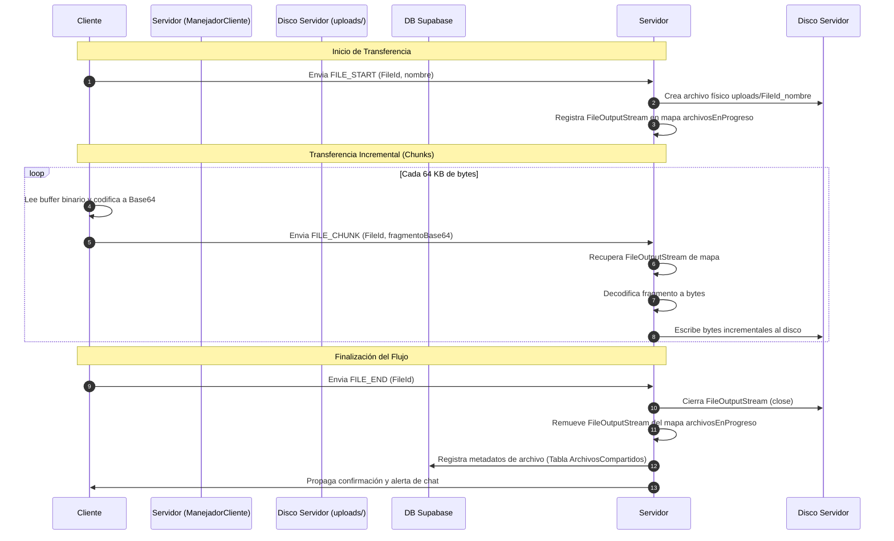

# INFORME TÉCNICO DE SUSTENTACIÓN: DISEÑO DE PERSISTENCIA, PROTOCOLO DE SOCKETS Y TOLERANCIA A FALLOS
**Módulo:** Base de Datos, Protocolo de Comunicación JSON, Tolerancia a Fallos y Conclusiones del Proyecto LP2-Zoom  
**Autor original de la sección:** Jeanpier Robles Fabian (Expositor 3)  
**Fecha de elaboración:** 26 de junio de 2026  

---

## 1. INTRODUCCIÓN Y ENFOQUE TECNOLÓGICO
El presente documento constituye el informe técnico detallado y formal de los componentes expuestos por el **Expositor 3 (Jeanpier Robles)** en el minuto **6:00 al 9:00** de la sustentación del proyecto académico **LP2-Zoom**.

Este módulo abarca la infraestructura de persistencia relacional implementada en la nube, el diseño y especificación del protocolo de mensajería binaria/JSON sobre sockets TCP, los algoritmos de control de flujo para archivos y multimedia, y los mecanismos de resiliencia del servidor ante desconexiones físicas abruptas de los clientes. El objetivo es consolidar y extender las explicaciones de la presentación con evidencias directas de la implementación del código fuente del sistema.

---

## 2. DISEÑO DEL MODELO RELACIONAL (SUPABASE) EN TERCERA FORMA NORMAL (3FN)
La capa de datos del proyecto se aloja en una instancia remota de **PostgreSQL administrada por Supabase**, con conectividad cifrada mediante el controlador JDBC de PostgreSQL en modo seguro (`sslmode=require`). Para evitar redundancias de información y anomalías de actualización, inserción o borrado, el diseño de la base de datos sigue estrictamente la **Tercera Forma Normal (3FN)**.

### 2.1. Arquitectura de las 6 Tablas Clave
El esquema físico está compuesto por 6 tablas relacionales normalizadas:

1.  **`Usuarios`**: Almacena las cuentas registradas en la aplicación.
    *   *Seguridad Criptográfica:* El campo `PasswordHash` (VARCHAR(255)) almacena la contraseña procesada con la función hash criptográfica SHA-256 en el servidor. Nunca viaja ni se almacena información en texto plano dentro del motor de persistencia.
2.  **`Salas`**: Administra las salas activas de videoconferencia. Cada registro contiene un `CodigoSala` alfanumérico único de 6 caracteres autogenerado mediante un UUID truncado en el servidor, además de un enlace foráneo al anfitrión creador (`IdHost`).
3.  **`ParticipantesSala`**: Tabla asociativa que gestiona la membresía activa de los participantes que han sido admitidos por el Host en una sala. Contiene un estado de participación (`ACTIVO` o `SALIÓ`).
4.  **`SolicitudesSala`**: Funciona como la cola física de la "Sala de Espera". Los usuarios que solicitan unirse se registran aquí con estado `PENDIENTE` hasta que el Host interactúa con la interfaz gráfica y actualiza su estado a `ACEPTADO` o `RECHAZADO`.
5.  **`Mensajes`**: Almacena el feed histórico de mensajería instantánea grupal asociado a cada sala, posibilitando la recarga del historial bajo demanda de nuevos participantes.
6.  **`ArchivosCompartidos`**: Almacena las referencias lógicas (metadatos y rutas físicas locales del tipo `uploads/fileId_nombre.ext`) de los documentos compartidos en las salas por parte de los usuarios.

### 2.2. Diagrama de Relaciones Físicas (Modelo Entidad-Relación)
A continuación, se detalla la topología de relaciones físicas y cardinalidades mediante notación de ingeniería de software (Mermaid):



### 2.3. Restricciones Físicas Críticas e Integridad Referencial
*   **Prevención de Duplicidad Mediante Restricciones Compuestas**:
    *   **`uq_sala_usuario`** en `ParticipantesSala`: Restringe la inserción en la combinación `(IdSala, IdUsuario)` de modo que un usuario no pueda registrarse simultáneamente como participante activo múltiple dentro del mismo identificador de videoconferencia.
    *   **`uq_solicitud_sala_usuario`** en `SolicitudesSala`: Evita que un invitado inunde la consola del Host con múltiples peticiones de unión repetidas. Al intentar unirse de nuevo, el sistema actualiza de forma segura la tupla existente en la cola de admisión en lugar de agregar duplicados redundantes.
*   **Ciclo de Vida Consistente mediante Borrado en Cascada (`ON DELETE CASCADE`)**:
    *   Todas las llaves foráneas (`IdSala` e `IdUsuario`) se configuran con la instrucción `ON DELETE CASCADE` de PostgreSQL. 
    *   *Justificación de Diseño:* Ante la remoción de una sala (por ejemplo, cierre definitivo o expiración por inactividad) o la eliminación del perfil de un usuario, el motor relacional de Supabase purga de forma inmediata y automática todos los mensajes, metadatos de archivos cargados, registros en la cola de admisión y listados de asistencia asociados. Esto previene la persistencia de datos huérfanos e inconsistencias que podrían degradar la eficiencia de las consultas sobre índices físicos.

---

## 3. PROTOCOLO DE SOCKETS PERSONALIZADO Y ESTRUCTURA DE TRAMAS JSON
Para la mensajería y la coordinación bidireccional en tiempo real, el sistema implementa un protocolo de red personalizado sobre sockets TCP nativos de Java SE (`java.net.Socket`), estructurado bajo el formato de intercambio de datos **JSON**.

### 3.1. Clase Unificada del Protocolo: `MensajeSocket`
Todas las transmisiones físicas del socket TCP se serializan y deserializan utilizando la biblioteca de Google **Gson** a través del puente de protocolo `ProtocolBridge`. El contrato común de comunicación se define mediante el modelo estructurado [MensajeSocket.java](file:///c:/Users/Jeanpier/OneDrive/Desktop/LP2-Zoom/Servidor/src/main/java/model/MensajeSocket.java), el cual consta de los siguientes campos:

| Campo de Trama | Tipo de Dato | Propósito Técnico |
| :--- | :--- | :--- |
| **`type`** | `String` | **Cabecera del Protocolo**. Identifica la operación o tipo de evento (ej: `CHAT_MESSAGE`, `FILE_START`, `CAMERA_FRAME`). |
| **`roomCode`** | `String` | Código de 6 dígitos que asocia la trama de red a una sala lógica en ejecución en el servidor. |
| **`userId`** | `Integer` | Identificador único numérico del usuario emisor del evento. |
| **`userName`** | `String` | Nombre o alias del emisor del evento. |
| **`message`** | `String` | Payload dinámico principal (texto plano del chat, hash SHA-256 de contraseña, ruta física de archivo, o datos Base64). |
| **`sentAt`** | `String` | Marca de tiempo que registra el momento de envío. |
| **`fullName`** | `String` | Nombre completo (utilizado principalmente en tramas de registro e inicio de sesión). |

### 3.2. Enrutamiento Polimórfico en el Servidor
En lugar de forzar múltiples canales físicos abiertos o estructuras complejas de sockets para cada tipo de dato, el servidor centraliza la recepción en la clase [ManejadorCliente.java](file:///c:/Users/Jeanpier/OneDrive/Desktop/LP2-Zoom/Servidor/src/main/java/network/ManejadorCliente.java).
Cada manejador posee un hilo independiente proporcionado por un pool dinámico (`Executors.newCachedThreadPool()`). El bucle principal lee continuamente las líneas de texto enviadas por el socket mediante un `BufferedReader` y ejecuta un enrutamiento polimórfico mediante un bloque `switch-case` evaluando la propiedad `type` del JSON:

```java
// Fragmento simplificado del enrutador de red en ManejadorCliente
private void procesarMensaje(MensajeSocket mensaje) {
    String tipo = mensaje.getType();
    switch (tipo) {
        case "LOGIN_REQUEST":         ejecutarLogin(mensaje); break;
        case "REGISTER_REQUEST":      ejecutarRegistro(mensaje); break;
        case "CREATE_ROOM":           ejecutarCrearSala(mensaje); break;
        case "JOIN_ROOM_REQUEST":     ejecutarSolicitudUnirse(mensaje); break;
        case "ADMIT_USER":            ejecutarAdmitirUsuario(mensaje); break;
        case "CHAT_MESSAGE":          ejecutarMensajeChat(mensaje); break;
        case "CAMERA_FRAME":          ejecutarFrameCamara(mensaje); break;
        case "CAMERA_STATE":          ejecutarEstadoCamara(mensaje); break;
        case "FILE_START":            ejecutarInicioArchivo(mensaje); break;
        case "FILE_CHUNK":            ejecutarChunkArchivo(mensaje); break;
        case "FILE_END":              ejecutarFinArchivo(mensaje); break;
        default:                      System.out.println("[!] Tipo no soportado: " + tipo); break;
    }
}
```

---

## 4. GESTIÓN DE FLUJOS MULTIMEDIA Y ARCHIVOS EN LA JVM
### 4.1. Transmisión Fragmentada de Archivos en Chunks (Base64)
Un problema recurrente al transmitir archivos binarios sobre sockets TCP es la carga completa de datos en memoria antes de la transmisión. Si un usuario intenta enviar un archivo de 50 MB, cargar los 50 millones de bytes en un único array bidimensional en el heap de Java puede provocar que la Máquina Virtual de Java (JVM) se quede sin memoria (arrojando un `java.lang.OutOfMemoryError`), congelando todos los hilos del servidor y degradando severamente el rendimiento general.

*   **Estrategia de Mitigación**: Implementación de una segmentación en chunks (bloques) lógicos en el cliente y reconstrucción incremental en el servidor.
*   **Proceso Técnico de Subida de Archivos**:
    1.  **`FILE_START`**: El cliente envía un mensaje inicial notificando al servidor el inicio del flujo. En este payload se adjunta un `FileId` único autogenerado y el nombre original del archivo. Al recibir esta trama, el servidor crea una carpeta física `uploads/` (si no existiese) e instancia un `FileOutputStream` asociado al nombre temporal `uploads/FileId_NombreArchivo.ext`. Este stream abierto se almacena temporalmente en un mapa concurrente en memoria denominado `archivosEnProgreso`.
    2.  **`FILE_CHUNK`**: El cliente lee secuencialmente el archivo en **bloques de 64 KB**. Cada fragmento de bytes se codifica en **Base64** para transformarlo en texto seguro JSON y se transmite por el socket TCP. Al llegar la trama `FILE_CHUNK` al servidor, el `ManejadorCliente` recupera el `FileOutputStream` del mapa concurrente, decodifica los bytes de Base64 de forma incremental y los escribe inmediatamente en el almacenamiento local en disco. Esto evita que los fragmentos queden acumulados en el Heap de la JVM, permitiendo al Garbage Collector liberar memoria de forma instantánea.
    3.  **`FILE_END`**: Al finalizar la lectura de bytes en el cliente, se emite una trama de confirmación. El servidor recupera el flujo, invoca al método `close()` para liberar el descriptor físico de archivos de red, remueve la clave del mapa de transferencias y registra en Supabase el metadato definitivo del archivo en la tabla `ArchivosCompartidos` de la base de datos, notificando automáticamente al chat de la sala la disponibilidad del elemento compartido.



### 4.2. Transmisión Continua de Video y Captura de Frames
La transmisión del video web funciona de forma análoga a la transferencia de archivos en tiempo real, pero adaptada para frames continuos de imagen:
1.  **Captura y Redimensión**: La cámara del cliente (mediante el patrón *Strategy* y *Proxy* que deciden si se utiliza una webcam física o el simulador dinámico en fallback) captura fotogramas de video y los escala a una resolución ligera de **320x240 píxeles** para reducir la carga de red.
2.  **Compresión y Serialización**: El fotograma escalado se somete a una compresión JPEG de calidad controlada. Los bytes del JPEG comprimido resultante se convierten en cadenas codificadas en **Base64**.
3.  **Transmisión (`CAMERA_FRAME`)**: El string resultante se envía al socket TCP como el payload de una trama de tipo `CAMERA_FRAME`. El servidor procesa la trama y la retransmite en tiempo real a todos los clientes suscritos activos en la misma sala (excluyendo al remitente original).
4.  **Decodificación Asíncrona**: En el extremo receptor, para evitar el bloqueo del Event Dispatch Thread (EDT) de Swing que congelaría la interfaz de usuario, los clientes decodifican la cadena Base64 y renderizan la imagen de manera asíncrona dentro de un pool concurrente secundario daemon (`videoDecoderExecutor`).

---

## 5. SEGURIDAD DE PERSISTENCIA Y ACOPLAMIENTO DE LA ARQUITECTURA
### 5.1. Regla de Oro: Aislamiento Completo de JDBC en el Cliente
Un principio fundamental de diseño y seguridad industrial de nivel corporativo implementado en **LP2-Zoom** es que **el cliente no tiene acceso directo (JDBC) a la base de datos en la nube**.
*   **El Riesgo de Exposición de Credenciales**: Si el cliente realizara consultas SQL directas por la red, la aplicación requeriría incorporar el controlador JDBC y las credenciales de administración del clúster remoto de PostgreSQL. Cualquier usuario podría descompilar el software ejecutable cliente (usando descompiladores estándar de Java como JD-GUI o bytecode decoders), obtener la contraseña de la base de datos en texto plano y tomar control absoluto del motor de base de datos de la aplicación.
*   **La Solución Implementada (Aislamiento de Persistencia)**:
    - El cliente se comunica con el servidor de sockets exclusivamente mediante mensajes cifrados en tramas JSON serializadas por TCP.
    - El servidor es la única entidad autorizada que posee el acceso JDBC seguro a Supabase.
    - Todas las transacciones (como la creación de salas, registro de participantes e historial de mensajes) se envían como peticiones al socket, y es el servidor el que ejecuta, audita, valida y procesa las llamadas SQL.
    - El hash **SHA-256** de las contraseñas se procesa localmente en el servidor, garantizando que incluso ante vulnerabilidades de interceptación en la red local (Man-in-the-Middle) no se expongan credenciales en texto plano a la base de datos.

### 5.2. Cola de Moderación Dinámica para Salas
El flujo de admisión se gestiona a través del Event Dispatch Thread de Swing e hilos secundarios del socket:
*   Un usuario invitado envía una solicitud de unión (`JOIN_ROOM_REQUEST`).
*   El servidor inserta en Supabase la solicitud con estado `PENDIENTE` y notifica instantáneamente al Host de la sala enviándole la cola actualizada en JSON (`WAITING_ROOM_UPDATE`).
*   La interfaz del Host dibuja dinámicamente la lista de espera. Al presionar "Admitir" o "Rechazar", el Host envía la instrucción `ADMIT_USER` que actualiza el estado a `ACEPTADO` o `RECHAZADO` en base de datos. El servidor notifica inmediatamente al participante invitado para que este cargue las interfaces de videoconferencia de forma reactiva.

---

## 6. TOLERANCIA A FALLOS Y LIBERACIÓN DE RECURSOS EN CALIENTE
En entornos de red reales, es común que los clientes experimenten desconexiones abruptas e imprevistas (pérdidas de cobertura inalámbrica, fallas de suministro eléctrico o terminación forzada del proceso cliente). Si el servidor no gestiona proactivamente estas fallas de I/O, el socket de red TCP quedará en un limbo de comunicación, manteniendo el hilo del pool de conexiones abierto de forma indefinida y provocando una fuga masiva de memoria física y sockets del sistema operativo (bloqueos por acumulación de descriptores de archivos).

### 6.1. Detección y Flujo del Bloque `finally`
En el servidor, el hilo asignado en [ManejadorCliente.java](file:///c:/Users/Jeanpier/OneDrive/Desktop/LP2-Zoom/Servidor/src/main/java/network/ManejadorCliente.java) ejecuta un ciclo de lectura bloqueante:
```java
while ((mensajeJSON = entrada.readLine()) != null) { ... }
```
Cuando un cliente se desconecta de forma abrupta, el método `readLine()` de Java SE inmediatamente interrumpe su espera y retorna `null`, o en su defecto arroja una excepción de I/O (`IOException`). Cualquiera de estos dos escenarios desvía la ejecución fuera del bucle de lectura y cae en el bloque de salida `finally`, el cual invoca al método de saneamiento crítico en caliente denominado `desconectar()`:

```java
private void desconectar() {
    try {
        if (this.userId != null) {
            // 1. Remoción del mapa de control de sockets activos en memoria
            MainServidor.clientesActivos.remove(this.userId);
            System.out.println("[-] Usuario " + this.userName + " (ID: " + this.userId + ") desconectado del registro.");
            
            if (this.roomCode != null) {
                // 2. Notificación de salida física al resto de la sala
                MensajeSocket leaveMsg = new MensajeSocket();
                leaveMsg.setType("LEAVE_ROOM");
                leaveMsg.setRoomCode(this.roomCode);
                leaveMsg.setUserId(this.userId);
                leaveMsg.setUserName(this.userName);
                MainServidor.retransmitirMensaje(leaveMsg, this.userId);

                // 3. Propagación de apagado forzado del Feed de Video
                MensajeSocket camOffMsg = new MensajeSocket();
                camOffMsg.setType("CAMERA_STATE");
                camOffMsg.setRoomCode(this.roomCode);
                camOffMsg.setUserId(this.userId);
                camOffMsg.setUserName(this.userName);
                camOffMsg.setMessage("OFF");
                MainServidor.retransmitirMensaje(camOffMsg, this.userId);

                // 4. Actualización del estado del participante en Supabase
                MainServidor.database.actualizarEstadoSolicitud(this.roomCode, this.userId, "RECHAZADO");
                
                // 5. Notificación general del sistema en el feed de chat
                MensajeSocket alerta = new MensajeSocket("CHAT_MESSAGE", this.roomCode, 0, "SISTEMA", this.userName + " se ha desconectado.", null);
                MainServidor.retransmitirMensaje(alerta, null);
            }
        }
        // 6. Cierre físico y liberación del socket y recursos de red
        if (socketCliente != null && !socketCliente.isClosed()) {
            socketCliente.close();
        }
    } catch (Exception e) {
        System.err.println("[-] Error al cerrar recursos del socket: " + e.getMessage());
    }
}
```

### 6.2. Explicación de los Pasos de Desconexión en Caliente
1.  **Liberación del Pool Activo**: Al eliminar el ID del usuario del mapa concurrente de red `MainServidor.clientesActivos`, se detienen de inmediato las transmisiones entrantes dirigidas a dicho socket roto, evitando que otros hilos generen excepciones secundarias al intentar retransmitir frames de video o texto de chat.
2.  **Apagado del Feed de Video (`CAMERA_STATE = OFF`)**: Ante una caída repentina, la cámara del cliente no enviará una señal limpia de apagado. El servidor se encarga de emular e inyectar esta señal para que los paneles de video de los demás participantes liberen la memoria gráfica asignada y apaguen los paneles de renderizado correspondientes al usuario caído, evitando fotogramas congelados en la UI.
3.  **Actualización del Estado de Persistencia**: El servidor cambia el estado en la base de datos a `RECHAZADO` (o libera al participante en la tabla asociativa), asegurando que el host de la sala visualice correctamente que el participante ya no se encuentra consumiendo recursos lógicos en la sesión.
4.  **Cierre Físico del Socket**: La invocación a `socketCliente.close()` cierra explícitamente la conexión TCP a nivel de kernel del sistema operativo. Esto libera de inmediato el descriptor de archivos físicos del puerto local 5000 y limpia las estructuras TCP subyacentes, previniendo condiciones de carrera e inestabilidades de red.

---

## 7. CONCLUSIONES GENERALES Y PROPUESTA DE TRABAJO FUTURO
### 7.1. Conclusiones del Proyecto
1.  **Potencia y Robustez de Sockets Nativos y POO**: El desarrollo de un software distribuido multicliente sobre sockets TCP puros sin emplear frameworks empresariales de mensajería (como Netty, WebSockets o Spring Boot) demuestra los beneficios prácticos de la Programación Orientada a Objetos en entornos concurrentes de tiempo real. El uso sistemático de patrones de diseño dota al sistema de flexibilidad, permitiendo intercambiar estrategias de base de datos o hardware de captura multimedia sin alterar la infraestructura básica de la red.
2.  **Arquitectura de Seguridad Industrial Decoupled**: El aislamiento absoluto de la base de datos en Supabase del entorno del cliente constituye la arquitectura de seguridad recomendada por la industria de software. Centralizar la interacción con PostgreSQL a través de un canal exclusivo operado por el servidor web mitiga por completo las vulnerabilidades de descompilación y filtración de credenciales lógicas de infraestructura.

### 7.2. Propuesta de Trabajo Futuro
*   **Transición a Streams de Video Nativos mediante RTP/RTSP sobre UDP**:
    Actualmente, la transmisión multimedia del proyecto encapsula imágenes JPEG individuales codificadas en Base64 dentro de tramas JSON enviadas sobre TCP. Si bien este esquema garantiza simplicidad en el desarrollo e integridad en la entrega de cuadros, introduce un **overhead del ~33% en el volumen de datos de red** debido a la codificación de caracteres, además de generar latencias acumulativas por el control de flujo y retransmisión TCP.
    
    Como evolución futura, se proyecta reemplazar la transmisión de video por sockets TCP lógicos por un canal de streaming basado en **RTP (Real-time Transport Protocol)** y **RTSP (Real Time Streaming Protocol)** sobre el protocolo de transporte **UDP**. Esto permitirá la transmisión asíncrona de streams con códecs de compresión avanzados (ej. H.264 o VP8), optimizando el ancho de banda del canal, disminuyendo la latencia de video a valores sub-segundo e incrementando el rendimiento de procesamiento del Heap Memory de la JVM al evitar la recorección de basura masiva de strings temporales Base64.
